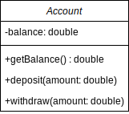

# 7. Account - Klassendiagramm

> :point_up: **Machen Sie sich mit den [UML Klassendiagrammen](../uml.md) bekannt bevor Sie weiterfahren!**

## Aufgabe

1. Skizzieren Sie das UML Klassendiagramm der folgenden Klasse `Account`

```java
public class Account {
  private double balance = 0;

  public double getBalance() {
    return balance;
  }
  public void deposit(double amount) {
    balance = balance + amount;
  }
  public void withdraw(double amount) {
    balance = balance - amount;
  }
}
```

<details>
<summary>Nur zum Überprüfen der eigenen Implementation!</summary>



</details>
