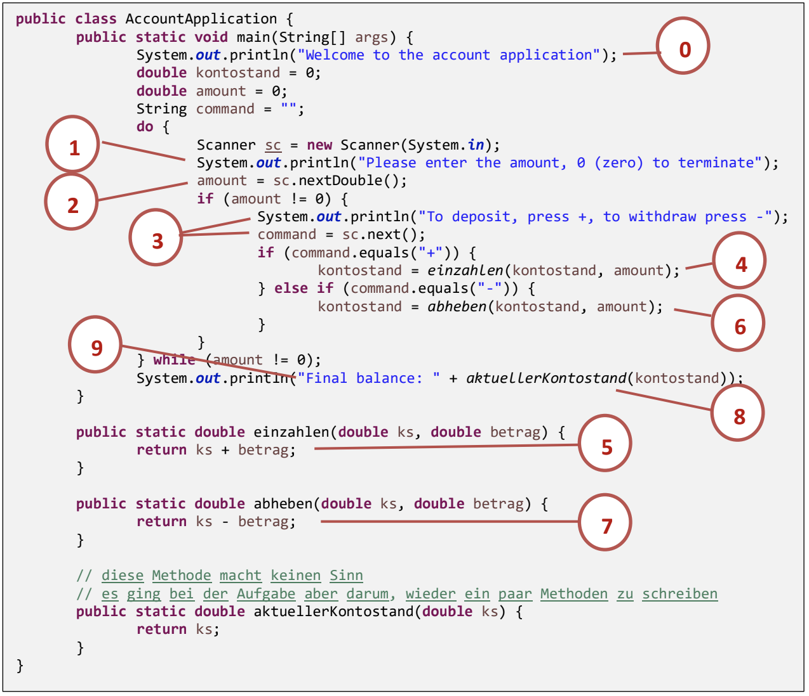

# 2. Analyse Account Applikation 

| **Material** | Abbildung unterhalb |
|:----|:----|
| **Richtzeit** | ca. 15 Minuten |
| **Sozialform** | Zweier Teams |

## Auftrag

Sie haben nun ein kleines Programm geschrieben, das vom Benutzer Eingaben über Ein- und Auszahlungen einliest und damit einen Kontostand verwaltet. Wie vom Modul 403 her gewohnt, haben wir alles in einer Klasse erledigt. Wir wollen nun **analysieren, was diese Klasse alles für Aufgaben übernimmt**. Dazu ist der Code der **Musterlösung** mit Nummern versehen worden

1. Überlegen Sie **zu zweit**, was die jeweilige nummerierte Zeile aufgabenmässig genau macht
1. **Notieren Sie sich die Antworten in elektronischer Art oder auf einem Blatt Papier**

