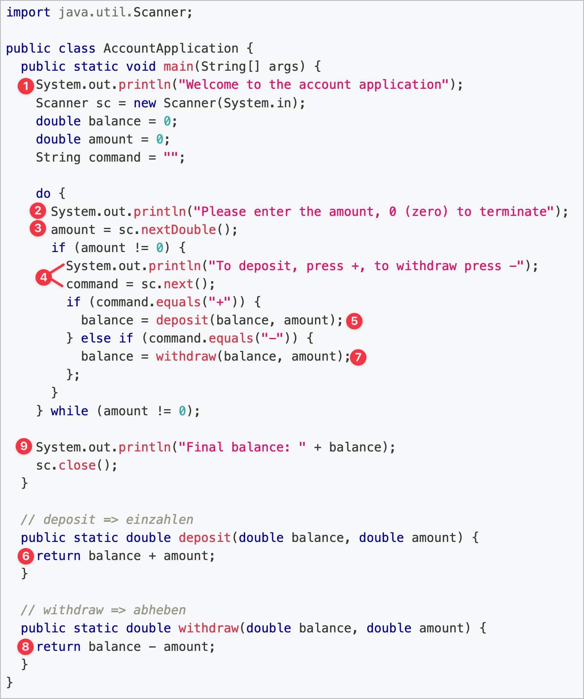

# 2. Analyse Account Applikation

| **Material**   | Abbildung unterhalb |
| :------------- | :------------------ |
| **Richtzeit**  | ca. 15 Minuten      |
| **Sozialform** | Zweier Teams        |

## Auftrag

Sie haben nun ein kleines Programm geschrieben, das vom Benutzer Eingaben über Ein- und Auszahlungen einliest und damit einen Kontostand verwaltet. Wie vom Modul 403 her gewohnt, haben wir alles in einer Klasse erledigt. Wir wollen nun **analysieren, was diese Klasse alles für Aufgaben übernimmt**. Dazu ist der Code der **Musterlösung** mit Nummern versehen worden

1. Überlegen Sie **zu zweit**, was die jeweilige nummerierte Zeile aufgabenmässig genau macht
1. **Notieren Sie sich die Antworten in elektronischer Art oder auf einem Blatt Papier**

// verwende neueres Bild!

## Lösung

Nur zum Überprüfen der eigenen Ideen!

1. Begrüssung im Terminal
2. Anweisung einen Betrag im Terminal einzugeben
   - Wenn `0` soll das Programm abbrechen
3. Einlesen der Antwort/Eingabe als `double` in die Variable `amount`
4. Wenn nicht `0` eingegeben wurde wird aufgefordert einen Betrag einzugeben
   - Einlesen der Antwort/Eingabe als `double` in die Variable `command`
5. Berechnung und Speichern des neuen Kontostandes durch ein **einzahlen**
6. Die Berechnung wird in der Methode `deposit` durchgeführt
7. Berechnung und Speichern des neuen Kontostandes durch ein **auszahlen**
8. Die Berechnung wird in der Methode `withdraw` durchgeführt
9. Ausgabe des Kontostandes im Terminal wenn durch `0` abgebrochen wurde

