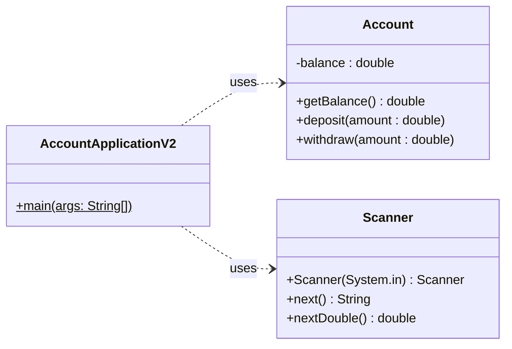

# 3. Refactoring Account Applikation

:::danger WICHTIG

:point_up: **Machen Sie sich mit dem Konzept der
[Fachklassen](../konzepte/fachklassen.md) bekannt bevor Sie weiterfahren!**

:::

:::note Refactoring

Bezeichnung im Programmieren, dass man den **vorhandenen Code neu Strukturiert,
ohne neue Funktionalität hinzuzufügen**. Refactoring dient dazu, dass die
Applikation/Software auf lange Zeit besser wartbar und erweiterbar ist.

:::

## Ausgangslage

1. Das Konto-Programm bearbeitet zu viele Aufgaben (Verantwortlichkeiten) in
   einer Klasse
1. Die Arbeit wollen wir **in zwei Klassen aufteilen**

- `AccountApplication` (Beinhaltet die Benutzerinteraktion und `main` Methode)
- `Account` rsp. `Konto` (Beinhaltet die Fachlogik)

## Einführung der Klasse `Account`/`Konto`

Die **Fachlogik** der `AccountApplication` kann in eine eigene Klasse `Account`
ausgelagert werden.

```java title="Account.java"
public class Account {
  private double balance;             // englisch für "kontostand"

  public void deposit(double value) { // englisch für "einzahlen"
    balance += value;
  }

  public void withdraw(double value) { // englisch für "auszahlen"
    balance -= value;
  }

  public double getBalance() {
    return balance;
  }
}
```

:::info Dazu muss man folgendes beachten: Die Variable `private double balance;`
ist nicht mehr in einer Methode deklariert, sondern gleich zu Beginn, **vor**
den einzelnen Methoden (_im Klassen-Body_). Dadurch ist die Variable **überall
in der Klasse sichtbar**. :::

Dies hat nun auch den Vorteil, dass wir daraus viele Konto-Objekte erstellen
können, die komplett eigenständig einen Kontostand verwalten können. Somit wird
ermöglicht, theoretisch mehrere Konti anzulegen.

```java title="Beispiel: Mehrere Objekte der Klasse 'Account'"
Account sparkonto = new Account(); // neues `Account` Objekt gespeichert in der Variable `sparkonto`
Account girokonto = new Account(); // neues `Account` Objekt gespeichert in der Variable `girokonto`

sparkonto.deposit(10); // dem Sparkonto 10 Franken einzahlen
sparkonto.deposit(20); // dem Sparkonto 20 Franken einzahlen

girokonto.withdraw(20); // dem Girokonto 20 Franken abheben

System.out.println(sparkonto.getBalance()); // => 30;
System.out.println(girokonto.getBalance()); // => -20;
```

:::tip Objekte haben eigenen Speicherbereich!

- Das Objekt `sparkonto` und `girokonto` **teilen sich den Code** der Klasse
  `Account`.
- Die **Werte der Instanz-Variable** `private double balance;` sind jedoch
  **unabhängig**!

:::

## Aufgabe

Bauen Sie Ihr Programm nun so um, dass es aus zwei Klassen besteht (die
ursprüngliche Klasse und die Klasse `Account`).

- Kopieren Sie die Klasse `AccountApplication` und benennen Sie die neue
  `AccountApplicationV2`.
- Erstellen und implementieren Sie die Klasse `Account`.
- Löschen Sie in der neuen Klasse (`AccountApplicationV2`) die Variable
  `double balance`;
- Legen Sie dafür ein **Objekt** der Klasse `Account` an.
- Jetzt erscheinen Fehler im Quellcode.
  - Überall dort müssen Sie das Programm anpassen und mit dem **Objekt** der
    Klasse `Account` arbeiten.
- Die Methoden `deposit` und `withdraw` müssen nun in der Klasse
  `AccountApplicationV2` gelöscht werden.

### UML der Musterlösung

Verwenden Sie das UML um die Struktur der Aufgabe zu verstehen.



:::tip

Für jeden **gepunkteter Pfeil der mit "uses" beschrifetet** ist, muss in der
Klasse, von der der Pfeil abgeht (hier `AccountApplicationV2`) **ein Objekte der
Klasse auf die gezeigt wird** vorhanden sein (hier `Account` und `Scanner`).

In der Klasse `AccountApplicationV2` muss somit irgendwo `new Account()` und
`new Scanner(System.in)` stehen! Da die Klasse `AccountApplicationV2` nur die
`main`-Methode beinhaltet, wird es wohl darin sein.

:superhero: Theoretisch könnte das Objekt auch über einen Parameter der Klasse
übergeben werden. Das nennt sich _Dependency Injection_.

:::

## Musterlösung

<details>
<summary>Nur zum Überprüfen der eigenen Implementation!</summary>

```java title="AccountApplicationV2.java"
import java.util.Scanner;

public class AccountApplicationV2 {
  public static void main(String[] args) {
    System.out.println("Welcome to the account application");
    // highlight-next-line
    Account account = new Account();  // hier wird ein Objekt der Klasse `Account` erstellt
    double amount = 0;
    String command = "";

    try(Scanner scanner = new Scanner(System.in)) {
        do {
          System.out.println("Please enter the amount, 0 (zero) to terminate");
          amount = scanner.nextDouble();
          if (amount != 0) {
            System.out.println("To deposit, press +, to withdraw press -");
            command = scanner.next();
            if ("+".equals(command)) {
              // highlight-next-line
              account.deposit(amount); // nun wird das Objekt "account" verwendet
            } else if ("-".equals(command)) {
              // highlight-next-line
              account.withdraw(amount); // nun wird das Object "account" verwendet
            }
          }
        } while (amount != 0);
        // Die balance/Kontostand wird direkt im Objekt "account" berechnet
        // highlight-next-line
        System.out.println("Final balance: " + account.getBalance());
    }
  }
}
```

</details>
