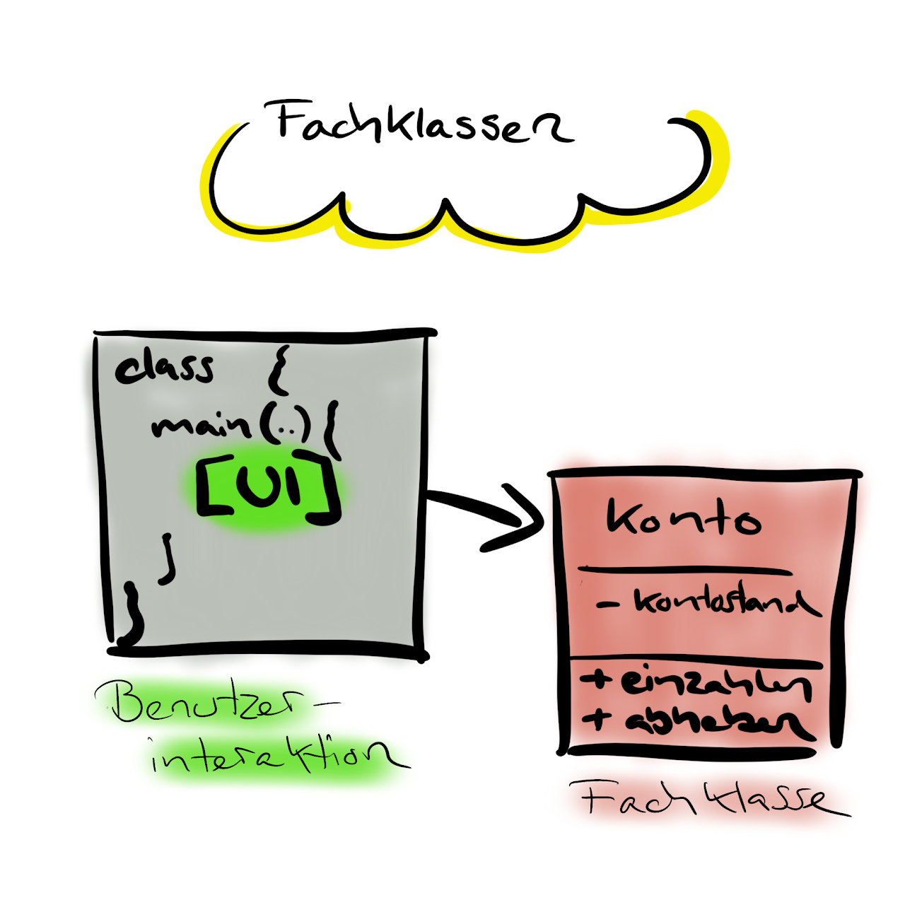

# 3. Refactoring Account Applikation

> :point_up: **Machen Sie sich mit dem Konzept der [Fachklassen](../konzepte/fachklassen.md) bekannt bevor Sie weiterfahren!**

:::note Refactoring
Bezeichnung im Programmieren, dass man den **vorhandenen Code neu Strukturiert, ohne neue Funktionalität hinzuzufügen**. Refactoring dient dazu, dass die Applikation/Software auf lange Zeit besser wartbar und erweiterbar ist.
:::

## Ausgangslage

1. Das Konto-Programm bearbeitet zu viele Aufgaben (Verantwortlichkeiten) in einer Klasse
1. Die Arbeit wollen wir **in zwei Klassen aufteilen**
  - `AccountApplication` (Beinhaltet die Benutzerinteraktion und `main` Methode)
  - `Account` rsp. `Konto` (Beinhaltet die Fachlogik)




## Einführung der Klasse `Account`/`Konto`

Die **Fachlogik** der `AccountApplication` kann in eine eigene Klasse `Account` ausgelagert werden. 

```java title="Account.java"
public class Account {
  private double balance;             // englisch für "kontostand"

  public void deposit(double value) { // englisch für "einzahlen"
    balance += value;
  }

  public void withdraw(double value) { // englisch für "auszahlen"
    balance -= value;
  }

  public double getBalance() { 
    return balance;
  }
}
```

:::info Dazu muss man folgendes beachten:
Die Variable `private double balance;` ist nicht mehr in einer Methode deklariert, sondern gleich zu Beginn, **vor** den einzelnen Methoden (_im Klassen-Body_). Dadurch ist die Variable **überall in der Klasse sichtbar**.
:::

Dies hat nun auch den Vorteil, dass wir daraus viele Konto-Objekte erstellen können, die komplett eigenständig einen Kontostand verwalten können. Somit wird ermöglicht, theoretisch mehrere Konti anzulegen.

```java title="Beispiel: Mehrere Objekte der Klasse 'Account'"
Account sparkonto = new Account(); // neues `Account` Objekt gespeichert in der Variable `sparkonto`
Account girokonto = new Account(); // neues `Account` Objekt gespeichert in der Variable `girokonto`

sparkonto.deposit(10); // dem Sparkonto 10 Franken einzahlen
sparkonto.deposit(20); // dem Sparkonto 20 Franken einzahlen

girokonto.withdraw(20); // dem Girokonto 20 Franken abheben

System.out.println(sparkonto.getBalance()); // => 30;
System.out.println(girokonto.getBalance()); // => -20;
```
:::tip Objekte haben eigenen Speicherbereich!
- Das Objekt `sparkonto` und `girokonto` **teilen sich den Code** der Klasse `Account`. 
- Die **Werte der Instanz-Variable** `private doubel balance;` sind jedoch **unabhängig**!
:::

## Aufgabe

Bauen Sie Ihr Programm nun so um, dass es aus zwei Klassen besteht (die ursprüngliche Klasse und die Klasse `Account`).

- Erstellen und implementieren Sie die Klasse `Account`.
- Löschen Sie in der ursprüngliche Klasse (`AccountApplication`) die Variable `double balance`;
- Legen Sie dafür ein **Objekt** der Klasse `Account` an.
- Jetzt erscheinen Fehler im Quellcode. 
  - Überall dort müssen Sie das Programm anpassen und mit dem neuen Objekt der Klasse `Account` arbeiten.
- Die Methoden `einzahlen`,`abheben` und `aktuellerKontostand` der ursprünglichen Klasse `AccountApplication` **sollten nun gelöscht werden können**.

## Musterlösung

<details>
<summary>Nur zum Überprüfen der eigenen Implementation!</summary>

```java title="AccountApplicationV2.java"
import java.util.Scanner;

public class AccountApplicationV2 {
	public static void main(String[] args) {
		System.out.println("Welcome to the account application");
		Account account = new Account();  // hier wird ein Objekt der Klasse `Account` erstellt
		double amount = 0;
		String command = "";
		do {
			Scanner sc = new Scanner(System.in);
			System.out.println("Please enter the amount, 0 (zero) to terminate");
			amount = sc.nextDouble();
			if (amount != 0) {
				System.out.println("To deposit, press +, to withdraw press -");
				command = sc.next();
				if (command.equals("+")) {
					account.deposit(amount);
				} else if (command.equals("-")) {
					account.withdraw(amount);
				}
			}
		} while (amount != 0);
		System.out.println("Final balance: " + account.getBalance());
	}
}
```

</details>
