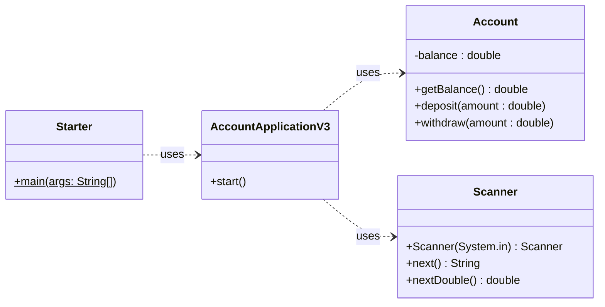

# 4. Starterklasse

- Es ist eine gute Praxis in der `main` Methode nicht viel Logik zu implementieren.
- Bestenfalls besteht die `main` Methode nur aus der **Instanzisierung einer Applikations Klasse** welche die eigentliche App verwaltet.

```java title="Starter.java als Beispiel"
public class Starter {

    public static void main(String[] args) { // Startpunkt des Programms, ist immer static!
        MyNewShinyApp app = new MyNewShinyApp(); // `new` ist innerhalb von `static` erlaubt
        app.start(); // starten der eigentlichen App
    }

}
```

## Aufgabe

### 1. Umbau der `AccountApplicationV2` Klasse

- Kopieren Sie die Klasse und benennen Sie dies neue `AccountApplicationV3`
- Ändern Sie die Definition der Methode `public static void main(String[] args)` um in `public void start()`

### 2. Erstellen der Starterklasse

- Erstellen Sie eine neue Klasse `Starter`
- Diese Klasse muss die Methode `public static void main(String[] args)` besitzen
- Erstellen Sie in der `main` Methode ein **Objekt** Ihrer Applikationsklasse (`AccountApplicationV3`)
- Rufen Sie dann die Methode `start()` des Objekts auf

### UML der Musterlösung

Verwenden Sie das UML um die Struktur der Aufgabe zu verstehen.



## Musterlösung

<details>
<summary>Nur zum Überprüfen der eigenen Implementation!</summary>

```java title="Starter.java"
public class Starter {

  public static void main(String[] args) {
    AccountApplicationV3 app = new AccountApplicationV3();
    app.start();
  }

}
```

```java title="AccountApplicationV3.java"
import java.util.Scanner;

public class AccountApplicationV3 {

  public void start() {
    System.out.println("Welcome to the account application");
    Account account = new Account();  // hier wird ein Objekt der Klasse `Account` erstellt
    double amount = 0;
    String command = "";

    try(Scanner scanner = new Scanner(System.in)) {
      do {
        System.out.println("Please enter the amount, 0 (zero) to terminate");
        amount = scanner.nextDouble();
        if (amount != 0) {
          System.out.println("To deposit, press +, to withdraw press -");
          command = scanner.next();
          if ("+".equals(command)) {
            account.deposit(amount);
          } else if ("-".equals(command)) {
            account.withdraw(amount);
          }
        }
      } while (amount != 0);
      System.out.println("Final balance: " + account.getBalance());
    }
  }

}
```

```java title="Account.java"
public class Account {
  private double balance;             // englisch für "kontostand"

  public void deposit(double value) { // englisch für "einzahlen"
    balance += value;
  }

  public void withdraw(double value) { // englisch für "auszahlen"
    balance -= value;
  }

  public double getBalance() {
    return balance;
  }
}
```

</details>
