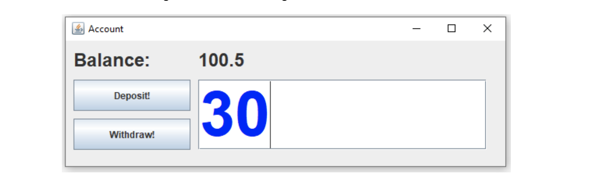

# 7. Account Applikation

In der ersten Woche haben wir eine Konsolenapplikation implementiert, wobei man einen Betrag auf ein Konto einzahlen und abheben konnte, zusätzlich wurde zum Schluss der Kontostand angezeigt.

Sie haben sich mittlerweile schon ein grosses Wissen angeeignet, wie wir mit Swing Programme mit einer graphischen Benutzeroberfläche schreiben können. Sie wissen auch, wie Sie vom Benutzer Eingaben erhalten und Werte ausgeben können.

Jetzt geht es darum, unser Einstiegsbeispiel einer einfachen Kontoverwaltung zu überarbeiten. Versuchen Sie alles Wissen anzuwenden, das Sie sich angeeignet haben. Arbeiten Sie mit dem Faktenblatt zusammen, wenn Sie unsicher sind. Es enthält sehr viele Informationen, aber man muss wissen, wo sie stehen. Wenn Sie sich jetzt an dieses Blatt gewöhnen, kann es Ihnen bei einer Leistungsbeurteilung eine Hilfe sein.



Das Programm muss nicht genau so aussehen. Aber vielleicht möchten Sie etwas ausprobieren.

- Die Applikation startet mit Kontostand 0
- Im Textfeld kann man einen Betrag eingeben
- Durch Betätigen des Buttons «Deposit!» wird der eingegebene Betrag dem Konto gutgeschrieben und die Anzeige oberhalb (Balance:) aktualisiert. Anschliessend wird das Textfeld mit der Eingabe geleert.
- Durch Betätigen des Buttons «Withdraw!» wird der eingegebene Betrag dem Konto abgezogen und die Anzeige oberhalb (Balance:) aktualisiert. Anschliessend wird das Textfeld mit der Eingabe geleert.

## Musterlösung

<details>
<summary>Immer zuerste selber versuchen! Lösung abtippen, nicht kopieren ;)</summary>

```java title="Starter.java"
public class Starter {
  public static void main(String[] args) {
    AccountGui gui = new AccountGui();
    gui.showDialog();
  }
}
```

```java title="AccountGui.java"
import java.awt.event.ActionEvent;
import java.awt.event.ActionListener;

import javax.swing.JButton;
import javax.swing.JFrame;
import javax.swing.JLabel;
import javax.swing.JTextField;

public class AccountGui extends JFrame implements ActionListener {
  Account account;
  JButton deposit;
  JButton withdraw;
  JLabel balanceLabel;
  JTextField amountTextField;
  
  public AccountGui() {
    // Initialisieren der Werte im Konstruktor
    account = new Account();
    deposit = new JButton("einzahlen");
    withdraw = new JButton("auszahlen");
    balanceLabel = new JLabel();
    amountTextField = new JTextField();
  }
  
  public AccountGui(double startBalance) {
    // Initialisieren der Werte mit einem startguthaben
    account = new Account();
    account.deposit(startBalance);
    deposit = new JButton("einzahlen");
    withdraw = new JButton("auszahlen");
    balanceLabel = new JLabel();
    amountTextField = new JTextField();
  }

  public void showDialog() {
    this.setLayout(null);

    amountTextField.setBounds(10, 10, 250, 20);
    balanceLabel.setBounds(10, 40, 250, 20);
    deposit.setBounds(10, 70, 250, 20);
    withdraw.setBounds(10, 100, 250, 20);

    this.add(amountTextField);
    this.add(balanceLabel);
    this.add(deposit);
    this.add(withdraw);

    deposit.addActionListener(this);
    withdraw.addActionListener(this);

    this.setTitle("Account GUI Application");
    this.setDefaultCloseOperation(EXIT_ON_CLOSE);
    this.setSize(300, 300);
    this.setVisible(true);
  }

  @Override
  public void actionPerformed(ActionEvent e) {
    if (e.getSource() == deposit) {
        account.deposit(getAmount());
    } else if (e.getSource() == withdraw) {
        account.withdraw(getAmount());
    }
    refreshBalance();
    clearAmount();
  }

  // Es ist guter Stil, wenn private Methoden unterhalb der public Methoden stehen
  // Am besten sortiert nach der Verwendung. Dies vereinfacht das Lesen des Codes!

  private double getAmount() {
    return Double.parseDouble(amountTextField.getText());
  }

  private void refreshBalance() {
    double balance = account.getBalance();
    balanceLabel.setText(balance + "");
    //balanceLabel.setText(Double.toString(balance)); // alternative Möglichkeit
  }

  private void clearAmount() {
    amountTextField.getText("");
  }
}
```

```java title="Account.java"
public class Account {
  private double balance;

  public double getBalance() {
    return balance;
  }

  public void deposit(double value) {
    this.balance += value;
  }
  
  public void withdraw(double value) {
    this.balance -= value;
  }
}
```

</details>

