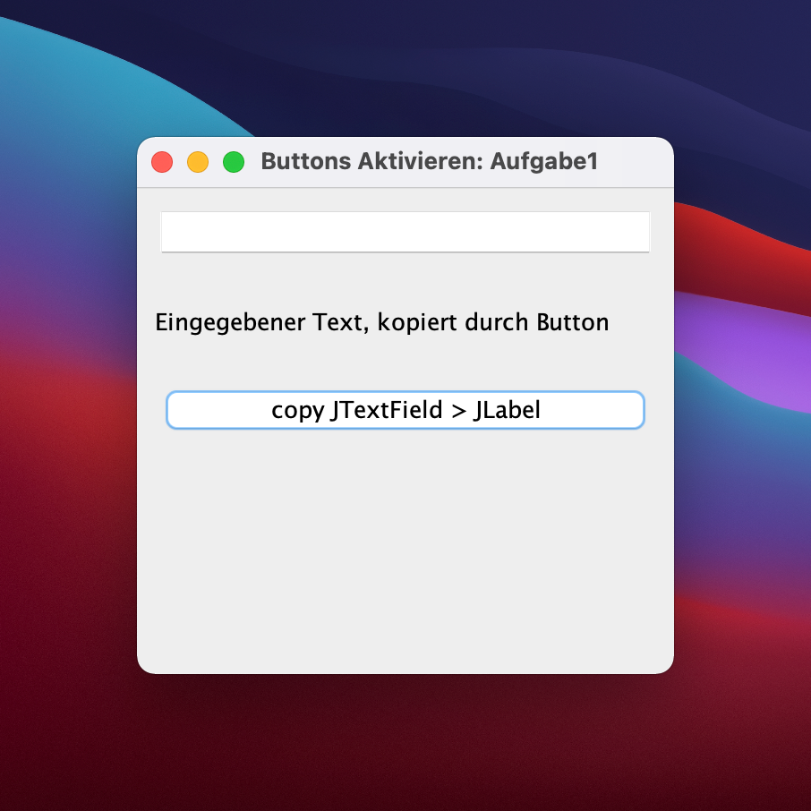
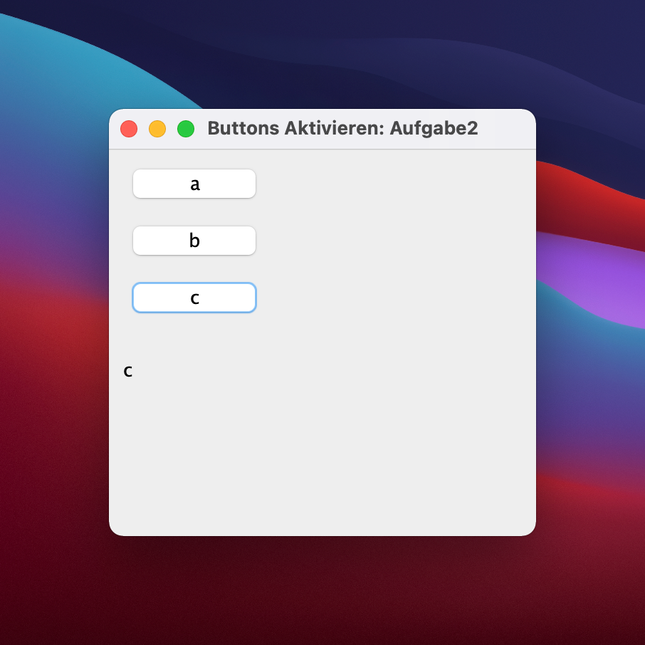

# 4. JButton Aktivieren

> :point_up: **Machen Sie sich mit dem Konzept des [ActionListener](../konzepte/actionlistener.md) bekannt bevor Sie weiterfahren!**

## Aufgabe 1: Einen Wert kopieren

Erstellen Sie das Programm unten. Das Ziel ist, dass bei Anklicken der Schaltfläche der Wert aus dem Textfeld in das Label unterhalb kopiert wird, während das obere Textfeld geleert wird.



<details>
<summary>Immer zuerste selber versuchen! Lösung abtippen, nicht kopieren ;)</summary>

```java
import java.awt.event.ActionEvent;
import java.awt.event.ActionListener;
import javax.swing.JButton;
import javax.swing.JFrame;
import javax.swing.JLabel;
import javax.swing.JTextField;

public class Aufgabe1 extends JFrame implements ActionListener {
  private JTextField textfield = new JTextField();
  private JLabel label = new JLabel("");
  private JButton button = new JButton("copy JTextField > JLabel");

  public void showDialog() {
    setLayout(null);

    textfield.setBounds(10, 10, 280, 30);
    add(textfield);
    label.setBounds(10, 60, 280, 30);
    add(label);
    button.setBounds(10, 110, 280, 30);
    add(button);
    button.addActionListener(this);

    setDefaultCloseOperation(EXIT_ON_CLOSE);
    setSize(300, 300);
    setTitle("Buttons Aktivieren: Aufgabe1");
    setVisible(true);
  }

  @Override
  public void actionPerformed(ActionEvent e) {
    String text = textfield.getText(); // Auslesen vom Textfeld
    label.setText(text); // Kopieren vom Textfeld
    textfield.setText(""); // leeren des Textfeldes
  }
}
```

</details>


## Aufgabe 2: Mehrere Buttons auswerten

Erstellen Sie das Programm unten. Das Ziel ist, dass bei Anklicken der Schaltfläche der Wert aus dem Textfeld in das Label unterhalb kopiert wird, während das obere Textfeld geleert wird.



<details>
<summary>Immer zuerste selber versuchen! Lösung abtippen, nicht kopieren ;)</summary>

```java
import java.awt.event.ActionEvent;
import java.awt.event.ActionListener;
import javax.swing.JButton;
import javax.swing.JFrame;
import javax.swing.JLabel;
import javax.swing.JTextField;

public class Aufgabe2 extends JFrame implements ActionListener {
  private JLabel label = new JLabel("");
  private JButton buttonA = new JButton("a");
  private JButton buttonB = new JButton("b");
  private JButton buttonC = new JButton("c");

  public void showDialog() {
    setLayout(null);

    buttonA.setBounds(10, 10, 100, 30);
    add(buttonA);
    buttonA.addActionListener(this);
    buttonB.setBounds(10, 50, 100, 30);
    add(buttonB);
    buttonB.addActionListener(this);
    buttonC.setBounds(10, 90, 100, 30);
    add(buttonC);
    buttonC.addActionListener(this);
    label.setBounds(10, 140, 100, 30);
    add(label);

    setDefaultCloseOperation(EXIT_ON_CLOSE);
    setSize(300, 300);
    setTitle("Buttons Aktivieren: Aufgabe2");
    setVisible(true);
  }

  @Override
  public void actionPerformed(ActionEvent e) {
    // highlight-start

    // Hier werden nun die einzelnen Buttons identifiziert!
    if (e.getSource() == buttonA) {
      label.setText(buttonA.getText());
    } else if(e.getSource() == buttonB) {
      label.setText(buttonB.getText());
    } else if(e.getSource() == buttonC) {
      label.setText(buttonC.getText());
    }

    // highlight-end
  }
}
```

</details>

## Cheat Sheet

:::note Code snippets funktionieren nur im richtigen Kontext ;)
:::

```java
// Die Klasse definieren
class MyClass extends JFrame implements ActionListener

// ActionListener registrieren
button.addActionListener(this); 

// Method actionPerformed implementieren
@Override
public void actionPerformed(ActionEvent e) {
  if (e.getSource() == button) {
    // do this
  } elseif (e.getSource() == button2) {
    // do that
  }
}
```
