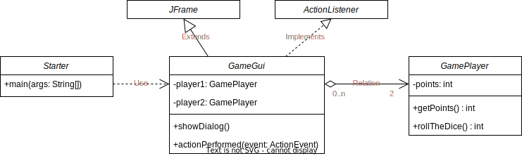

# 7. Easy Dice Game

> - :point_up: **Machen Sie sich mit den [UML Klassendiagrammen](../uml.md) bekannt bevor Sie weiterfahren!**
> - :point_up: **Für diese Aufgabe müsst Ihr den [ActionListener](../konzepte/actionlistener) verstanden haben!**

## Aufgabe

- Es soll ein **Würfelspiel** realisiert werden, wobei der **Spieler in eine Fachklasse ausgelagert** wird
- Es soll das untenstehende UML-Klassendiagramm als Struktur verwendet werden
- Die Fachklasse `GamePlayer` (Würfelspieler), kann würfeln und verwaltet das Punktetotal
- Es soll ein GUI in der Klasse `GameGui` mit zwei Spielern programmiert werden

**UML-Klassendiagramm**



:::info
In der Methode `rollTheDice()` ist folgende Berechnung nötig, um eine zufällige Zahl zwischen 1 und 6 zu erzeugen:

```java title="Zufallszahl zwischen 1 und 6"
(int) (Math.random() * 6 + 1);
```
:::

## Arbeitsschritte

1. Programmieren Sie die Fachklasse `GamePlayer`. Untersuchen Sie, was `Math.random()` macht, und warum die weiteren Anweisungen notwendig sind.
1. Um sich mit der Klasse vertraut zu machen, erstellen Sie eine Instanz der Fachklasse und rufen die Methode `rollTheDice()` wiederholt auf, z.B. mittels einer for-Schleife. 
1. Entwerfen Sie ein mögliches GUI. Überlegen Sie: welche Interaktionselemente (Schaltflächen, Textanzeige, etc.) sind nötig für das Spiel?
1. Implementieren Sie nun das GUI gemäss Ihrer Skizze.
