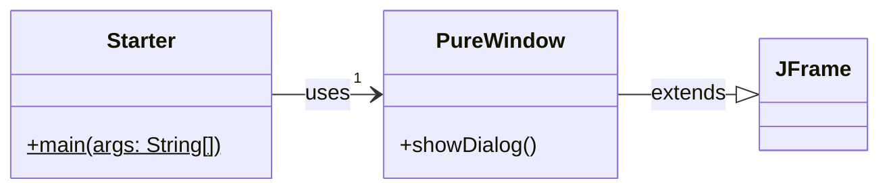
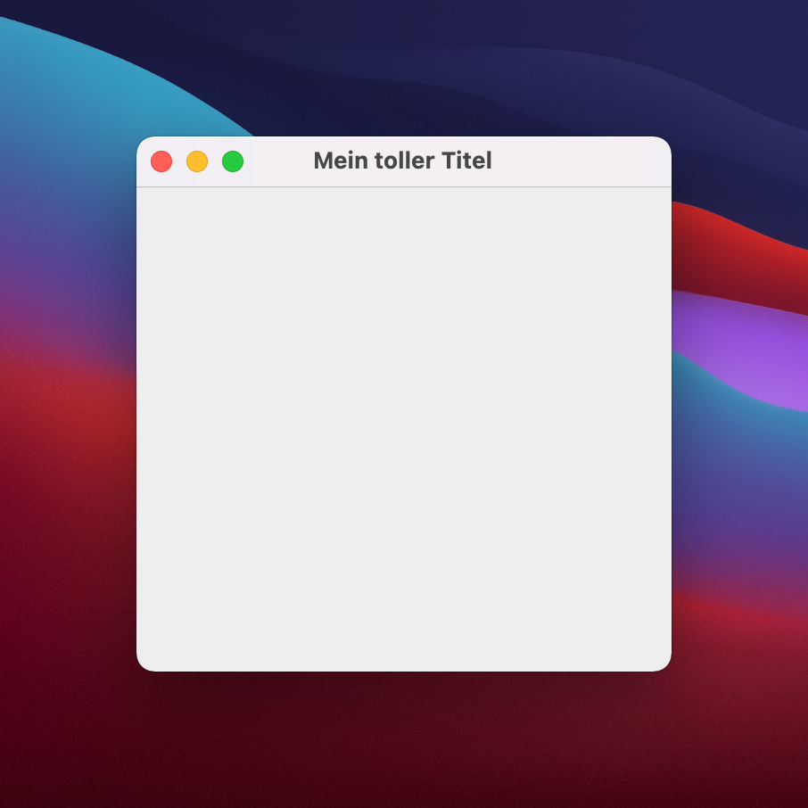

# 2. Fenster (JFrame)

Das folgende Beispiel zeigt die Vorkehrungen, die notwendig sind, um ein Fenster anzuzeigen:

## UML



## Starter.java

In der `main`-Methode der Klasse `Starter` wird ein Objekt der Klasse `PureWindow` erzeugt und in der Variable `pureWindow` gespeichert. Die Variable `pureWindow` wird dann verwendet, um die Methode `showDialog()` aufzurufen.

```java title="Starter.java"
public class Starter {
  public static void main(String[] args) {
    PureWindow pureWindow = new PureWindow(); // Ertellt ein `PureWindow` Objekt und speichert es in der Variable `pureWindow`
    pureWindow.showDialog(); // Führt die Methode `showDialog()` aus
  }
}
```

:::tip

- `PureWindow` ist die Klasse sowie der `Datentyp`
- `pureWindow` (klein) ist die Variable, die das Objekt beinhaltet.

:::

## PureWindow.java

- Die Klasse `PureWindow` muss von der Klasse `JFrame` alle Fähigkeiten übernehmen. Dies geschieht durch die Anweisung `extends JFrame`. Damit wird die Klasse `PureWindow` zu einem `JFrame`.
- Die Methode `showDialog()` führt die **grundlegenden Konfigurationsschritte** aus. Diese werden bei allen Fenstern benötigt.
- Die Methode `showDialog()` muss über das Objekt `pureWindow` aufgerufen werden. `pureWindow.showDialog()`

```java title="PureWindow.java"
import javax.swing.JFrame;

public class PureWindow extends JFrame {

  public void showDialog() { // Beliebiger Name, kann auch, "start" oder nur "show" heissen.
    setLayout(null); // Deaktiviert Layout-Automatismen von Swing
    setDefaultCloseOperation(EXIT_ON_CLOSE); // Beended beim Schliessen des Fensters ebenfalls den Prozess
    setSize(300, 300); // Bestimmt die grösse des Fensters
    setTitle("Mein toller Titel"); // Setzt den Titel des Fensters
    setVisible(true); // Muss am Ende stehen! Ohne das wird nichts angezeigt!
  }
}
```

:::info

Die Klasse haben wir `PureWindow` genannt. Deutsch heisst das soviel wie "reines Fenster". Die Klasse kann beliebig benannt werden. `PureWindow` eignet sich, da es sich um ein Beispiel für das Grundgerüst handelt, ohne weiteren Inhalt.

:::

:::tip

Lesen Sie auch die Kommentare im Code, löschen Sie die einzelnen Zeilen und schauen was passiert!

:::

## Programm starten

Wenn das Programm gestartet wird, erscheint ein Fenster das ca. wie folgt aussieht:



## Aufgabe

Erstellt nun ein neues Programm, kopiert den Code von Oben und schaut, ob es bei euch auch funktioniert.

- Löscht einzelne Zeilen und analysiert den Effekt

:::tip Anstatt copy/paste tippt ihr den Text am besten selber ab!

1. Lernt Ihr so besser
2. Merkt Ihr, dass der Editor vorschläge macht!
3. Erhält Ihr ein besseres "Gefühl" wie es ist zu programmieren :superhero:

:::

## Cheat Sheet

```java
setLayout(null); // Standard Layout deaktivieren
setDefaultCloseOperation(EXIT_ON_CLOSE); // Beim schliessen des Fensters, das ganze Programm beenden
setSize(300, 300); // Grösse vom Fenster festlegen
setTitle("Ich bin der Fenster Titel"); // Titel des Fensters festlegen
setVisible(true); // Fenster sichtbar machen

JLabel label = new JLabel("Beschriftung"); // Ein Label
label.setBounds(x, y, width, height); // Bestimmen wo sich das Label befindet
add(label); // Label hinzufügen

JTextField textfield = new JTextField(); // Ein Textfeld
textfield.setBounds(x, y, width, height); // Bestimmen wo sich das Textfeld befindet
add(textfield); // Textfeld hinzufügen

JButton button = new JButton("press me"); // Ein Button
button.setBounds(x, y, width, height); // Bestimmen wo sich der Button befindet
add(button); // Textfeld hinzufügen
```
