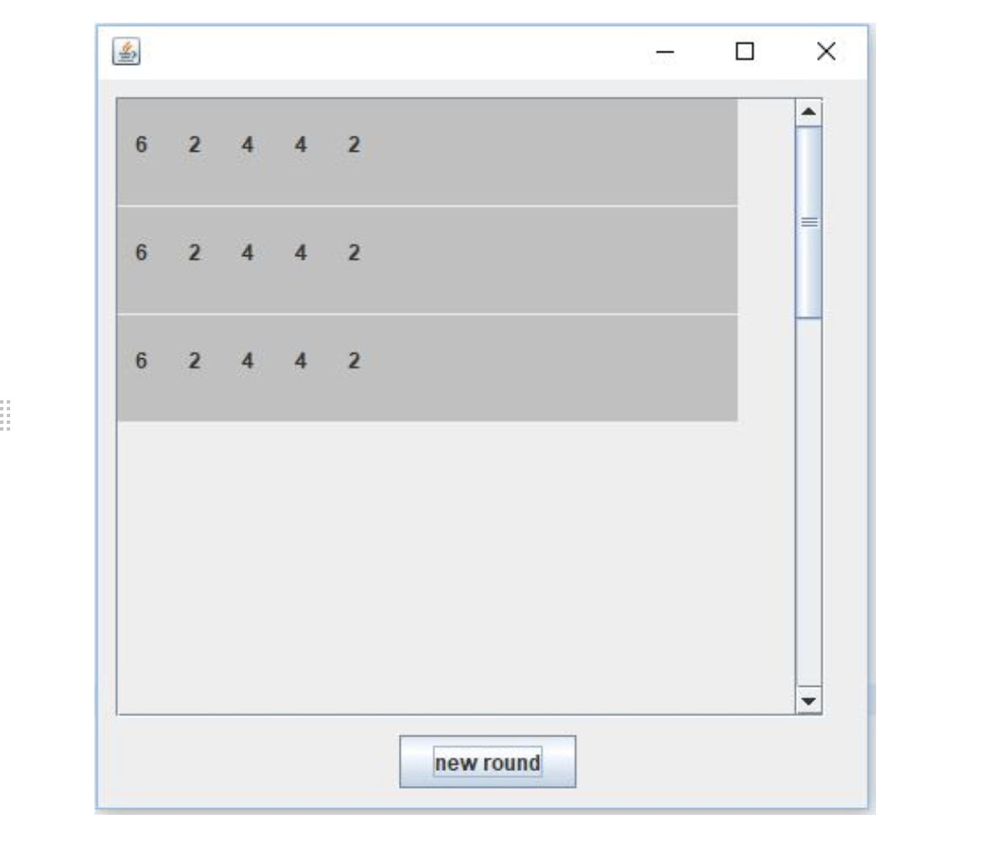

# 8. JPanel

Für diejenigen, die mit JPanels arbeiten wollen, dient folgendes Beispielprogramm als Inspiration.

Dadurch, dass wir alles mit `setBounds` fix positionieren, ist es zusammen mit der Scrollbar nicht die schönste Variante, aber zumindest eine Verbesserung. Die Arbeit mit sogenannten Layouts wäre hier schöner, dies behandeln wir aber in einem Folgemodul.



```java title="PanelFrame.java"
package panelExample;

import java.awt.Dimension;
import java.awt.event.ActionEvent;
import java.awt.event.ActionListener;

import javax.swing.JButton;
import javax.swing.JFrame;
import javax.swing.JPanel;
import javax.swing.JScrollPane;

public class PanelFrame extends JFrame implements ActionListener {

  private JButton btnNewRound = new JButton("new round");
  private JPanel pnl1 = new JPanel(); //Panel, welches andere Panels aufnimmt
  private JScrollPane scrollpane = new JScrollPane(pnl1, 
      JScrollPane.VERTICAL_SCROLLBAR_AS_NEEDED, JScrollPane.HORIZONTAL_SCROLLBAR_NEVER);

  // Würde hier ein Array Sinn machen?
  // Wie kann man alle Panels aller Runden speichern?
  private RoundPanel panel = new RoundPanel(); 
  // Wie löse ich es für den Player zwei?

  private int y = 0; // Vertikale verschiebung der Panels
  
  // Ersetzt Starter.java für dieses Beispiel
  public static void main(String[] args) {
    new PanelFrame();
  }

  public PanelFrame() {
    this.setLayout(null); // fixe Positionierungen
    pnl1.setLayout(null);
    pnl1.setPreferredSize(new Dimension(350, 1000)); //PreferredSize für scrollbar

    scrollpane.setBounds(10, 10, 400, 350);
    this.add(scrollpane);

    btnNewRound.setBounds(170, 370, 100, 30);
    this.add(btnNewRound);
    this.btnNewRound.addActionListener(this);

    this.setSize(450, 450);
    this.setDefaultCloseOperation(EXIT_ON_CLOSE);
    this.setVisible(true);
  }

  @Override
  public void actionPerformed(ActionEvent e) {
    if (e.getSource() == this.btnNewRound) {
      // `this.` darf auch weggelassen werden
      this.panel = new RoundPanel()   // neues Panel Objekt pro Runde
      this.panel.setBounds(0, y, 350, 60);
      this.y += 61;                   // y-Position des nächsten Runden Panels
      this.pnl1.add(panel);           // zum scrollbaren Panel hinzufügen
      this.repaint();                 // Alles neu zeichnen
    }
  }
}
```

```java title="RoundPanel.java"
package panelExample;
  
import java.awt.Color;
  
import javax.swing.JLabel;
import javax.swing.JPanel;
  
public class RoundPanel extends JPanel {
  
  // Könnte man hier auch einen Array machen?
  // Was würde ein Array für Vorteile bringen?
  private JLabel lbl1 = new JLabel("6");
  private JLabel lbl2 = new JLabel("2");
  private JLabel lbl3 = new JLabel("4");
  private JLabel lbl4 = new JLabel("4");
  private JLabel lbl5 = new JLabel("2");
  
  public RoundPanel() {
    this.setLayout(null);
    
    lbl1.setBounds(10, 10, 30, 30);
    lbl2.setBounds(40, 10, 30, 30);
    lbl3.setBounds(70, 10, 30, 30);
    lbl4.setBounds(100, 10, 30, 30);
    lbl5.setBounds(130, 10, 30, 30);
    
    add(lbl1);
    add(lbl2);
    add(lbl3);
    add(lbl4);
    add(lbl5);
    this.setBackground(Color.LIGHT_GRAY);
  }

  // Was fehlt, damit die einzelnen Labels von aussen geändert werden können?
}
```

## Aufgabe

- Schreiben Sie den oben bestehenden Code ab, sodass das Bild oben reproduzierbar ist.
- Versuchen Sie die einzuelnen Label **im nachhinein** zu ändern
- Versuchen Sie einen Button `diceButton` hinzuzufügen, welcher würfelt und das Resultat in das entsprechende `RoundPanel` `label` schreibt
- Nach 5 `würfen` soll ein neues `RoundPanel` erstellt werden.
