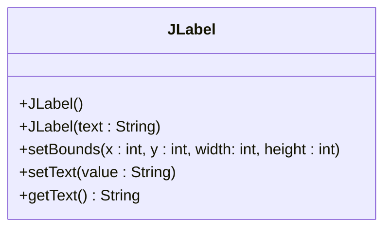
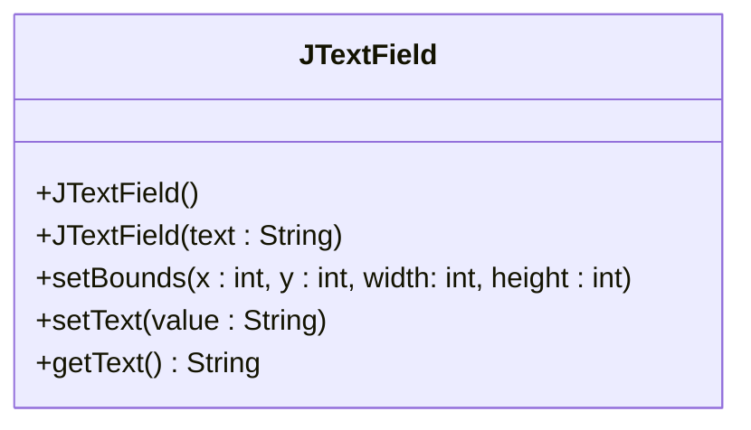
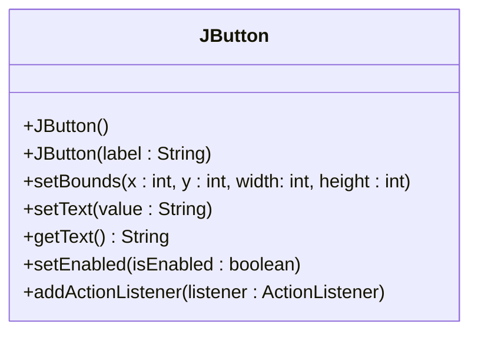
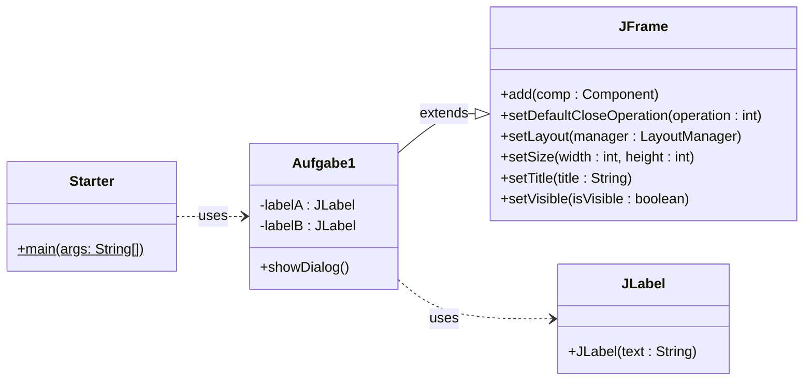
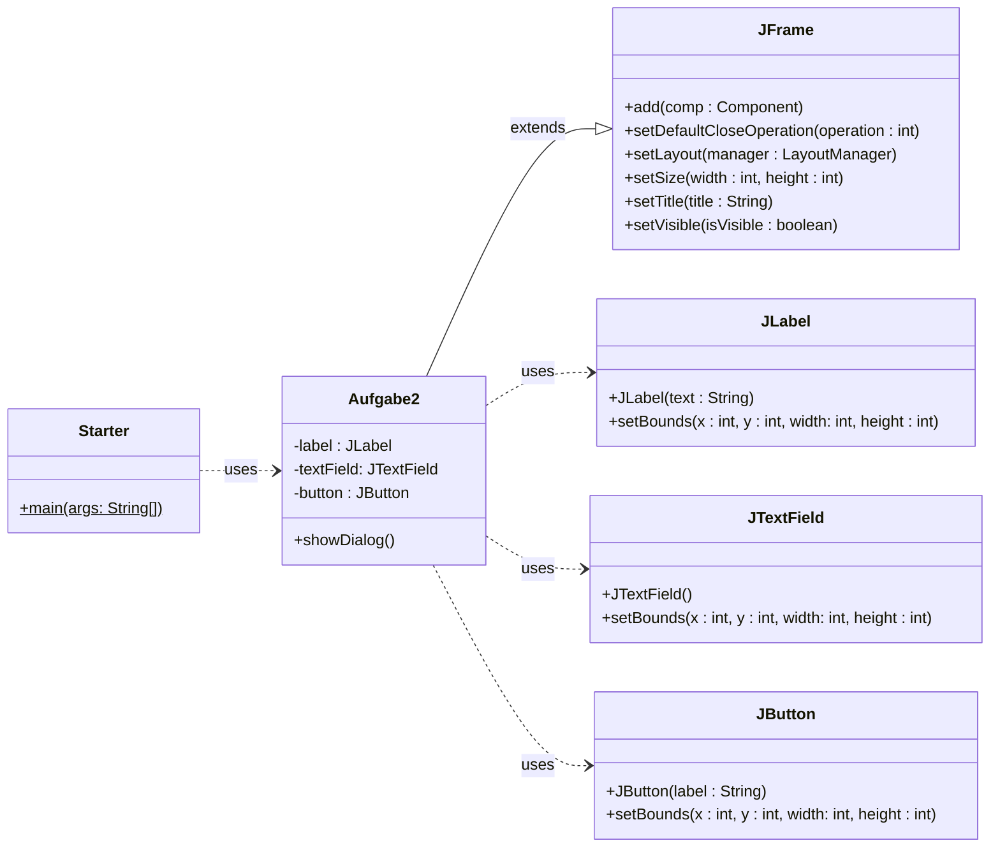
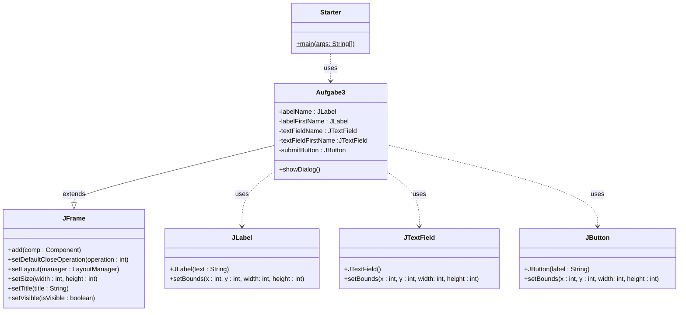

# 3. JFrame Komponenten

Neben JFrame werden hier drei für unser Modul unverzichtbare Komponenten vorgestellt. Der dazu nötige Quelltext wird zwischen die beiden Blöcke der Konfiguration des JFrame geschrieben.

## `JLabel`

> Eine Komponente zur Beschriftung

```java
JLabel label = new JLabel("Beschriftung");

// Wichtige Methoden
label.setBounds(x, y, width, height); // setzt die Koordinaten der Komponente auf dem Fenster
label.setText("Eine neue Beschriftung"); // Setzt einen neuen Text
String text = label.getText(); // gibt den Text des Labels zurück
```

- Der Parameter dient zur Initialisierung eines Textes

### UML



### Wann wird das `JLabel` eingesetzt?

<div class="grid"><div>

- Zur **Beschriftung** von Textfelder
- Zur Ausgabe von berechnetem Text
  - z.B. Bei einer Umwandlung von Einheiten
- Labels sind vom GUI schreibgeschützt

</div><div>


</div></div>

## `JTextField`

> Eine Komponente zur Texteingabe (Alternative zu Scanner)

```java
JTextField textfield = new JTextField();

// Wichtige Methoden
textfield.setBounds(x, y, width, height); // setzt die Koordinaten der Komponente auf dem Fenster
String text = textfield.getText(); // gibt den Text des Textfeldes zurück
textfield.setText("setzt ein Text"); // Setzt einen neuen Text
```

### UML



### Wann wird das `JTextField` eingesetzt?

<div class="grid"><div>

- Zur **Eingabe von Text** durch den Benutzer (z.B. Spielernamen Eingabe)
- Zur Ausgabe von Text (Hierzu eignen sich `JLabel` meistens besser!)

</div><div>


</div></div>

:::tip

Der `Scanner` wird in einer GUI Applikation **nicht mehr verwendet**. Dafür existiert nun das `JTextField`.

:::

## `JButton`

> Eine Komponente zur Benutzerinteraktion

```java
JButton button = new JButton("press me");

// Wichtige Methoden
button.setBounds(x, y, width, height); // setzt die Koordinaten der Komponente auf dem Fenster
button.setText("Neue Beschriftung");
button.setEnabled(true); // aktivieren (true) / deaktivieren (false) vom Button

// Special
button.addActionListener(this); // Wird zu einem späteren Zeitpunkt genauer erläutert!
```

- Ohne `button.addActionListener(this)` und der Methode `actionPerformed(ActionEvent event)` passiert noch nichts wenn man auf den Button drückt. Dies wird später eingeführt.

### UML



### Wann wird der `JButton` eingesetzt?

<div class="grid"><div>

- Zur Aktionsausführung durch den Benutzer
  - (z.B. würfeln, Formular abschicken, usw...)

</div><div>


</div></div>

:::tip

Der Elementare `do/while`-Loop einer Konsolenapplikation wird in einer GUI Applikation nicht mehr benötigt. Hier wird durch Buttons einen **Aktions-Event** erstellt und abgearbeitet. Wenn der Benutzer den Button mehrmals drückt, wird der Aktions-Event auch mehrmals abgearbeitet. **Dies macht den Loop überflüssig!**

:::

## Komponenten in ein Fenster einfügen

Um eine Swing-Komponente in einem Fenster sichtbar zu machen, sind noch **zwei Anweisungen** notwendig. Dafür nehmen wir eine Komponente in der Variable `component` an. Die Variable `component` darf also auch anders heissen! Muss jedoch ein Objekt einer der oben vorgestellten Komponenten beinhalten.

### `component.setBounds(x, y, width, heigth)`

Der Aufruf von `component.setBounds(x, y, width, heigth)` **positioniert die Komponente im Fenster und legt die Grösse fest**:

- In einem Fenster liegt die Koordinate `(0, 0)` oben links
- `component.setBounds(10, 10, 100, 15);` bedeutet somit:
  - 10 Pixel von oben
  - 10 Pixel von links
  - 100 Pixel lang und
  - 15 Pixel hoch.

### `add(component)`

Schliesslich muss die Komponente auch noch wirklich dem Fenster hinzugefügt werden. Der Aufruf dazu lautet `add(component);` wobei `this` ein `JFrame` sein muss:

### ComponentWindow als Beispiel mit JLabel

```java title="ComponentWindow.java"
import javax.swing.JFrame;
import javax.swing.JLabel;

public class ComponentWindow extends JFrame {
  // highlight-next-line
  JLabel label = new JLabel("Ich bin ein Label"); // Hier werden die Komponenten initialisiert

  public void showDialog() { // Beliebiger Name, kann auch, "start" oder nur "show" heissen.
    setLayout(null); // Deaktiviert Layout-Automatismen von Swing

  // highlight-start
    label.setBounds(10, 10, 100, 15); // setzt die Position und Grösse vom Label
    add(label); // fügt das Label ins Fenster ein
  // highlight-end

    setDefaultCloseOperation(EXIT_ON_CLOSE); // Beended beim Schliessen des Fensters ebenfalls den Prozess
    setSize(300, 300); // Bestimmt die grösse des Fensters
    setTitle("Ein Fenster mit Komponenten"); // Setzt den Titel des Fensters
    setVisible(true); // Muss am Ende stehen! Ohne das wird nichts angezeigt!
  }

}
```

:::tip

Komponenten sollte immer als **Instanz-Variablen** initialisiert werden! So hat man von der gesamten Klasse aus darauf Zugriff! Darum wurde hier das `JLabel label = new JLabel("Ich bin ein Label");` **nicht** in der Methode `showDialog()` initialisiert, sondern im Klassen-Body.

:::

## Aufgaben

### Aufgabe 1

> Ein Fenster mit zwei Label

<div class="grid"><div>

- Erstellen Sie ein Swing-Fenster-Programm gemäss der Vorgabe rechts.
- Es sollen zwei Labels angezeigt werden.
- Verwenden Sie das folgende UML zur Hilfe.

</div><div>


</div></div>

#### UML der Musterlösung



#### Musterlösung

<details>
<summary>Immer zuerste selber versuchen! Lösung abtippen, nicht kopieren ;)</summary>

```java
import javax.swing.JFrame;
import javax.swing.JLabel;

public class Aufgabe1 extends JFrame {
  // highlight-start
  JLabel labelA = new JLabel("A");
  JLabel labelB = new JLabel("B");
  // highlight-end

  public void showDialog() {
    setLayout(null);
    // highlight-start

    labelA.setBounds(10, 10, 50, 30);
    add(labelA);
    labelB.setBounds(150, 10, 50, 30);
    add(labelB);

    // highlight-end
    setDefaultCloseOperation(EXIT_ON_CLOSE);
    setSize(300, 300);
    setTitle("Fenster mit A / B Labels");
    setVisible(true);
  }

}
```

</details>

### Aufgabe 2

> ein Fenster mit je einem Label, TextField und Button

<div class="grid"><div>

- Erstellen Sie ein Swing-Fenster-Programm gemäss der Vorgabe rechts.
- Es soll eine Komponente jeder Art auf dem JFrame angezeigt werden, so wie rechts gezeigt.
- Die Befehlsschaltfläche reagiert noch nicht auf Mausklicks.
- Verwenden Sie das folgende UML als Hilfe

</div><div>


</div></div>

#### UML der Musterlösung



#### Musterlösung

<details>
<summary>Immer zuerste selber versuchen! Lösung abtippen, nicht kopieren ;)</summary>

```java
import javax.swing.JButton;
import javax.swing.JFrame;
import javax.swing.JLabel;
import javax.swing.JTextField;

public class Aufgabe2 extends JFrame {
  // highlight-start
  JLabel label = new JLabel("A");
  JTextField textField = new JTextField();
  JButton button = new JButton("press me");
  // highlight-end

  public void showDialog() {
    setLayout(null);
    // highlight-start

    label.setBounds(10, 10, 100, 30);
    add(label);
    textField.setBounds(10, 60, 100, 30);
    add(textField);
    button.setBounds(10, 110, 100, 30);
    add(button);

    // highlight-end
    setDefaultCloseOperation(EXIT_ON_CLOSE);
    setSize(300, 300);
    setTitle("Fenster mit allen Komponenten");
    setVisible(true);
  }
}
```

</details>

### Aufgabe 3 (Optional)

> Beschriftete Textfelder

<div class="grid"><div>

Programmieren Sie das Fenster auf der rechten Seite. Es enthält links zwei JLabel, rechts zwei JTextField, unterhalb ein JButton. Der JButton reagiert noch nicht auf Mausklicks.

</div><div>


</div></div>

#### UML der Musterlösung



#### Musterlösung

<details>
<summary>Immer zuerste selber versuchen! Lösung abtippen, nicht kopieren ;)</summary>

```java
import javax.swing.JButton;
import javax.swing.JFrame;
import javax.swing.JLabel;
import javax.swing.JTextField;

public class Aufgabe3 extends JFrame {
  // highlight-start
  private JLabel labelName = new JLabel("Name");
  private JLabel labelFirstName = new JLabel("Vorname");
  private JTextField textFieldName = new JTextField();
  private JTextField textFieldFirstName = new JTextField();
  private JButton submitButton = new JButton("submit");
  // highlight-end

  public void showDialog() {
    setLayout(null);
    // highlight-start

    labelName.setBounds(10, 10, 100, 20);
    textFieldName.setBounds(120, 10, 150, 20);
    labelFirstName.setBounds(10, 40, 100, 20);
    textFieldFirstName.setBounds(120, 40, 150, 20);
    submitButton.setBounds(120, 70, 100, 30);

    add(labelName);
    add(textFieldName);
    add(labelFirstName);
    add(textFieldFirstName);
    add(submitButton);

    // highlight-end
    setDefaultCloseOperation(EXIT_ON_CLOSE);
    setSize(300, 300);
    setTitle("Fenster mit beschrifteten Textfelder");
    setVisible(true);
  }
}
```

</details>
