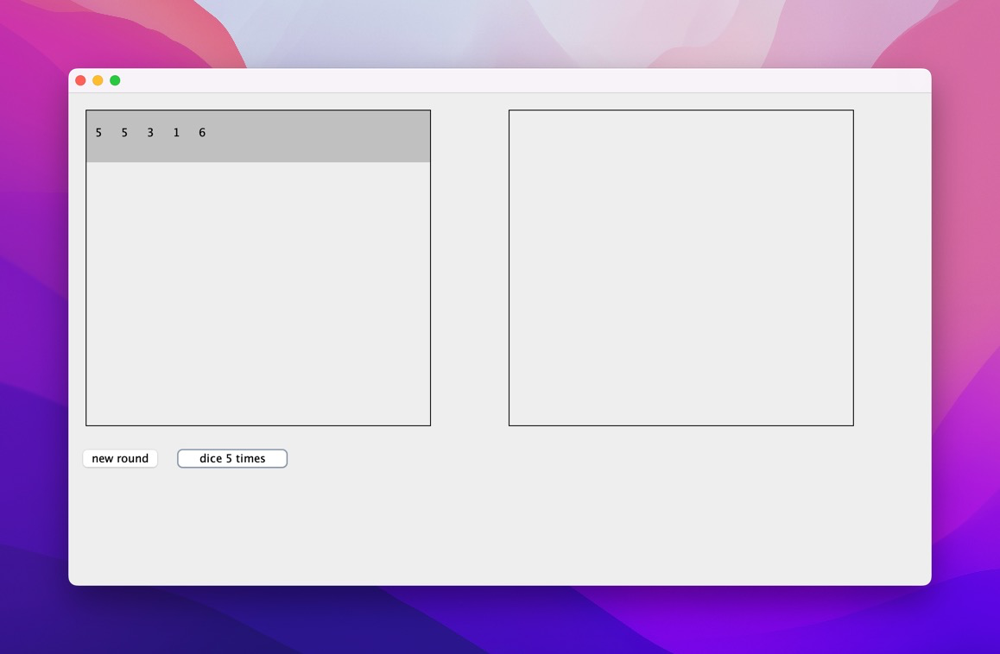

# 10. PlayerPanel

Hier gibt es nun noch ein JPanel Beispiel welches es durch folgende Mehtoden ermöglicht von aussen die neue Runden zu erstellen und auch die Würfelwerte der aktuellen Runde zu setzen. 

- `playerPanel.startNewRound()`
- `playerPanel.setDiceValue(index, value)`

So ist es möglich für zwei Spieler <u>je eine eigene Instanz</u> der gleichen Klasse `PlayerPanel` zu erstellen. So können nun die Runden und Punke dargestellt werden.



```java title="Starter.java"
public class Starter {

  public static void main(String[] args) {
    new GameGui();
  }

}
```

```java title="GameGui.java"
import java.awt.event.ActionEvent;
import java.awt.event.ActionListener;

import javax.swing.JButton;
import javax.swing.JFrame;

public class GameGui extends JFrame implements ActionListener {
	
	private PlayerPanel player1Panel = new PlayerPanel();
	private PlayerPanel player2Panel = new PlayerPanel();
	
	private JButton newRoundButton = new JButton("new round");
	private JButton diceButton = new JButton("dice 5 times");

	public GameGui() {
		this.setLayout(null); // fixe Positionierungen
		
		player1Panel.setBounds(10, 10, 450, 400);
		this.add(player1Panel);
		
		player2Panel.setBounds(500, 10, 450, 400);
		this.add(player2Panel);
		
		newRoundButton.setBounds(10, 410, 100, 30);
		this.add(newRoundButton);
		this.newRoundButton.addActionListener(this);

		diceButton.setBounds(120, 410, 140, 30);
		this.add(diceButton);
		this.diceButton.addActionListener(this);
		
		this.setSize(1000, 600);
		this.setDefaultCloseOperation(EXIT_ON_CLOSE);
		this.setVisible(true);
	}

	@Override
	public void actionPerformed(ActionEvent e) {
		if (e.getSource() == this.newRoundButton) {
			// hier wird nur ein Spieler beachtet
			// natürlich sollte das Spiel mit 2 Spieler gehen
			this.player1Panel.startNewRound();
		} else if (e.getSource() == this.diceButton) {
			// 5 mal würfeln hintereinander,
			// Natürlich muss dass dan schritt für schritt passieren 
			// und auch abgebrochen werden können
			for (int i = 0; i < 5; i++) {
				int rand = (int) (Math.random() * 6 + 1);
				this.player1Panel.setDiceValue(i, rand);
			}
		}
	}
	
}
```

```java title="PlayerPanel.java"
import java.awt.Color;

import javax.swing.BorderFactory;
import javax.swing.JPanel;

public class PlayerPanel extends JPanel {

	private JPanel parentPanel = new JPanel();
	private RoundPanel currentRoundPanel;
	private int y = 1; // Vertikale verschiebung der Panels

	public PlayerPanel() {
		this.setLayout(null); // fixe Positionierungen
		parentPanel.setLayout(null);
		parentPanel.setBorder(BorderFactory.createLineBorder(Color.black));
		parentPanel.setBounds(10, 10, 400, 367);
		this.add(parentPanel);

		this.setSize(450, 450);
		this.setVisible(true);
	}

	public void setDiceValue(int index, int value) {
		if (this.currentRoundPanel == null) {
			return; // Schützt vor nullpointer!
		}
		this.currentRoundPanel.setLabelText(index, "" + value);
	}

	public void startNewRound() {
		// `this.` darf auch weggelassen werden
		this.currentRoundPanel = new RoundPanel(); // neues Panel Objekt pro Runde
		this.currentRoundPanel.setBounds(1, y, 398, 60);
		this.y += 61; // y-Position des nächsten Runden Panels
		this.parentPanel.add(currentRoundPanel); // zum scrollbaren Panel hinzufügen
		this.repaint(); // Alles neu zeichnen
	}
}
```

```java title="RoundPanel.java"
import java.awt.Color;

import javax.swing.JLabel;
import javax.swing.JPanel;

public class RoundPanel extends JPanel {

	private JLabel[] labels = new JLabel[5];

	public RoundPanel() {
		this.setLayout(null);

		for (int i = 0; i < labels.length; i++) {
			labels[i] = new JLabel();
			labels[i].setBounds(10 + (i * 30), 10, 30, 30);
			add(labels[i]);
		}

		this.setBackground(Color.LIGHT_GRAY);
	}

	public void setLabelText(int index, String value) {
		labels[index].setText(value);
	}

}
```

## Aufgabe

- Schreiben Sie den oben bestehenden Code ab, sodass das Bild oben reproduzierbar ist.
- Dies darf als Grundlage fürs Projekt genommen werden!
- Lesen Sie den [Projektbeschrieb](../beurteilungen/lb2.md) gut durch und ergänzen Sie das Spiel.
- Schauen Sie dass die Logik in einer eigenen Klasse geschrieben wird!
