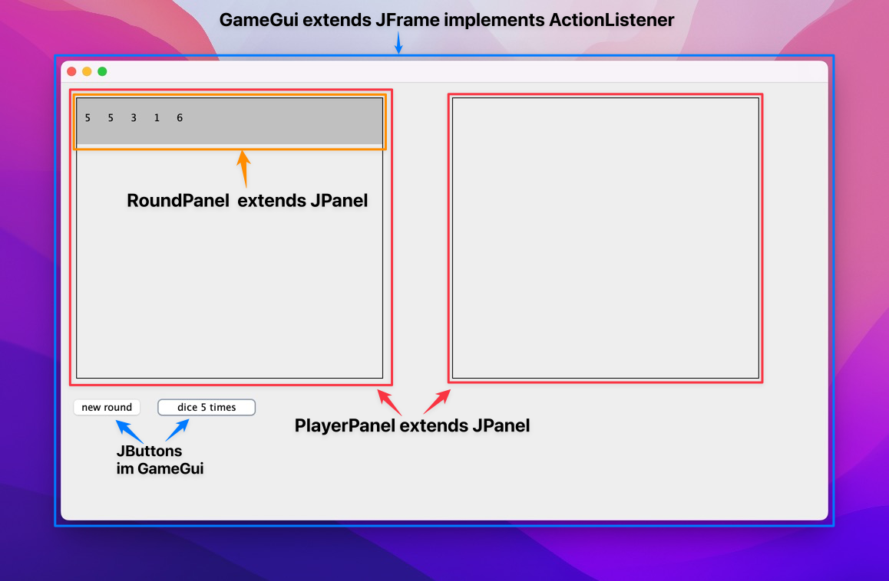
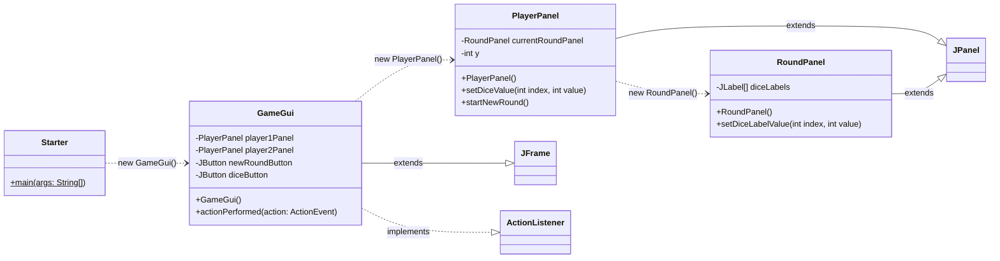

# 10. PlayerPanel

Hier gibt es nun noch ein JPanel Beispiel welches es durch folgende Methoden ermöglicht von aussen die neue Runden zu erstellen und auch die Würfelwerte der aktuellen Runde zu setzen. 

- `playerPanel.startNewRound()`
- `playerPanel.setDiceValue(index, value)`

So ist es möglich für zwei Spieler <u>je eine eigene Instanz</u> der gleichen Klasse `PlayerPanel` zu erstellen. Dies ermöglicht die Darstellung der Runden und den Punkteverlauf.

:::tip `JPanel` wie `<div></div>` in HTML

- Ein `JPanel` ist ein Container, der Swing Componenten Gruppieren kann. 
- `JPanel`'s können beliebig geschachtelt werden.
- Sie entsprechen damit dem `<div></div>` Tag in HTML.

:::

## Darstellung



## UML



## Java Code

```java title="Starter.java"
public class Starter {

  public static void main(String[] args) {
    new GameGui();
  }

}
```

```java title="GameGui.java"
import java.awt.event.ActionEvent;
import java.awt.event.ActionListener;

import javax.swing.JButton;
import javax.swing.JFrame;

/**
 * Das GameGui ist die Hauptklasse. Sie zeichnet das Spiel-Fenseter.
 * 
 * Es werden zwei `PlayerPanel`'s erstellt. Momentan wird nur das PlayerPanel
 * vom Spieler 1 aktiv verwendet! Auch werden immer automatisch 5 Würfe gemacht.
 * Versuchen Sie nun darauf aufbauend das GUI zu erweitern und auch die
 * Spiellogik zu erstellen.
 */
public class GameGui extends JFrame implements ActionListener {

	private PlayerPanel player1Panel = new PlayerPanel();
	private PlayerPanel player2Panel = new PlayerPanel();

	private JButton newRoundButton = new JButton("new round");
	private JButton diceButton = new JButton("dice 5 times");

	public GameGui() {
		this.setLayout(null);

		player1Panel.setBounds(10, 10, 350, 367);
		this.add(player1Panel);

		player2Panel.setBounds(400, 10, 350, 367);
		this.add(player2Panel);

		newRoundButton.setBounds(10, 410, 100, 30);
		this.add(newRoundButton);
		this.newRoundButton.addActionListener(this);

		diceButton.setBounds(120, 410, 140, 30);
		this.add(diceButton);
		this.diceButton.addActionListener(this);

		this.setSize(800, 550);
		this.setDefaultCloseOperation(EXIT_ON_CLOSE);
		this.setVisible(true);
	}

	@Override
	public void actionPerformed(ActionEvent e) {
		if (e.getSource() == this.newRoundButton) {
			// hier wird nur ein Spieler beachtet
			// natürlich sollte das Spiel mit 2 Spieler gehen
			this.player1Panel.startNewRound();
		} else if (e.getSource() == this.diceButton) {
			// 5 mal würfeln hintereinander,
			// Natürlich muss dass dan schritt für schritt passieren
			// und auch abgebrochen werden können
			for (int i = 0; i < 5; i++) {
				int rand = (int) (Math.random() * 6 + 1);
				this.player1Panel.setDiceValue(i, rand);
			}
		}
	}

}
```

```java title="PlayerPanel.java"
import java.awt.Color;

import javax.swing.BorderFactory;
import javax.swing.JPanel;

/**
 * PlayerPanel koordiniert und zeichnet RoundPanel's für einen Spieler. Die
 * Klasse dient nur zur Darstellung und beinhaltet keine Spiellogik.
 */
public class PlayerPanel extends JPanel {

	// private JPanel parentPanel = new JPanel();
	private RoundPanel currentRoundPanel;
	private int y = 1; // Vertikale verschiebung der Panels

	public PlayerPanel() {
		this.setLayout(null);
		this.setBorder(BorderFactory.createLineBorder(Color.black));
		this.setVisible(true);
	}

	/**
	 * Ermöglicht das Setzen eines Würfelwertes. Delegiert an das RoundPanel der
	 * aktiven Runde.
	 *
	 * @param index - Der index vom Wurf, startet bei 0
	 * @param value - Der Wert vom Wurf als int (1-6)
	 */
	public void setDiceValue(int index, int value) {
		if (this.currentRoundPanel == null) {
			return; // Schützt vor NullPointer!
		}
		// Hier werden die Werte delegiert, also weitergereicht
		this.currentRoundPanel.setDiceLabelValue(index, value);
	}


	/**
	 * Startet eine neue Runde. Erstellt ein neues RoundPanel und speichert es als
	 * aktives RoundPanel in der Instanz-Variable "currentRoundPanel". Sobald eine
	 * neue Runde gestartet wurde, kann auf die vorherigen Runden nicht mehr
	 * zugegriffen werden!
	 */
	public void startNewRound() {
		this.currentRoundPanel = new RoundPanel(); // neues Panel Objekt pro Runde
		// mit `this.getBounds().width` wird garantiert, dass das RoundPanel
		// gleich breit ist wie das PlayerPanel.
		this.currentRoundPanel.setBounds(1, y, this.getBounds().width - 2, 60);
		this.y += 61; // y-Position des nächsten Runden Panels
		this.add(currentRoundPanel); // zum parentPanel hinzufügen
		this.repaint(); // Alles neu zeichnen
	}
}
```

```java title="RoundPanel.java"
import java.awt.Color;

import javax.swing.JLabel;
import javax.swing.JPanel;

/**
 * Das RoundPanel dient dazu die fünf Würfe einer Runde nebeneinander
 * darzustellen. Die Werte der Würfe können durch die Methode
 * `setDiceLabelValue` gesetzt werden.
 */
public class RoundPanel extends JPanel {

	// Ein Array für 5 Würfe!
	private JLabel[] diceLabels = new JLabel[5];

	// Könnte man hier noch Ergänzungen machen um auch das Total und die Rundensumme
	// darzustellen? Es fehlt auch noch die Rundennummer.

	public RoundPanel() {
		this.setLayout(null);

		for (int i = 0; i < diceLabels.length; i++) {
			diceLabels[i] = new JLabel();
			diceLabels[i].setBounds(10 + (i * 30), 10, 30, 30);
			add(diceLabels[i]);
		}

		this.setBackground(Color.LIGHT_GRAY);
	}

	/**
	 * Ermöglicht das Setzen eines Würfelwertes
	 * 
	 * @param index - Der index vom Wurf startet bei 0
	 * @param value - Der Wert vom Wurf als int
	 **/
	public void setDiceLabelValue(int index, int value) {
		diceLabels[index].setText("" + value);
	}

}
```

## Aufgabe

- Schreiben Sie den oben bestehenden Code ab, sodass das Bild oben reproduzierbar ist.
- Dies darf als Grundlage fürs Projekt genommen werden!
- Lesen Sie den [Projektbeschrieb](../beurteilungen/lb2.md) gut durch und ergänzen Sie das Spiel.
- Schauen Sie dass die Logik in einer eigenen Klasse geschrieben wird!
