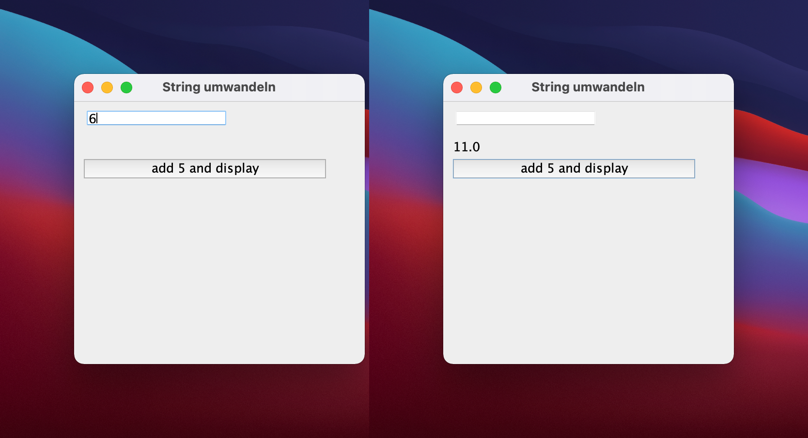

# 7. Strings in Zahlen umwandeln

Das nachfolgende Programm zeigt ein Swing-Programm, bei dem eine Zahl eingelesen wird, damit eine einfache Rechnung angestellt und das Ergebnis wieder ausgegeben wird.

## Beispiel: Umwandeln und 5 hinzufügen



```java title="CastingExample.java"
public class CastingExample extends JFrame implements ActionListener {
  JButton commandButton = new JButton("add 5 and display");
  JLabel outputLabel = new JLabel();
  JTextField entryField = new JTextField();

  public void showDialog() {
    setLayout(null);
    entryField.setBounds(10,10,150,15);
    outputLabel.setBounds(10,40,150,15);
    commandButton.setBounds(10, 60, 250, 20);
    add(entryField);
    add(outputLabel);
    add(commandButton);
    // highlight-next-line
    commandButton.addActionListener(this);
    setDefaultCloseOperation(EXIT_ON_CLOSE);
    setSize(300,300);
    setTitle("String umwandeln");
    setVisible(true);
  }

  @Override
  public void actionPerformed(ActionEvent e) {
    // Damit mit der Eingabe gerechnet werden kann, muss der String
    // in einen double umgerechnet werden. Dies geht mit `Double.parseDouble(String string)`
    // highlight-next-line
    double number = Double.parseDouble(entryField.getText()); // String -> doubel
    number = number + 5; // double wird mathematisch mutiert
    // Nach der Rechnung muss der double wieder in einen String umgewandelt werden
    // highlight-next-line
    outputLabel.setText("" + number); // double -> String
    entryField.setText("");
  }
}
```

### Erläuterung zum Code:

- Neu ist hier `Double.parseDouble(String string)`, welches demnach einen String als Parameter entgegen nimmt. Diese Methode verwandelt den String, welcher durch `entryField.getText()` zurück gegeben wird in eine Zahl vom Typ `double`, mit der dann gerechnet wird. Anschliessend wird das Resultat im outputLabel ausgegeben.
- Da das `outputLabel` aber einen String-Wert erwartet, wird der Datentyp durch die Methode `Double.toString(double value)` in einen String umgewandelt. 


:::tip
Solche Methoden gibt es nicht nur für den Datentyp `double`, sondern auch für `foat` und `int`. Da heissen die Methoden dann entsprechend `Float.parseFloat(String value)` und `Integer.parseInt(String value)`.

- :bulb: Nach `String` kann **jeder Datentyp** mit `"" + variable` umgewandelt werden! :bulb:
:::

## Aufgabe

- Erweitern Sie das Programm mit einem weiteren Textfeld `entryField2`
- Benennen Sie den Button nach "Sum" um
- Bei einem Klick auf den Button "Sum" sollen die Eingaben vom `entryField` und `entryField2` aufsummiert werden und im `outputLabel` ausgegeben werden.

:::note
zu dieser Aufgabe gibt es keine Musterlösung
:::
