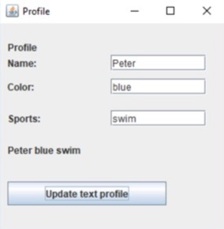
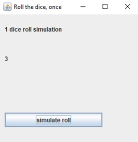
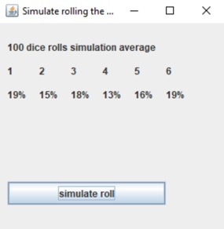
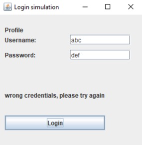
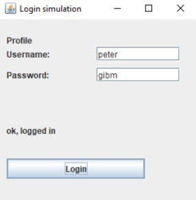
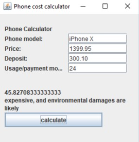

# Zusatzaufgaben

## Zusatzufgabe 1 - einfach

Dieser Auftrag besteht darin, einfache Eingaben für ein Benutzer-Profil zu erstellen und dann diese Eingaben als eine zusammengefasste Profil-Beschreibung anzuzeigen.

<div class="grid"><div>

- Erstellen Sie ein GUI, in welchem man ein einfaches Profil, mit Namen, bevorzugter Farbe und Sportart eintragen kann. 
- Erstellen Sie eine **Fachklasse** `Profil` für die Logik
    - Darin sollen die im GUI eingegebenen Daten gespeichert und verarbeitet werden.
- Nach Click auf einen Button wird das **kombinierte Profil** in einem `JLabel` angezeigt.

</div><div>



</div></div>

<details><summary>Musterlösung:</summary>

```java title="Profile.java"
public class Profile {
    private String name = "";
    private String favoriteColor = "";
    private String favoriteSports = "";

    public void setName(String name) {
        this.name = name;
    }

    public void setFavoriteColor(String favoriteColor) {
        this.favoriteColor = favoriteColor;
    }

    public void setFavoriteSports(String favoriteSports) {
        this.favoriteSports = favoriteSports;
    }

    public String getProfileDescription() {
        return name + " " + favoriteColor + " " + favoriteSports;
    }
}
```

```java title="ProfileGUI.java"
import java.awt.event.ActionEvent;
import java.awt.event.ActionListener;

import javax.swing.JButton;
import javax.swing.JFrame;
import javax.swing.JLabel;
import javax.swing.JTextField;

public class ProfileGUI extends JFrame implements ActionListener {
	JLabel titleLabel = new JLabel("Profile");
	JLabel nameLabel = new JLabel("Name:");
	JTextField nameField = new JTextField();
	JLabel favColorLabel = new JLabel("Color:");
	JTextField favColorField = new JTextField();
	JLabel favSportsLabel = new JLabel("Sports:");
	JTextField favSportsField = new JTextField();
	JLabel descriptionLabel = new JLabel();
	JButton profileButton = new JButton("Update text profile");
	Profile profile = new Profile();

	public void showDialog() {
		setLayout(null);
		titleLabel.setBounds(10, 20, 200, 20);
		int labelWith = 120;
		int fieldIndentation = 140;
		int line1 = 40;
		nameLabel.setBounds(10, line1, labelWith, 20);
		nameField.setBounds(fieldIndentation, line1, labelWith, 20);
		int line2 = 70;
		favColorLabel.setBounds(10, line2, labelWith, 20);
		favColorField.setBounds(fieldIndentation, line2, labelWith, 20);
		int line3 = 110;
		favSportsLabel.setBounds(10, line3, labelWith, 20);
		favSportsField.setBounds(fieldIndentation, line3, labelWith, 20);
		descriptionLabel.setBounds(10, 150, 250, 20);
		profileButton.setBounds(10, 200, 200, 30);
		add(titleLabel);
		add(nameLabel);
		add(nameField);
		add(favColorLabel);
		add(favColorField);
		add(favSportsLabel);
		add(favSportsField);
		add(descriptionLabel);
		add(profileButton);
		profileButton.addActionListener(this);
		setDefaultCloseOperation(EXIT_ON_CLOSE);
		setSize(300, 300);
		setTitle("Profile");
		setVisible(true);
	}

	public void actionPerformed(ActionEvent arg0) {
		profile.setName(nameField.getText());
		profile.setFavoriteColor(favColorField.getText());
		profile.setFavoriteSports(favSportsField.getText());
		descriptionLabel.setText(profile.getProfileDescription());
	}
}
```

```java title="ProfileGUIStarter.java"
public class ProfileGUIStarter {

	public static void main(String[] args) {
		ProfileGUI gui = new ProfileGUI();
		gui.showDialog();
	}

}
```

</details>


<!-- Durch SOL
### Punkte

- 1 Punkt, wenn Name, Color, Sports direkt in der actionPerformed-Methode kombiniert werden.
- 2 Punkte, wenn Name, Color, Sports erst in der zur Verfügung gestellten Fachklasse Profile gespeichert werden, und dann von dort als eine `profileDescription` abgerufen werden.
- 3 Punkte, wenn Sie die Fachklasse Profile selbst programmiert haben.
-->

## Zusatzaufgabe 2 - mittel

Dieser Auftrag besteht in zwei Varianten: 

- a) das Programm simuliert ein einmaliges würfeln, indem eine der Augenzahlen 1 bis 6 entsprechende Zahl zufällig erzeugt wird.
- b) es werden 100 Würfeldurchgänge simuliert und die zufällige Verteilung angezeigt.

:::note Wie erzeugt man am Computer eine zufällig gewürfelte Augenzahl?

```java
return (int) (Math.random() * 6) + 1;
```

:::

### Variante 1

<div class="grid"><div>

1. einmal würfeln
2. Das GUI zeigt bei Click auf den Button jeweils eine neue zufällige Zahl an.

</div><div>



</div></div>

<!--
Punkte:
- 2 Punkte, wenn Fachklasse fertig übernommen,
- 3 Punkte, wenn auch Fachklasse selbst programmiert,
-->

<details><summary>Musterlösung:</summary>

```java title="Dice.java"
public class Dice {
    // kann static sein, da keine Instanz-Variablen verwendet werden
    public static int roll() {
        return (int) (Math.random() * 6) + 1;
    }

    // nur zum testen von sich selbst
    public static void main(String[] args) {
        System.out.println(Dice.roll());
    }
}
```

```java title="DiceGUI.java"
import java.awt.event.ActionEvent;
import java.awt.event.ActionListener;

import javax.swing.JButton;
import javax.swing.JFrame;
import javax.swing.JLabel;

public class DiceGUI extends JFrame implements ActionListener {
	JLabel titleLabel = new JLabel("1 dice roll simulation");
	JLabel oneLabel = new JLabel();
	JButton rollButton = new JButton("simulate roll");
	Dice dice = new Dice();

	public void showDialog() {
		setLayout(null);
		titleLabel.setBounds(10, 20, 200, 20);
		oneLabel.setBounds(10, 80, 30, 20);
		rollButton.setBounds(10, 200, 200, 30);
		add(titleLabel);
		add(oneLabel);
		add(rollButton);
		rollButton.addActionListener(this);
		setDefaultCloseOperation(EXIT_ON_CLOSE);
		setSize(300, 300);
		setTitle("");
		setVisible(true);
	}

	public void actionPerformed(ActionEvent arg0) {
		oneLabel.setText(Integer.toString(dice.roll()));
	}
}
```


```java title="DiceGUIStarter.java"
public class DiceGUIStarter {

	public static void main(String[] args) {
		DiceGUI gui = new DiceGUI();
		gui.showDialog();
	}

}
```

</details>

### Variante 2

<div class="grid"><div>

1. hundert Mal würfeln
2. Das GUI zeigt bei Click auf den Button jeweils die Zufallsverteilung der in diesem Durchgang gewürfelten Zahlen an.

</div><div>



</div></div>

<details><summary>Musterlösung:</summary>

```java title="MultiDice.java"
public class MultiDice {

	public static int[] rollTimes(int times) {
		int[] counts = { 0, 0, 0, 0, 0, 0 }; // pro Zahl eine Stelle
		for (int i = 0; i < times; i++) {
			int randomNumber = rollOnce(); // würfeln
			counts[randomNumber - 1]++; // index startet bei 0 daher -1
			// counts[rollOnce() - 1]++; // das würde auch gehen
		}
		return counts; // gibt Array zurück mit allen Zahlen
	}

	public static int rollOnce() {
		return (int) (Math.random() * (6 - 1 + 1)) + 1;
	}

	// nur zum testen von sich selbst
	public static void main(String[] args) {
        // hier könnte man auch 217 mal würfeln
        // dann müsste man die % Angaben aber auch normalisieren!
		int[] counts = MultiDice.rollTimes(100); 
		for (int i = 0; i < counts.length; i++) {
			System.out.println((i + 1) + ": " + counts[i] + "%");
		}
	}

}
```

```java title="MultiDiceGUI.java"
import java.awt.event.ActionEvent;
import java.awt.event.ActionListener;

import javax.swing.JButton;
import javax.swing.JFrame;
import javax.swing.JLabel;

public class MultiDiceGUI extends JFrame implements ActionListener {
	JLabel titleLabel = new JLabel("100 dice rolls simulation average");
	JLabel oneLabel = new JLabel();
	JLabel twoLabel = new JLabel();
	JLabel threeLabel = new JLabel();
	JLabel fourLabel = new JLabel();

	JLabel fiveLabel = new JLabel();
	JLabel sixLabel = new JLabel();
	JLabel oneTitleLabel = new JLabel("1");
	JLabel twoTitleLabel = new JLabel("2");
	JLabel threeTitleLabel = new JLabel("3");
	JLabel fourTitleLabel = new JLabel("4");
	JLabel fiveTitleLabel = new JLabel("5");
	JLabel sixTitleLabel = new JLabel("6");
	JButton rollButton = new JButton("simulate roll");
	MultiDice dicer = new MultiDice();

	public void showDialog() {
		setLayout(null);
		titleLabel.setBounds(10, 20, 200, 20);
		int line2 = 50;
		oneTitleLabel.setBounds(10, line2, 30, 20);
		twoTitleLabel.setBounds(50, line2, 30, 20);
		threeTitleLabel.setBounds(90, line2, 30, 20);
		fourTitleLabel.setBounds(130, line2, 30, 20);
		fiveTitleLabel.setBounds(170, line2, 30, 20);
		sixTitleLabel.setBounds(210, line2, 30, 20);
		int line3 = 80;
		oneLabel.setBounds(10, line3, 30, 20);
		twoLabel.setBounds(50, line3, 30, 20);
		threeLabel.setBounds(90, line3, 30, 20);
		fourLabel.setBounds(130, line3, 30, 20);
		fiveLabel.setBounds(170, line3, 30, 20);
		sixLabel.setBounds(210, line3, 30, 20);
		rollButton.setBounds(10, 200, 200, 30);
		add(oneTitleLabel);
		add(twoTitleLabel);
		add(threeTitleLabel);
		add(fourTitleLabel);
		add(fiveTitleLabel);
		add(sixTitleLabel);
		add(titleLabel);
		add(oneLabel);
		add(twoLabel);
		add(threeLabel);
		add(fourLabel);
		add(fiveLabel);
		add(sixLabel);
		add(rollButton);

		rollButton.addActionListener(this);
		setDefaultCloseOperation(EXIT_ON_CLOSE);
		setSize(300, 300);
		setTitle("");
		setVisible(true);
	}

	public void actionPerformed(ActionEvent arg0) {
		int[] counts = MultiDice.rollTimes(100); 
		oneLabel.setText(counts[0] + "%");
		twoLabel.setText(counts[1] + "%");
		threeLabel.setText(counts[2] + "%");
		fourLabel.setText(counts[3] + "%");
		fiveLabel.setText(counts[4] + "%");
		sixLabel.setText(counts[5] + "%");
	}
}
```

```java title="MultiDiceGUIStarter.java"
public class MultiDiceGUIStarter {

	public static void main(String[] args) {
		MultiDiceGUI gui = new MultiDiceGUI();
		gui.showDialog();
	}

}
```

</details>

<!--
Punkte:
- 3 Punkte, wenn Fachklasse fertig übernommen,
- 4 Punkte, wenn Fachklasse selbst programmiert,
-->

## Zusatzaufgabe 3 - einfach

<div class="grid"><div>

Dieser Auftrag besteht darin ein GUI zu entwickeln, welches einen Login-Dialog simuliert. 

Dabei werden feste Werte erwartet:
- Benutzer: *"peter"*
- Passwort: *"gibm"*

Es wird ausgegeben, ob der Login erfolgreich war:
- werden die falschen Anmeldeinformationen eingegeben, erscheint eine entsprechende Fehlermeldung. 
- Sind die Angaben jedoch korrekt, wird eine Bestätigung angezeigt, dass man nun eingeloggt ist.

</div><div>





</div></div>

<details><summary>Musterlösung:</summary>

```java title="Login.java"
public class Login {

	// ACHTUNG! NIE Passwörter in Klartext im Code haben. Dies hier ist nur zur Übung.
	//          Passwörter werden üblicherweise als HASH gespeichert
	//          - https://de.wikipedia.org/wiki/Kryptographische_Hashfunktion
	private String userNameAnswer = "bitte-setzte-mich-via-konstruktor";
	private String passwordAnswer = "bitte-setzte-mich-via-konstruktor";
	private String userName = "";
	private String password = "";

	public Login(String userNameAnswer, String passwordAnswer) {
		this.userNameAnswer = userNameAnswer;
		this.passwordAnswer = passwordAnswer;
	}

	public void setPassword(String password) {
		this.password = password;
	}

	public void setUserName(String userName) {
		this.userName = userName;
	}

	public String getLoginStateText() {
		if (this.isSuccessfull()) {
			return "ok, logged in";
		}
		return "wrong credentials, please try again";
	}

	private boolean isSuccessfull() {
		return this.password.equals(this.passwordAnswer) 
            && this.userName.equals(this.userNameAnswer);
	}

	// nur zum testen von sich selbst
	public static void main(String[] args) {
		Login login = new Login("peter", "gibm");
		login.setUserName("peter");
		login.setPassword("nicht-korrektes-password");
		System.out.println(login.getLoginStateText());
		login.setPassword("gibm");
		System.out.println(login.getLoginStateText());
	}
}
```

```java title="LoginGUI.java"
import java.awt.event.ActionEvent;
import java.awt.event.ActionListener;

import javax.swing.JButton;
import javax.swing.JFrame;
import javax.swing.JLabel;
import javax.swing.JTextField;

public class LoginGUI extends JFrame implements ActionListener {
	JLabel titleLabel = new JLabel("Profile");
	JLabel nameLabel = new JLabel("Username:");
	JTextField nameField = new JTextField();
	JLabel passwordLabel = new JLabel("Password:");
	JTextField passwordField = new JTextField();
	JLabel loginInfoLabel = new JLabel();
	JButton loginButton = new JButton("Login");
	Login login = new Login("peter", "gibm");

	public void showDialog() {
		setLayout(null);
		titleLabel.setBounds(10, 20, 200, 20);
		int labelWith = 120;
		int fieldIndentation = 140;
		int line1 = 40;
		nameLabel.setBounds(10, line1, labelWith, 20);
		nameField.setBounds(fieldIndentation, line1, labelWith, 20);
		int line2 = 70;
		passwordLabel.setBounds(10, line2, labelWith, 20);
		passwordField.setBounds(fieldIndentation, line2, labelWith, 20);
		loginInfoLabel.setBounds(10, 150, 250, 20);
		loginButton.setBounds(10, 200, 200, 30);
		add(titleLabel);
		add(nameLabel);
		add(nameField);
		add(passwordLabel);
		add(passwordField);
		add(loginInfoLabel);
		add(loginButton);
		loginButton.addActionListener(this);
		setDefaultCloseOperation(EXIT_ON_CLOSE);
		setSize(300, 300);
		setTitle("Login simulation");
		setVisible(true);
	}

	public void actionPerformed(ActionEvent arg0) {
		login.setUserName(nameField.getText());
		login.setPassword(passwordField.getText());
		loginInfoLabel.setText(login.getLoginStateText());
	}
}
```

```java title="LoginStarter.java"
public class LoginStarter {
	
	public static void main(String[] args) {
		LoginGUI gui = new LoginGUI();
		gui.showDialog();
	}
	
}
```

</details>

<!--
Punkte:
- 1 Punkt, wenn Fachklasse fertig übernommen,
- 2 Punkte, wenn auch Fachklasse selbst
programmiert,
-->

## Zusatzaufgabe 4 - anspruchsvoll

<div class="grid"><div>

Dieser Auftrag besteht darin ein GUI zu entwickeln, in welchem die **monatlichen Gerätekosten bei einer bestimmten Anzahl Monate berechnet werden**.

Wenn alle Angaben vorhanden sind, erscheint bei **einem Klick auf "calculate"** wieviel jeden Monat für die Abzahlung bezahlt werden muss.

- *Optional* kann **zusätzlich ein Ökologie-Faktor** anhand der Abzahldauer berechnet werden, wobei angenommen wird, dass die Nutzungsdauer nicht länger als die Abzahldauer ist.
- *Optional* kann die Anwendung so erweitert werden, dass **zwei Telefone oder Laufzeiten** nebeneinander verglichen werden können.

</div><div>



</div></div>

<details><summary>Musterlösung:</summary>

```java title="PhoneCalculator.java"
public class PhoneCalculator {
	private String model;
	private double price;
	private double deposit;
	private int months;

	public void setModel(String model) {
		this.model = model;
	}

	public String getModel() {
		return this.model;
	}

	public void setPrice(double price) {
		this.price = price;
	}

	public double getPrice() {
		return this.price;
	}

	public void setDeposit(double deposit) {
		this.deposit = deposit;
	}

	public double getDeposit() {
		return this.deposit;
	}

	public void setMonths(int months) {
		this.months = months;
	}

	public int getMonths() {
		return this.months;
	}

	public double calculateMonthlyCosts() {
		return (price - deposit) / months;
	}

	public String calculateEcologicFootprint() {
		if (months < 13) {
			return "expensive, and strong environmental damages are likely";
		} else if (months >= 14 && months <= 24) {
			return "expensive, and environmental damages are likely";
		} 
		return "less environmental damages due to longer usage period";
	}
	
    // nur zum testen von sich selbst
	public static void main(String[] args) {
		PhoneCalculator calculator = new PhoneCalculator();
        calculator.setModel("iPhone X");
        calculator.setPrice(1399.95d);
        calculator.setDeposit(300.10d);
        calculator.setMonths(24);

        System.out.println("Costs: " + calculator.calculateMonthlyCosts());
        System.out.println("Environment: " + calculator.calculateEcologicFootprint());
	}
}

```

```java title="PhoneCalculatorGUI.java"
import java.awt.event.ActionEvent;
import java.awt.event.ActionListener;

import javax.swing.JButton;
import javax.swing.JFrame;
import javax.swing.JLabel;
import javax.swing.JTextField;

public class PhoneCalulatorGUI extends JFrame implements ActionListener {
	JLabel titleLabel = new JLabel("Phone Calculator");
	JLabel nameLabel = new JLabel("Phone model:");
	JTextField nameField = new JTextField();
	JLabel priceLabel = new JLabel("Price:");
	JTextField priceField = new JTextField();
	JLabel depositLabel = new JLabel("Deposit:");
	JTextField depositField = new JTextField();
	JLabel monthsLabel = new JLabel("Usage/payment months:");
	JTextField monthsField = new JTextField();
	JLabel descriptionLabel = new JLabel();
	JButton profileButton = new JButton("calculate");
	PhoneCalculator calculator = new PhoneCalculator();

	public void showDialog() {
		setLayout(null);
		titleLabel.setBounds(10, 20, 200, 20);
		int labelWith = 120;
		int fieldIndentation = 140;
		int line1 = 40;
		nameLabel.setBounds(10, line1, labelWith, 20);
		nameField.setBounds(fieldIndentation, line1, labelWith, 20);
		int line2 = 60;
		priceLabel.setBounds(10, line2, labelWith, 20);
		priceField.setBounds(fieldIndentation, line2, labelWith, 20);
		int line3 = 80;
		depositLabel.setBounds(10, line3, labelWith, 20);
		depositField.setBounds(fieldIndentation, line3, labelWith, 20);
		int line4 = 100;
		monthsLabel.setBounds(10, line4, labelWith, 20);
		monthsField.setBounds(fieldIndentation, line4, labelWith, 20);
		descriptionLabel.setBounds(10, 150, 250, 50);
		profileButton.setBounds(10, 200, 200, 30);
		add(titleLabel);
		add(nameLabel);
		add(nameField);
		add(priceLabel);
		add(priceField);
		add(depositLabel);
		add(depositField);
		add(monthsLabel);
		add(monthsField);
		add(descriptionLabel);
		add(profileButton);
		profileButton.addActionListener(this);
		setDefaultCloseOperation(EXIT_ON_CLOSE);
		setSize(300, 300);
		setTitle("Phone cost calculator");
		setVisible(true);
	}

	public void actionPerformed(ActionEvent arg0) {
		calculator.setModel(nameField.getText());
		calculator.setPrice(Double.parseDouble(priceField.getText()));
		calculator.setDeposit(Double.parseDouble(depositField.getText()));
		calculator.setMonths(Integer.parseInt(monthsField.getText()));
        // Hier werden die zwei Variablen mal anders als mit `+` in einen String eingefügt.
        // Dies ist eigentlich die bessere Variante!
		String costResult = "<html>%s</br>%s</html>".formatted(calculator.calculateMonthlyCosts(),
				calculator.calculateEcologicFootprint());
		descriptionLabel.setText(costResult);
	}
}
```

```java title="PhoneCalculatorGUIStarter.java"
public class PhoneCalculatorGUIStarter {

	public static void main(String[] args) {
		PhoneCalulatorGUI gui = new PhoneCalulatorGUI();
		gui.showDialog();
	}
	
}
```

</details>

<!--
Punkte:
- 2 Punkte, wenn Fachklasse fertig übernommen,
- 4 Punkte, wenn auch Fachklasse selbst programmiert,
- 5 Punkte, wenn zusätzlich zwei Geräte nebeneinander dargestellt und verglichen werden
-->
