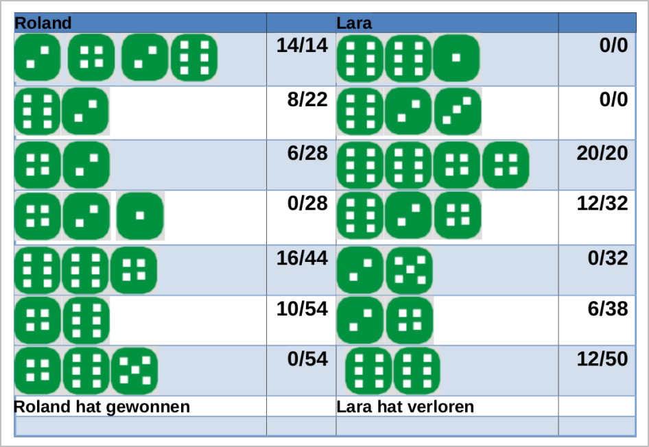
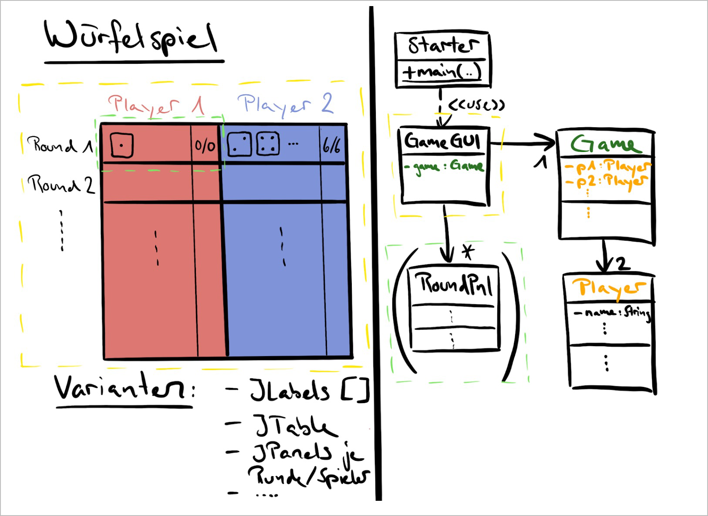

# LB 2 - Projekt

| Dauer                       | Gewichtung            |
| :-------------------------- | :-------------------- |
| **02.06.2023 - 30.06.2023** | **50%** der Modulnote |

:::danger Plagiat

- Sollten Plagiate (auch Teilplagiate) abgegeben werden, so erhalten alle Beteiligten für das Projekt die **Note 1**
- Es wird darauf verzichtet, Nachforschungen anzustellen, wer Quelle und wer Empfänger war

:::

:::tip Privates Git Repository

- Wenn Ihr euren Code mit **git** versioniert ist das super!
- Aber bitte verwendet ein **privates Repository** auf Github und co., damit nicht zukünftige Kameraden von Ihnen klauen könnt!

:::

## Einleitung

Im Modul 403 wurden nur konsolenbasierte Programme realisiert. Mittlerweile haben Sie die Fähigkeit,
Programme mit einer grafischen Oberfläche zu schreiben.

## Ziele

- Die Anforderungen an eine Fachklasse erforschen und formulieren.
- Eine grafische Benutzeroberfläche programmieren.
- Die eigene Arbeit mit Klassendiagrammen [dokumentieren][Dokumentation].
- Sauberen Quellcode schreiben.
- Programmcode und **[Dokumentation]** im eigenen Subordner des **[Google Drive Abgabeordner]** hochgeladen

## Aufgabenstellung

Es geht darum, ein Würfelspiel für 2 Mitspieler zu programmieren. Das Ziel des Spieles ist es, in einer gegebenen Anzahl Runden möglichst viele Punkte zu erzielen.

Pro Runde darf ein Spieler maximal 5 mal würfeln. Die gewürfelten Augenzahlen ergeben die Rundenpunkte. Sie werden zu der Gesamtpunktzahl des Spielers addiert.

**Aber Achtung**: es werden nur die geraden Zahlen aufaddiert. Sobald der Spieler eine ungerade Zahl würfelt, verliert er die Rundenpunkte und der andere Spieler ist an der Reihe. Der Spieler muss die Möglichkeit haben, die Runde abzubrechen und weniger als fünfmal in seiner Runde zu würfeln.

Hier sehen Sie einen möglichen Spielverlauf mit einer Visualisierung:

Wer am Ende der festgelegten Rundenzahl am meisten Punkte hat, gewinnt das Spiel.

Ihr Programm muss am Ende nicht genau so aussehen wie oben gezeigt. So eine Visualisierung des Spielverlaufs mit Würfelaugen und mehreren Runden ist aufwändig, ergibt dafür zusätzliche Punkte.

Es sind auch Spielvarianten denkbar. So könnte zum Beispiel zu Beginn festgelegt werden, dass die ungeraden Zahlen aufaddiert werden und die geraden Zahlen die Spielverderber sind.

Oder man könnte eine Augenzahl als Spielverderber festlegen und alle anderen Augenzahlen addieren.

## Produkt

Sie erstellen selbständig ein Programm gemäss der obigen Spielbeschreibung. Das Programm muss eine grafische Oberfläche besitzen.

Ausserdem besteht Ihr Produkt aus (mindestens) drei Klassen:

- grafische Darstellung des Spiels
- Starterklasse
- Fachklasse(n), die den Spielstand verwalten und logische Funktionen anbieten

Der Quellcode ist sauber formatiert. Alle Klassen, Methoden und Attribute haben aussagekräftige Namen.

Die von Ihnen erstellten Klassen dokumentieren Sie mit einem UML-Klassendiagramm, das alle Klassen enthält. Auch die Beziehungen zwischen den Klassen müssen dargestellt sein. In einer [Dokumentation] beschreiben Sie Ihr Programm. Notieren Sie, was Sie wie herausgefunden haben. Wenn zur Zeit der Abgabe noch nicht alles funktioniert, dann beschreiben Sie was nicht funktioniert und was das Problem ist.

Das Klassendiagramm gehört in die [Dokumentation].

## Bewertung

|                            | Punkte | Kriterium                                                                                                                                    |
| -------------------------- | :----: | :------------------------------------------------------------------------------------------------------------------------------------------- |
|                            |   1    | Die Starterklasse funktioniert                                                                                                               |
|                            |   3    | Das Programm läuft und lässt das beschriebene Spiel zu                                                                                       |
|                            |   2    | Die Spieler können Ihre Namen selber eingeben                                                                                                |
|                            |   2    | Der aktuelle Punktestand wird pro Spieler angezeigt                                                                                          |
|                            |   2    | Der aktuelle Spieler kann eine Runde beenden                                                                                                 |
|                            |   2    | Die Benutzerführung _(UX)_ macht Sinn _(Buttons werden ein/ausgeblendet rsp. de/aktiviert)_                                                  |
|                            |   2    | Die gewürfelten Punkte pro Runde werden als Text angezeigt                                                                                   |
|                            |   3    | Der Würfelverlauf wird über mehrere Runden angezeigt _(nicht nur die aktuelle)_                                                              |
|                            |   3    | Der Quellcode ist korrekt formatiert _(Einrückungen)_                                                                                        |
|                            |   3    | Die Namen der Klassen, Methoden und Attribute sind aussagekräftig und einheitlich                                                            |
|                            |   3    | _Dokumentation:_ die Beschreibung des Programms ist vollständig                                                                              |
|                            |   3    | _Dokumentation:_ die Reflexion ist tiefgründig und geht auf die Probleme ein                                                                 |
| :sweat_smile:              | _(29)_ | _**Volle Punktzahl bis hier ergeben eine <u>5.0</u>**_                                                                                       |
| :chart_with_upwards_trend: |   2    | Der **Verlauf des Punktestands** aller bereits gespielten Runden wird pro Spieler angezeigt                                                  |
| :game_die:                 |   2    | Die gewürfelten Punkte pro Runde werden **bildlich** dargestellt                                                                             |
| :sushi:                    |   3    | Die **Fachklassen** beinhalten die **Logik** / verwalten den **Spielstand** (ohne UI-Elemente)                                               |
| :checkered_flag:           | **36** | **TOTAL**                                                                                                                                    |
|                            |        | **Bonus**                                                                                                                                    |
| :superhero:                |  _2_   | _Das Programm übersteigt die oben beschriebenen Minimalanforderungen an das Spiel **wesentlich** und **ist auch vollumfänglich lauffähig**._ |

## Termin

Das Produkt (inklusive der [Dokumentation]) muss bis am **Freitag, 30.06.2023, 16:15** über den eigenen Unterordner im **[Google Drive Abgabeordner]** abgegeben werden.

## Strukturidee

[Dokumentation]: https://docs.google.com/document/d/1OhUYxLkwIWsxuk3SwcycjGUcRzkJQPRYRnbpkjiLEho/edit
[Google Drive Abgabeordner]: https://drive.google.com/drive/folders/11b3TCKZeapIwKUNCDz6ul-kLnfkrJAjN
