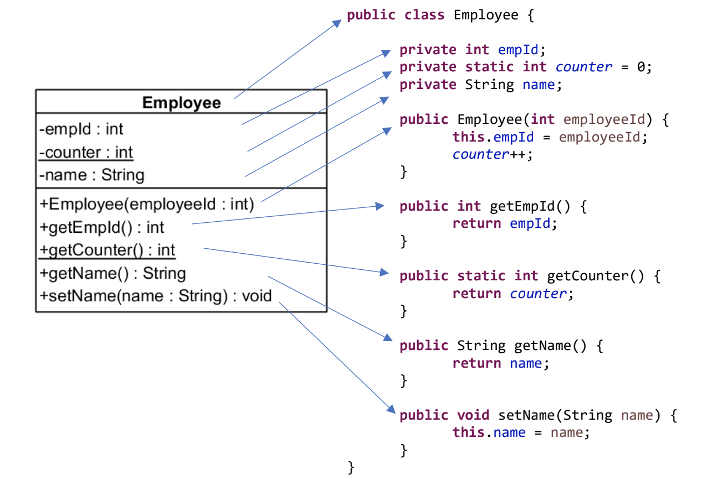

# UML

Mit dem Aufkommen der Programmierung wurde auch die Frage der Kommunikation über Programme immer wichtiger. Bei Einführung der Objektorientierung kam man bald nicht mehr mit Flussdiagrammen weiter und behalf sich mit einer neuen Notation, der **UML, Unified Modelling Language**. Sie hat sich inzwischen breit durchgesetzt, beispielsweise bis in den Businessbereich und damit der **Vermittlung zwischen Fachabteilung und Softwareentwicklung**, und für komplexe Projekte mit Tools, die eine automatische Umwandlung zwischen bestimmten Diagrammtypen und Quelltext beherrschen.

Es gibt viele UML Diagrammtypen, wirklich Verwendung finden vor allem folgende:

- [Klassendiagramm](#Klassendiagramm)
- [Sequenzdiagramm](https://www.websequencediagrams.com/)
- ERM, Entity Relationship Diagram (Für Datenbanken)

## Klassendiagramm

- Eine Klasse ist ein Rechteck
- Klassenname ist zentrierter Titel
- Sichtbarkeit
  - `-` ist `private`
  - `+` ist `public`
- Obenhalb: Instanz**variablen**
- Unterhalb: Instanz**methoden**
- <u>`Unterstrichen`</u>: `static`

### Methoden

| UML                                     | Java Signatur                         |
| --------------------------------------- | ------------------------------------- |
| `+setName(name : String)`               | `public void setName(String name)`    |
| `+getName() : String`                   | `public String getName()`             |
| <u>`+sum(a : int, b: int) : int`</u>    | `public static int sum(int a, int b)` |
| <u>`-secret(key : String) : String`</u> | `private String secret(String key)`   |

:point_up: **`+|-methodennamen( variablenNamen: DatenTyp ) : returnDatenTyp`**

### Variablen

**:point_up: `+|- variablenNamen : Datentyp`**

| UML                   | Java                       |
| --------------------- | -------------------------- |
| `-name : String`      | `private String name;`     |
| `+year : int`         | `public int year;`         |
| <u>`+PI : double`</u> | `public static double PI;` |

### Abhängigkeiten

**Klasse verwendet ein `new` Objekt**

- gestrichelter Pfeil

**Klasse `implements` ein Interface**

- gestrichelter Pfeil mit **Dreiecksspitze**

**Klasse `extends` eine Klasse**

- durchgezogener Pfeil mit **Dreiecksspitze**

## UML Tools :toolbox:

:::info die einfachste Art!

- [IntelliJ Diagrams](https://www.jetbrains.com/help/idea/class-diagram.html) _jedoch nicht 100% UML Standard!!_
  - IntelliJ finden Sie auf unseren **Widnows VMs**

:::

- [Mermaid](https://mermaid.js.org/) :mermaid:
  - wird auf dieser Seite verwendet
  - [Mermaid Dokumentation](https://mermaid.js.org/syntax/classDiagram.html)
  - [Mermaid Live im Browser](https://mermaid.live)
- ObjektAid funktioniert nur bis **Eclipse 2022-06 (4.24.0)**
  - [<s>ObjektAid for Eclipse</s>](https://github.com/AbbaouiAmine/objectAidArchive)
  - [<s>Video mit Installationsanleitung</s>](https://www.youtube.com/watch?v=UtSRX9swc1w)
