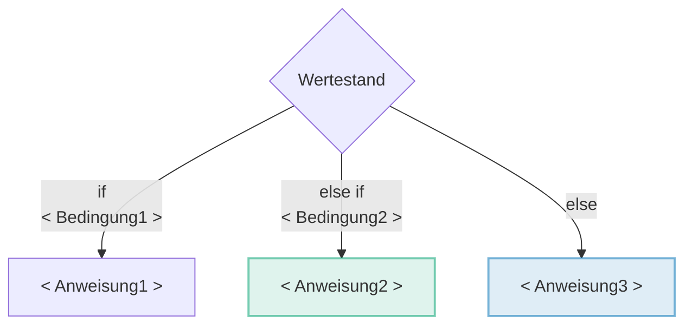
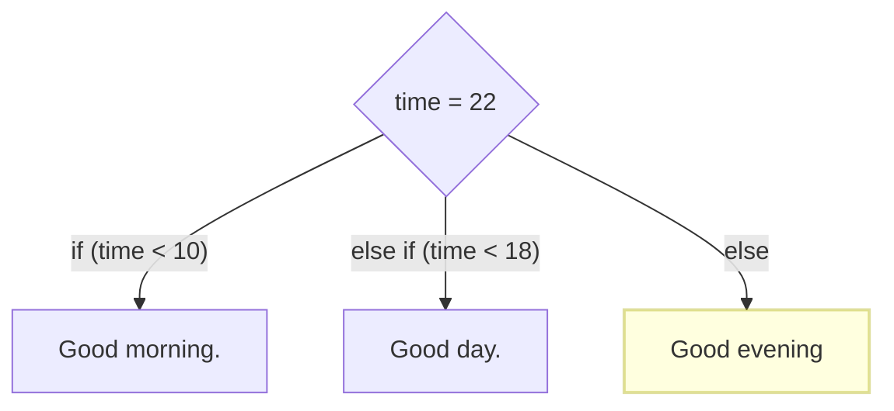
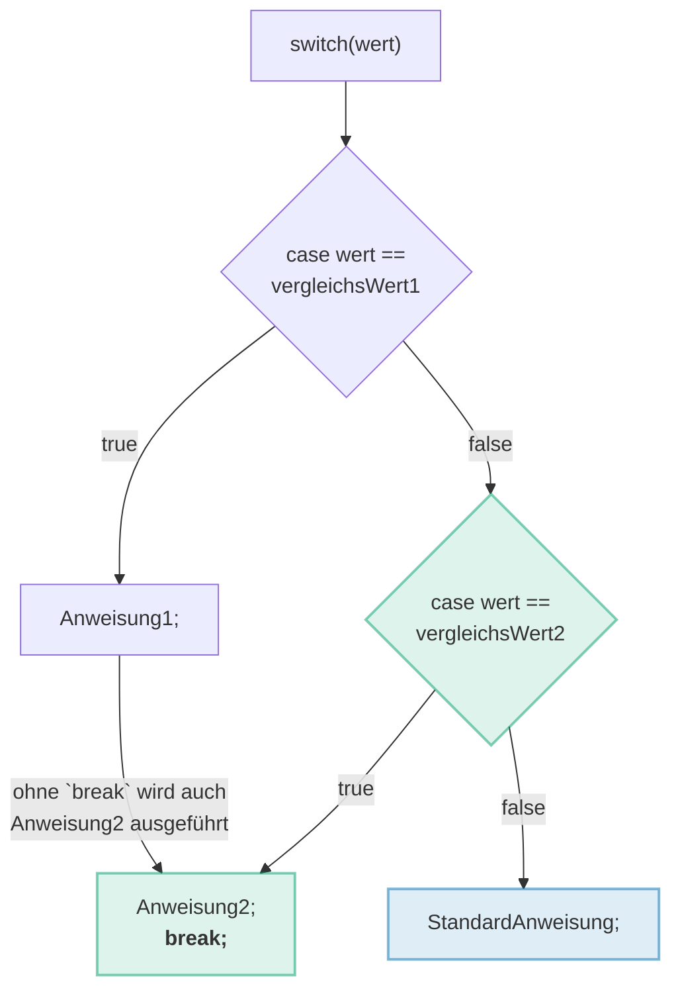
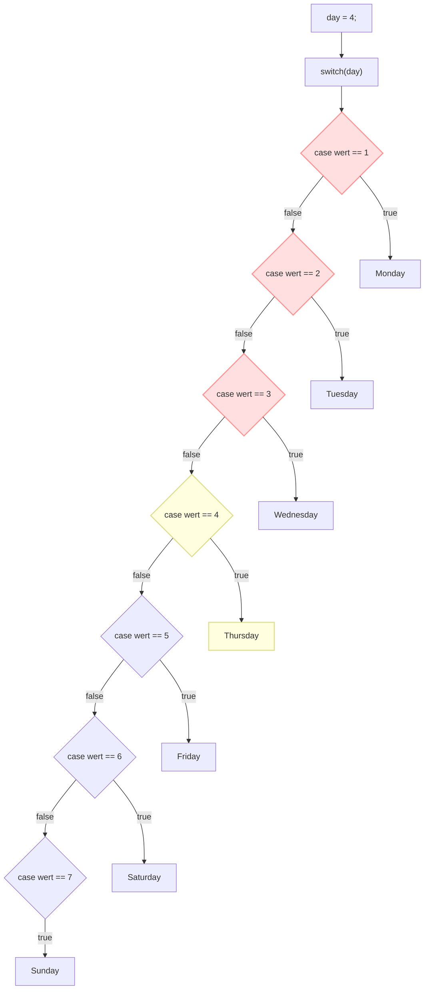

# Basics

Hier werden nochmals in kürze alle Konzepte vom Modul 319 aufgeführt

## Variablen

Variablen sind Platzhalter um Werte zu Speichern.

- Jede Variable reserviert einen Speicherplatz im Computerspeicher
- Durch den eindeutigen Namen kann auf diesen Speicherplatz zugegriffen werden

Um eine Variable zu definieren muss ein **Type**, einen **Namen** und einen **Wert** angegeben werden.

```java title="Variable syntax"
type variableName = value;
```

### _Primitive_ Datentypen

In Java gibt es eine beachtliche Anzahl an Datentypen gemäss folgender Tabelle.
Vorerst nutzen wir die _primitiven_ Datentypen. Diese sind erkennbar, indem der **Datentyp kleingeschrieben** ist.

| Datentyp | Grösse  | Beschreibung                                                                              | Spezifika |
| -------- | ------- | ----------------------------------------------------------------------------------------- | --------- |
| boolean  | 1 bit   | Speichert `true` _(wahr)_ oder `false` _(falsch)_ Werte                                   |
| byte     | 1 byte  | Speichert ganze Zahlen von `-128` bis `127`                                               |
| short    | 2 bytes | Speichert ganze Zahlen von `-32'768` bis `32'767`                                         |
| char     | 2 bytes | Speichert ein einzelnes Zeichen oder [ASCII]                                              | `''`      |
| int      | 4 bytes | Speichert ganze Zahlen `-2'147'483'648` bis `2'147'483'647`                               |
| float    | 4 bytes | Speichert Gleitkommazahlen von `6` bis `7` Dezimalstellen                                 | `f`       |
| long     | 8 bytes | Speichert ganze Zahlen von `-9'223'372'036'854'775'808l` bis `9'223'372'036'854'775'807l` | `l`       |
| double   | 8 bytes | Speichert Gleitkommazahlen von `15` Dezimalstellen                                        | `d`       |

[ASCII]: https://de.wikipedia.org/wiki/American_Standard_Code_for_Information_Interchange

### Initialisierung

Beispiele, wie Variablen initialisiert werden können. Die Leerzeichen dienen nur der Übersichtlichkeit.

```java title="Deklarierung von Variablen"
// Datentyp     Variablenname  Semikolon
   int          number         ;
   char         sign           ;
   ...
```

Die Initialisierung der Werte verwendet spezifische Zeichen für die verscheidenen Datentypen. So endet ein `float`-Wert immer mit `f` oder `long` mit `l`. Die Spezifikas pro Datentyp finden Sie in der Tabelle oberhalb unter "Spezifika".

```java title="Deklarierung & Initialisierung von Variablen"

// Datentyp     Variablenname  Zuweiseoperator   Wert  Semikolon
   int          number         =                 5     ;
   char         sign           =                 'c'   ;
   //                                            ^ ^  spezifisch für char sind ('')
   long         longNumber     =                 123l  ;
   //                                               ^ spezifisch für long (l)
   ...
```

### Der Datentyp `String`

Der Datentyp `String` **dient zur Speicherung von Zeichenfolgen**, also allgemeiner Text. Der Text muss immer zwischen zwei **"doppelten Anführungszeichen"** gestellt werden.

| Datentyp | Grösse             | Beschreibung              | Spezifika |
| -------- | ------------------ | ------------------------- | --------- |
| String   | 2 byte pro Zeichen | Speichert beliebigen Text | `""`      |

### Strings initialisieren

```java
// Datentyp     Variablenname  Zuweiseoperator   Wert   Semikolon
   String       zeichenFolge   =                 "abc"  ;
//                                               ^   ^
//                                   "doppelten Anführungszeichen"
```

### Strings zusammensetzen

Mehrere Variablen vom Datentyp `String` können durch ein Plus-Zeichen `+` zusammengesetzt werden. Dabei sollte man darauf achten, dass der erste Text mit einem Leerzeichen enden soll. Wieso, sieht ihr im Beispiel:

```java title="Mit + Strings zusammensetzen"
String name = "Mr Robot";
System.out.println("Your name is " + name);
//                              ^ Leerzeichen!
//                  Your name is Mr Robot

System.out.println("Your name is" + name);
//                  Your name isMr Robot
```

:::note Höhere Datentypen sind Grossgeschrieben

- `String` ist Gross geschrieben, da es sich um einen _höheren_ Datentyp handelt.
- Ein `String` baut auf dem _primitiven_ Datentyp `char` auf _(:bulb: daher höher)_
  - Evt. Hilft die Analogie von "Atome (primitiv)" zu "Moleküle (höher)".
- _Höhere_ Datentypen sind auch Objekte.
  - Was Objekte genau sind, erfahrt ihr im Folgemodul 404 und ist noch nicht relevant!

:::

### Strings mit Zahlen zusammensetzen

Strings können auch mit allen _primitiven_ Datentypen, also auch mit numerischen Werten, durch das Plus-Zeichen `+` zu einer Zeichenfolge kombiniert werden. Der _primitive_ Datentyp wird dadurch automatisch zu einem String!

```java title="String mit Zahlen kombinieren"
System.out.println("Ihre Geschwindigkeit lautet " + 21);
//                  Ihre Geschwindigkeit lautet 21
```

:::tip Eine Zahl in einen String umwandeln

Werden Zahlen mit einem **leeren String ""** konkatiniert, wird die Zahl alleine in einen String umgewandelt. Dies ist ein gängiger Java "Hack".

```java title="Zahl in String umwandeln"
String zahl = "" + 21;
// zahl ist nun "21"
```

:::

## Operatoren

### Arithmetische `+`, `-`, `/`, `*`, `%`

Arithmetische Operatoren kennt Ihr bereits von der Mathematik.
Damit lassen sich die gängigen Mathematischen Operationen durchführen.
Neu ist einzig der Rest Operator `%`. Dieser dividiert eine Zahl und gibt den Rest zurück.

```java title="+ - / * % Arithmetische Operatoren"
int result;
int number = 9;
int anotherNumber = 3;

result = number + anotherNumber; // Addition
result = number - anotherNumber; // Subtraktion
result = number / anotherNumber; // Division
result = number * anotherNumber; // Multiplikation
result = number % anotherNumber; // Rest der Division
```

:::tip Gerade/Ungerade berechnen mit `%`

Der Rest-Operator `%` gibt bei einer division immer den Rest zurück.
Wenn man nun eine Division durch 2 durchführt lässt sich herausfinden ob eine Zahl gerade oder ungerade ist.

```java
9 % 2  // ergibt 4 * 2 Rest 1 also ungerade
10 % 2 // ergibt 5 * 2 Rest 0 also gerade

public boolean even(int number) {
    return number % 2 == 0;
}
```

:::

### Verkürzte arithmetische Operation mit sich selbst `+=`, `-=`, `*=`, `/=`

Oft möchte man den Wert einer Variablen direkt verändern. Das Resultat also nicht in eine neue
Variable, sonder in sich selber speichern. Gegeben ist z.B. die Variable `number` vom Typ `int`
mit dem Initialwert `3`.

```java
int number = 3;
```

Möchte man dieser Variable `4` hinzuaddieren geht das folgendermassen:

```java
number = number + 4; // Addition und Zuweisung zu sich selbst
```

Da dies sehr oft vorkommt ist in allen gängigen Programmiersprachen dafür ein
kombinierten Operator vorgesehen. Es wird dem Zuweisungsoperator den arithmetische Operator **vorangestellt**.

```java
number += 4; // Verkürzte Addition und Zuweisung zu sich selbst
```

Aus `number = number + 4;` wird somit `number += 4;` und erspart uns die Dopplung der Variable.
Dies geht natürlich auch für alle anderen arithmetischen Operatoren.

```java
number -= 7; // Subtraktion und Zuweisung zu sich selbst
number *= 9; // Multiplikation und Zuweisung zu sich selbst
number /= 2; // Division und Zuweisung zu sich selbst
```

### Unäre (einstellige) Operatoren `++`, `--`

Noch häufiger als die verkürzte arithmetische Operation mit sich selbst wird
im Programmieren schrittweise hoch und runtergezählt **was auch Iteration genannt wird**.

Möchte man also von 0 - 3 hochzählen geht dies so:

```java
int number = 0;
number += 1;
number += 1;
number += 1;
```

Der Unäre Operator `++` zählt der links vorangestellten Variable eines nummerischen Typ eine 1 hinzu.
Der obere Code ist somit identisch zu diesem:

```java
int number = 0;
number++;
number++;
number++;
```

:::info Unär => einstellig

Unär bedeutet einstellig, es braucht daher **nur der linke** und nicht auch einen rechten Teil beim Operator.

:::

:::tip Iterieren durch Arrays

Der unäre Operator `++` wird insbesondere beim **Iterieren durch Arrays** wie im folgenden Beispiel verwendet.
Was gibt der obere Code wohl aus?

```java
char[] text = {'h','a','l','l','o',' ','w','e','l','t'};

// highlight-next-line
for (int i = 0; i < text.length; i++) {
    System.out.print(text[i]);
}
```

- Es wird Schrittweise jede Stelle vom Array `char[] text` in einem `for`-Loop ausgegeben
- Die Variable `i`, Iterator, wird durch `i++` für jeden Schritt +1 hochgezählt
- `i++` könnte auch mit `i += 1` oder `i = i + 1` ersetzt werden.
- `i++` ist jedoch viel kürzer.

:::

:::note Funfact

C++ erweitert die Programmiersprache C. Um diese Verwandtschaft ein bisschen NERDisch Auszudrücken wurde das Wortspiel C++ gewählt. C++ ist eine weitere Iteration von C.

:::

### Vergleichsoperatoren `==`, `!=`, `!`

Vergleichsoperatoren ergeben immer einen **boolean (true/false)**. Sie werden in Kontrollstrukturen als Bedingungen verwendet.

<div className="grid three"><div>

```java title="== Gleichheit"
true  == true; // true
1     == 1     // true

false == true; // false
1     == 2     // false
```

</div><div>

```java title="!= Ungleichheit"
false != true; // true
1     != 2     // true

true  != true; // false
1     != 1     // false
```

</div><div>

```java title="! Negation"
!false // true
!(1 == 2) // true

!true // false
!(1 == 1) // false
```

</div></div>

### Vergleichen von Strings `equals`

Strings und andere höhere Datentypen, können **nicht durch Vergleichsoperatoren verglichen werden**.

- Höhere Datentypen sind Datentypen die durch **Klassen** definiert werden
- Diese sind **immer gross geschrieben**
- Höhere Datentypen besitzen die **Methode `equals`** (was auf Deutsch "gleicht" heisst)

```java
String text = new String("Hallo Welt");
String text2 = new String("Hallo Welt");

text == text2;     // false! Die Speicherorte der Objekte `text` und `text2` sind unterschiedlich
text.equals(text2) // true!  Der Inhalt von beiden Objekte ist jedoch gleich.
```

#### Wieso ist dies nun so?

**Technisch:**

1. Durch **`String text = new String("Hallo Welt");`** wird ein **Objekt** erzeugt.
   Dieses besitzt einen **eigenen Speicherbereich** in der Variable `text`
2. Durch **`String text2 = new String("Hallo Welt");`** wird ebenfalls ein **neues Objekt** erzeugt.
   Dieses besitzt wiederum einen **eigenen Speicherbereich** in der Variable `text2`
3. Werden nun die zwei Objekte durch `==` verglichen, wird nicht deren Inhalt, sondern deren **Speicherort verglichen**!
4. **Mit `equals` wird nun aber der Inhalt verglichen.** Zwei Pakete mit dem gleichen Inhalt sind zwar eigenständig, aber sie sind sich gleich.

**Verständlich:**

1. Stellen wir uns **ein Paket**, Paket1, vor, in welches die Druckletter H,a,l,l,o, ,W,e,l und t gelegt werden
2. Stellen wir uns **ein zweites Paket**, Paket2, vor, in welches ebenfalls die Druckletter H,a,l,l,o, ,W,e,l und t gelegt werden
3. Zwei Pakete mit gleichem Inhalt sind auch in der uns bekannten Welt immer noch zwei unterschiedliche Pakete, oder?
   - **Mit `==` werden die Pakete** und nicht deren Inhalt "Hallo Welt" verglichen.
4. Vergleicht man jedoch der Inhalt befinden sich in beiden Paketen die gleichen Druckletter in der gleichen Reihenfolge.
   - **Mit `equals` wird der Inhalt** und nicht die Pakete verglichen.

#### Und wieso darf man nun primitiven Datentypen mit == vergleichen?

Primitive Datentypen sind in Java **keine Objekte**, sie werden somit nicht in ein Paket verpackt.

- Die Nummer `4` ist die Nummer `4`. Punkt.
- Das Zeichen `c` ist das Zeichen `c`. Punkt.
- Aber der Satz "Hallo Welt" könnte man
  - alphabetisch sortieren
  - gross schreiben
  - klein schreiben
  - ...

:::info String ist eine Klasse und somit ein Objekt

Eigentlich müsste man einen `String` wie folgt initialisieren:

```java
String text = new String("String ist eine Klasse und kann somit auch mit new initialisiert werden");
```

Da jedoch so oft Strings verwendet werden und die Klasse somit fest in die Sprache verankert ist, **wurde Ihr
durch den Compiler ein paar Sonderheiten verliehen**. So kann das `new String()` weggelassen werden.

```java
String text = "String ist eine Klasse und kann somit auch mit new initialisiert werden";
```

Beim kompilieren wird das `new String()` automatisch hinzugefügt!

:::

:::info Compiler sind schlau!

`"Hallo Welt" == "Hallo Welt";` ist `true`. Dies ist eine Ausnahme, da der Compiler schlau ist und merkt, dass hier nicht zwei Objekte benötigt werden.
Der Compiler versucht Speicher zu sparen. Sobald aber zwei Strings dynamisch erstellt werden (`new`) geht dies nicht mehr!

Nach dem compilieren sieht das in etwa wo aus:

```java
String text = new String("Hallo Welt");
text == text; // true da gleiches Objekt und Speicherort!
```

:::

:::note Nicht alle Programmiersprachen sind gleich

In [Ruby](https://www.ruby-lang.org) ist z.B. alles ein Objekt. Auch Zahlen. Da gehen lustige Dinge wie:

- [`print 3.month.from_now`](https://guides.rubyonrails.org/active_support_core_extensions.html#extensions-to-integer-time) gibt das Datum von in drei Monaten zurück
- oder [`3.times { print "Hallo Welt" }`](https://apidock.com/ruby/Integer/times) gibt 3 Mal "Hallo Welt" aus

:::

## Kontrollstrukturen

### if-Kontrollstrucktur

<div class="grid"><div>

```java title="Pseudo-Code"
// highlight-start
if (<Bedingung1>) {
  // Codeblock bei wahrer bedingung1
  <Anweisung1>
}
// highlight-end
// highlight-green-start
else if (<Bedingung2>) {
  // Codeblock bei
  //   - unwahrer bedingung1
  //   - aber wahrer bedingung2
  <Anweisung2>
}
// highlight-green-end
// highlight-blue-start
else {
  // Codeblock bei
  //   - unwahrer bedingung1
  //   - unwahrer bedingung2
  <Anweisung3>
}
// highlight-blue-end
```

</div><div>



</div></div>

### if-Beispiel

<div class="grid"><div>

```java title="if Beispiel"
int time = 22;
// highlight-red-next-line
if (time < 10) {
  System.out.println("Good morning.");
// highlight-red-next-line
} else if (time < 18) {
  System.out.println("Good day.");
} else {
  // highlight-yellow-next-line
  System.out.println("Good evening.");
}
// Outputs "Good evening." (else).
```

- Es wird der Code-Block von `else` ausgeführt, da die Variabe `time` sowohl grösser
  als 10 wie auch wie auch grösser als 18 ist.

</div><div>



</div></div>

### switch

<div class="grid"><div>

```java title="Pseudo-Code"
switch(wert) {
  case vergleichsWert1:
    <Anweisung1>;
    // ohne `break` wird auch <Anweisung2>
    // bis zum `break` ausgeführt.
  // highlight-green-start
  case vergleichsWert2:
    <Anweisung2>;
    break;
  // highlight-green-end
  // highlight-blue-start
  default:
    <StarndardAnweisung>;
  // highlight-blue-end
}
```

:::info Wertevergleich immer mit `==`, `equals`

Der `Wert` wird bei einer `switch-case`-Kontrollstruktur pro `case` mit dem
VergleichsWert verglichen. Dabei gilt immer `==` rsp. für höhere Datentypen `equals`

:::

:::info `break`

Wird eine Anweisung eines `case` nicht mit `brake` beendet, wird ebenfalls
die Anweisung des nächsten `case` ausgeführt. Solange bis ein `break` erscheint.
Dies gilt auch für die Standard Anweisung (`default`)!

:::

</div><div>



</div></div>

### Switch-Beispiel

<div class="grid"><div>

```java title="switch Beispiel"
int day = 4;
switch (day) {
// highlight-red-next-line
  case 1:
    System.out.println("Monday");
    break;
// highlight-red-next-line
  case 2:
    System.out.println("Tuesday");
    break;
// highlight-red-next-line
  case 3:
    System.out.println("Wednesday");
    break;
// highlight-yellow-start
  case 4:
    System.out.println("Thursday");
    break;
// highlight-yellow-end
  case 5:
    System.out.println("Friday");
    break;
  case 6:
    System.out.println("Saturday");
    break;
  case 7:
    System.out.println("Sunday");
    break;
}
// Outputs "Thursday" (day 4)
```

:::info `break` wird eigentlich immer verwendet

Es gibt fast keine realen Szenarien, in denen es Sinn macht mehrere cases auszuführen.
Deswegen sind `switch-case` statements nicht all zu oft anzutreffen.

Eine `switch-case`-Kontrollstruktur die für jede Anweisung ein `break` verwendet, kann
immer mit einer `if-else`-Kontrollstruktur mit `==` Bedingungen ersetzt werden.
Damit lassen sich die breaks sparen.

```java title="switch-case als if-else"
if (wert == 1) {
  <Anweisung1>
} else if (wert == 2) {
  <Anweisung2>
} else {
  <StandardAnweisung>
}
```

:::

:::tip Arrays sind toll!

:superhero: Mit einem _Array_ kann teilweise sogar eine Kontrollstruktur vermieden werden.

```java
String[] days = {"Monday", "Tuesday",
    "Wednesday", "Thursday", "Friday",
    "Saturday", "Sunday"};
int day = 4;
System.out.println(days[day-1]); // Arrays starten bei 0! deswegen day-1
// Outputs "Thursday"
```

:::

</div><div>



</div></div>

## Methoden
