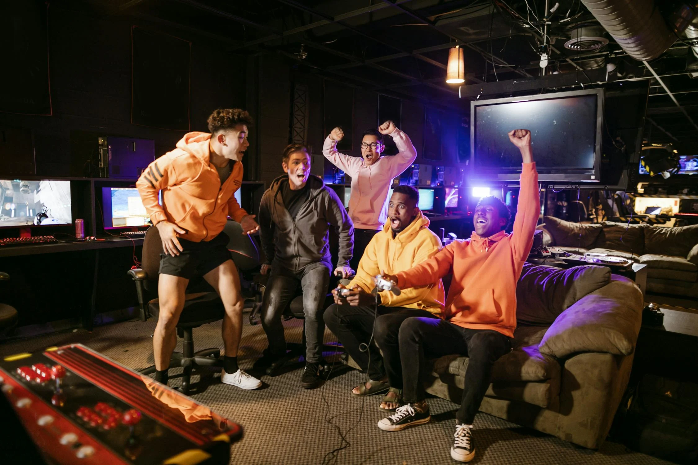
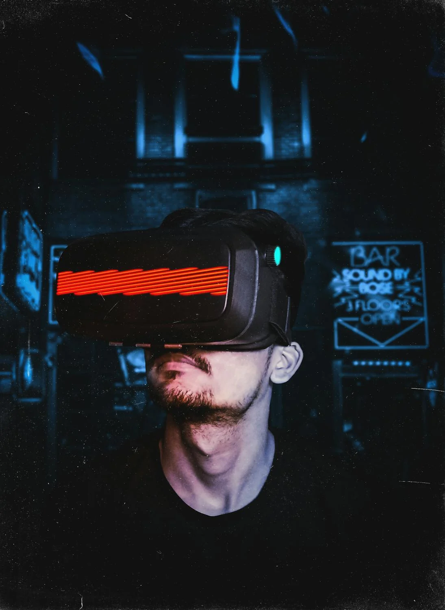
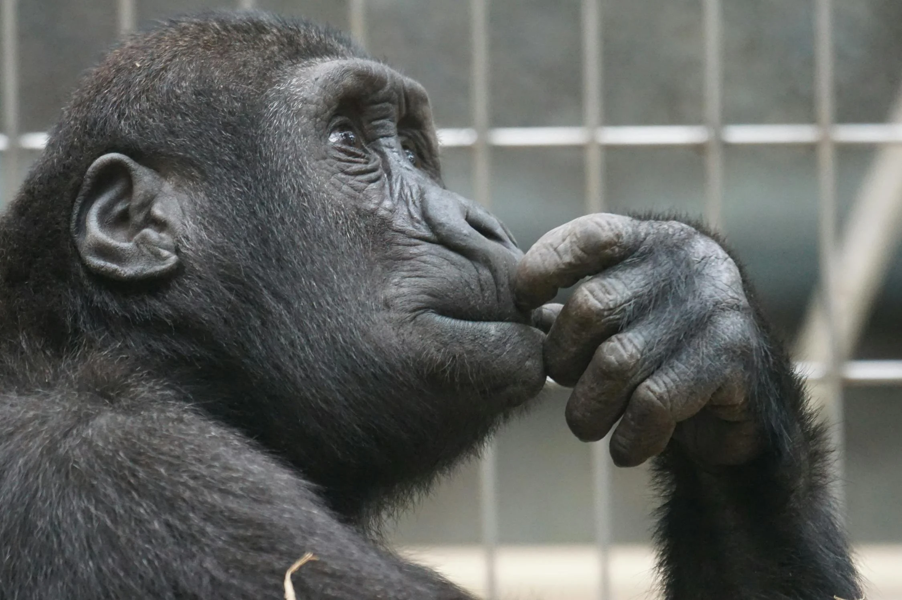

<!-- _class: big center dark -->

# Fallgeschichte

## Zockerbande

---

# Problem

- Einzelne Lernende sind im **eigenen Film / Spiel**.

- Sie haben kein Bewusstsein, was falsch zu machen.

---

# Lösung 1

---

<!-- _class: big center -->

# Nope

## <!-- fit --> ❌

---

<!-- _class: dark -->

# Lösung 2

---

<!-- _class: dark center big -->

# Juheiii

## <!-- fit --> :white_check_mark:

---

<!-- _class: big center -->

# Wie wollen <u style="font-size: 6rem;">**WIR**</u> vorgehen, wenn jemand zockt?

---

---

<!-- _class: big center -->

# <!-- fit --> Andere Lehrer melden es direkt dem

# <!-- fit --> <u>**Arbeitgeber**</u>!

---

---

<!-- _class: big center -->

# Wer zockt, backt für alle einen Kuchen!

---

<!-- _class: big center -->

# bis jetzt sind wir alle noch schlank und rank
