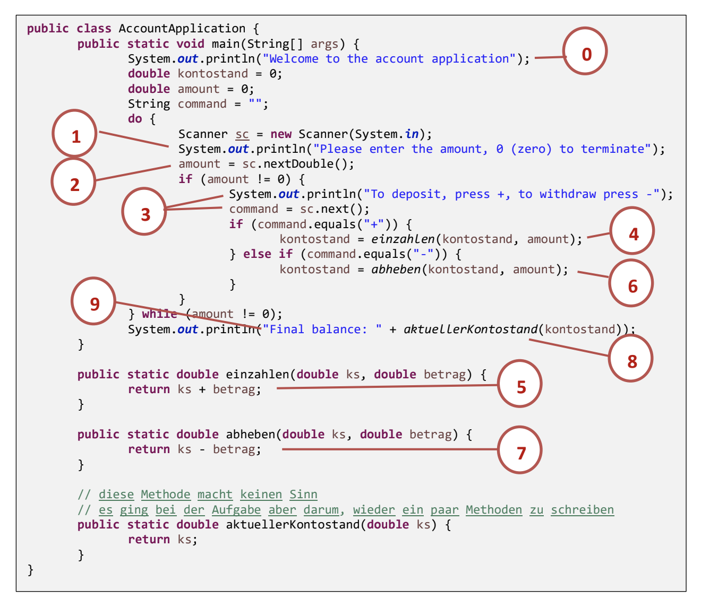

<!-- _class: big center -->

# Woche 1 / Modul 404

### Objektbasiert programmieren nach Vorgabe

---

<!-- _class: big center -->

# Agenda

## Siehe Screen

---

# Modulstruktur

- [319](https://www.modulbaukasten.ch/module/c6b67ea8-5e85-eb11-a812-0022486f644f/de-DE?title=Applikationen-entwerfen-und-implementieren)
  Applikationen entwerfen und implementieren
- **[404](https://www.modulbaukasten.ch/module/ba75c9da-716c-eb11-b0b1-000d3a830b2b/de-DE?title=Objektbasiert-programmieren-nach-Vorgabe) Objektbasiert programmieren nach Vorgabe**

## Später

- [216A](<https://www.modulbaukasten.ch/module/4e75c9da-716c-eb11-b0b1-000d3a830b2b/de-DE?title=Klassenbasiert-(ohne-Vererbung)-implementieren>)
  Klassenbasiert (ohne Vererbung) implementieren
- [216B](<https://www.modulbaukasten.ch/module/5075c9da-716c-eb11-b0b1-000d3a830b2b/de-DE?title=Objektorientiert-(mit-Vererbung)-implementieren>)
  Objektorientiert (mit Vererbung) implementieren

---

# Modulidentifikation

| Modulnummer  | 404                                                                                                                                                         |
| :----------- | :---------------------------------------------------------------------------------------------------------------------------------------------------------- |
| Kompetenz    | Vorgabe interpretieren, objektbasiert mit einer Programmiersprache implementieren, dokumentieren und testen.                                                |
| Lektionen    | 36                                                                                                                                                          |
| Beschreibung | [404 auf Modulbaukasten.ch](https://www.modulbaukasten.ch/module/ba75c9da-716c-eb11-b0b1-000d3a830b2b/de-DE?title=Objektbasiert-programmieren-nach-Vorgabe) |

---

# :dart: Modul Lernziele

1. Aufgrund einer Vorgabe den Ablauf darstellen. **_(UML Klassendiagram)_**

2. Eine Benutzerschnittstelle entwerfen und implementieren. **_(Java Swing)_**

3. Erforderliche Daten bestimmen und Datentypen festlegen. **_(Java Variablen)_**

4. Programmvorgabe unter Nutzung vorhandener Komponenten mit deren Eigenschaften und Methoden, sowie Operatoren und Kontrollstrukturen implementieren. **_(Java Basics)_**

---

# :dart: Modul Lernziele 2

5. Beim Programmieren vorgegebene Standards und Richtlinien einhalten, das
   Programm inline dokumentieren und dabei auf Wartbarkeit und
   Nachvollziehbarkeit achten. **_(Code Style)_**

6. Programm auf Einhaltung der Funktionalität testen, Fehler erkennen und
   beheben. **_(Manuelles Testen)_**

---

# Leistungsbeurteilungsvorgabe :muscle:

::: columns

## LB1 50%

### :pen: Prüfung

- Woche 5 / 90 Minuten
- Schriftlich + Praktisch am PC

[:link: details...](https://codingluke.github.io/bbzbl-modul-404/docs/beurteilungen/lb1)

::: split

## LB2 50%

### :pen: Projektarbeit

- Woche 5 bis 9
- Erstellen einer Applikation inkl. GUI

[:link: details...](https://codingluke.github.io/bbzbl-modul-404/docs/beurteilungen/lb2)

:::

---

<!-- _class: big -->

# :cop: Regeln

- Pünktlichkeit
- Aufmerksamkeit während des Unterrichts
- Selbständiges Arbeiten
- Internet als Arbeitsmittel

---

<!-- _class: big center -->
# :cop: Regeln / Zocken :joystick:

### Wie wollen wir vorgehen, wenn ich jemand beim zocken erwische?

---

<!-- _class: big -->

# Heutige Ziele :dart:

- **Modulwebseite** kennen und anwenden
- Wissenslücken aus dem Modul 319 schliessen
- Unterschied zwischen **Klassen** und **Objekten** verstehen
- **Eigene Klassen** schreiben können
- **Objekte instanziieren** können

---

# Die Modulwebseite [:link:](https://codingluke.github.io/bbzbl-modul-404)

<!-- - **Faktenblatt**: Übersicht über alle Themen  -->
<!-- - **INB21A**: Quartalübersicht und Wochenpräsentationen -->

::: columns

**Lektionen** Wochenfolien und die Quartalsübersicht

**Beurteilungen** Prüfungsrelevante Infos

**Repetition** Repetitionen vom Modul 319 / 403

::: split

**:pen: Aufgaben Grundlagen** Alle Grunlegenden Aufgaben

**:pen: Aufgaben Swing** _(GUI)_ Alle Aufgaben bezüglich `Swing`

**:bulb: Konzepte** Allgemeine Konzepte Isoliert erklärt

:::

## :link: [https://codingluke.github.io/bbzbl-modul-404](https://codingluke.github.io/bbzbl-modul-404)

---

<!-- _class: big center -->

# :superhero:

Die Aufgaben unter **Aufgaben Grundlagen / Swing** sind aufeinander aufbauend.

Ihr könnt zu Hause im **Selbststudium** alle Aufgaben lösen.

---

<!-- _class: big center -->

# Fragen? :point_up:

---

<!-- _class: emoji-list -->

# :brain: Repetition Modul 319 (20 Minuten) [:link:](https://codingluke.github.io/bbzbl-modul-404/docs/repetition/)

:::columns

- [:link: Repetition Lernkarten](https://codingluke.github.io/bbzbl-modul-404/docs/repetition/)
  öffnen
- Ihr erhaltet Lernkarten :clubs:

- :dancers: Zweierteam bilden
- :game_die: Zufällige Karten ziehen und versuchen zu lösen

::: split

- :white_check_mark: Korrekt gelöste Karten<br> auf **einen Stapel**

- :sweat_smile: Schwierige Karten<br> auf einen **eigenen Stapel**

:::

---

<!-- _class: emoji-list -->

# :film_projector: Account Applikation (45 Minuten) [:link:](https://codingluke.github.io/bbzbl-modul-404/docs/aufgaben-grundlagen/account-application)

::: columns

- :link: [Account Application](https://codingluke.github.io/bbzbl-modul-404/docs/aufgaben-grundlagen/account-application) öffnen

- :keyboard: Es handelt sich um eine Teminal Applikation
- :keyboard: Lesen und lösen Sie die Aufgabe
- :black_joker: Unterhalb existierte eine Musterlösung <sup>\*</sup>
- :man_teacher: Die machen wir zusammen!

::: split

## :bulb: Tipp

- :white_check_mark: Kennen sie noch den `Scanner`?
- :white_check_mark: Diese Code-Snippeds könnten hilfreich sein <sup>\*\*</sup>

```java
Scanner sc = new Scanner(System.in);
// liest double von der Commandline
double amount = sc.nextDouble();
// liest String von der Commandline
String command = sc.nextString();
```

:::

::: footnotes

\* Musterlösung nur verwenden, wenn Sie nicht mehr weiter kommen!
\*\* natürlich nicht genau so :sweat_smile:

:::

---

<!-- _class: emoji-list -->

# :pen: Analyse Account Applikation (20 Minuten) [:link:](https://drive.google.com/file/d/104nqkozBNkwxKqdJlWUBEvMcH6sgoAG9/view)

- :link: [Analyse Account Applikation](https://codingluke.github.io/bbzbl-modul-404/docs/aufgaben-grundlagen/analyse-account-application) öffnen

- :compass: Gehen Sie nach der Anleitung vor
- :brain: Analysieren Sie die dargestellte Klasse **zu zweit**

---

# :brain: Input Fachklassen [:link:](https://codingluke.github.io/bbzbl-modul-404/docs/konzepte/fachklassen)

- **Fachklassen** beinhalten die **generalisierte Logik** für ein Fachproblem

  - _In unserem Fall wäre das Fachproblem die Kontoverwaltung_

- Mit **Fachklassen** lassen sich **Programme entkoppeln**

  - **einfacherer Wartbarkeit**
  - **besserer Testbarkeit**
  - **besserer Qualität**

- Nennen wir es :sushi: **Sushi-Code**, das Gegenteil von :spaghetti:
  _Spaghetti-Code_

---

# :brain: Gemeinsame Analyse AccountApplication


