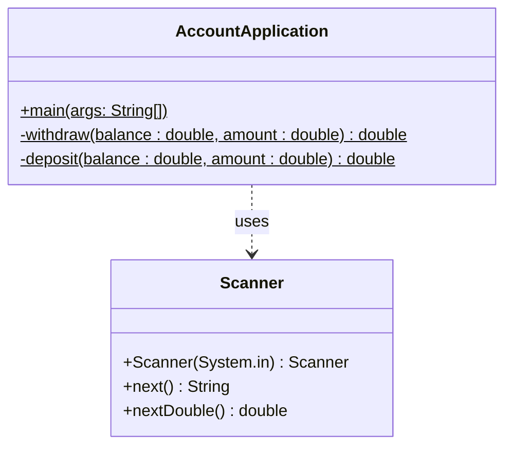
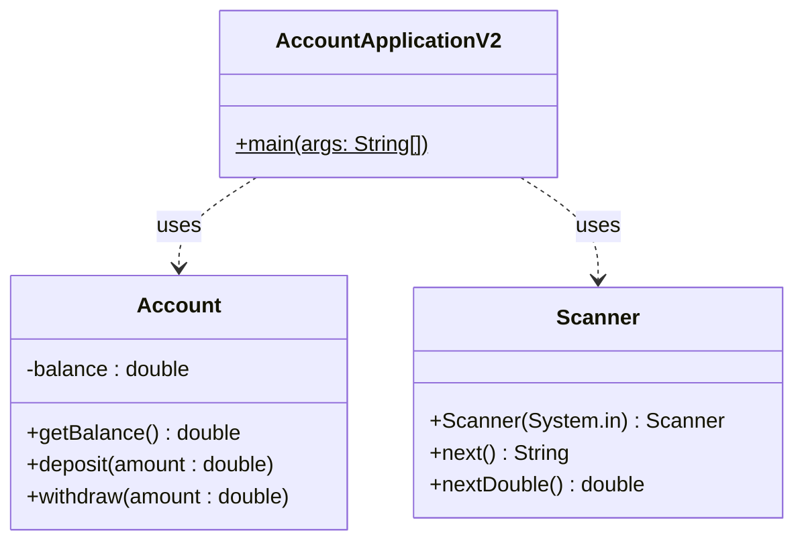

<!-- _class: big center -->

# Woche 2 / Modul 404

### Objektbasiert programmieren nach Vorgabe

---

<!-- _class: big center -->

# Agenda

## Siehe Screen

---

# :brain: Repetition Fachklassen [:link:](https://codingluke.github.io/bbzbl-modul-404/docs/konzepte/fachklassen)

- **Fachklassen** beinhalten die **generalisierte Logik** für ein Fachproblem

  - _In unserem Fall wäre das Fachproblem die ==Kontoverwaltung==_

- Mit **Fachklassen** lassen sich **Programme entkoppeln**

  - **einfacherer Wartbarkeit**
  - **besserer Testbarkeit**
  - **besserer Qualität**

- Nennen wir es :sushi: **Sushi-Code**, das Gegenteil von :spaghetti:
  _Spaghetti-Code_

---

# Account Applikation

::: columns

## :spaghetti: Spagetti



::: split

## :sushi: Sushi



:::

---

# :brain: Konzept `static`

- Kann ohne `new` aufgerufen werden
- Kann wiederum andere `static` Methoden aufrufen
- Kann `static` Variablen verwenden
- Kann mit `new` eine `Instanz` einer beliebigen Klasse erstellen.

::: columns

### Wofür sind `static` Methoden gut?

- Die Java `main` Methode (entrypoint)
- Helfermethoden **(ohne eigenen Datenstand)** _Z.B. `Math.sqrt(64);`_

::: split

### :scream: Limitationen

- **Können nicht** auf `Instanz-Methoden/Varaiblen` zugreifen!

:::

---


# `static` Beispiel

```java
private static double zins;
```

```java
private static void setZins(double zins) {
  this.zins = zins;
}
```

Den Zins kann nun direkt auf der Klasse gesetzt werden. **Ohne `new`**

```java
Account.setZins(4.3)
```

Er ist für alle Instanzen gleich.

---

# :brain: Konzept `Instanz`<sup>\*</sup>: :hatching_chick: ← es lebt!

- Instanzen beinhalten `Instanz-Methoden`:
  - `Instanz-Methoden` können auf `Instanz-Variablen` zugreifen
  - `Instanz-Methoden` können andere `Instanz-Methoden` ausführen
- es können von einer **Klasse mehrere Instanzen** erstellt werden
- eine `Instanz` wird durch `Klasse variableName = new Klasse()` erstellt

### :information_source: Instanzen **besitzen einen individuellen Datenstand**

```java
Account accountObject1 = new Account();
Account accountObject2 = new Account();
```

:::footnotes

\* **Instanzen** und **Objekte** sind **Synonym** verwendbar!

:::

---

# :brain: Static vs Instanz-Methoden

Eine `static` Methode einer `Klasse` kann direkt (ohne `new`) aufgerufen werden

```Java
public class MixedExample {
  private static final double PI = 3.14; // Konstante, kann nicht geändert werden!
  private String greeting = "Hello";     // Instanz-Variablen, kann geändert werden

  public static double staticCircle(double radiant) {
    return radiant * radiant * PI; // Kann auf `PI` zugreifen nicht aber auf `greeting`
  }

  public String instanceGreeting(String name) {
    return greeting + " " + name;  // Kann auf `greeting` zugreifen
                                   // Könnte theoretisch auch auf `PI` zugreifen
  }

  public void setGreeting(String greeting) { this.greeting = greeting; }
}
```

---

# :brain: Verwenden von `MixedExample`

```java
public class Starter {
  // Startpunkt des Programms, ist immer static!
  public static void main(String[] args) {
    // Statische Methoden können ohne new ausgeführt werden!
    double circle = MixedExample.staticCircle(1.5d);

    // Um instanceMethoden aufzurufen, muss zuerst eine Instanz erstellt werden
    MixedExample mixedExampleInstance = new MixedExample();
    String greeting = mixedExampleInstance.instanceGreeting("Lukas");
    // Wert ist "Hallo Lukas";

    mixedExampleInstance.setGreeting("Ciao") // Objekt ändern
    greeting = mixedExampleInstance.instanceGreeting("Lukas");
    // Wert ist "Ciao Lukas";
  }
}
```

---

# :keyboard: Grundlagen Aufgaben [:link:](https://codingluke.github.io/bbzbl-modul-404/docs/aufgaben-grundlagen)

- [Aufgabe Startklasse](https://codingluke.github.io/bbzbl-modul-404/docs/aufgaben-grundlagen/starterklasse)
- [Aufgabe Temperaturkonvertierer](https://codingluke.github.io/bbzbl-modul-404/docs/aufgaben-grundlagen/einheiten-umrechnen)

<!--fit--> **:superhero: Versucht es immer zuerst ohne Musterlösung!**

---

# :brain: Einstieg `Swing`

`Swing` ist eine **Bibliothek für grafische Oberflächen** :framed_picture:.
Dadurch ist es möglich die bis jetzt textuelle Benutzerinteraktion mit
grafischen Elemente umzusetzen.

- **`GUI`** - `Graphical User Interface` genannt

## :rotating_light: Achtung!

- Das Verständnis davon ist essenziell um im **LB1** eine gute Note zu erhalten!
- Auf dieser Grundlage wird auch das Projekt (**LB2**) umgesetzt!

> :point_up: Nehmt euch also die **Zeit** dies zu verstehen!

---

# :rocket: Hilfe im Web!

Es ist immer gut sich im Internet weiterzubilden (:thinking: zumindest für
IT-Themen)

https://www.java-tutorial.org ist eine Webseite die Java, sowie `Swing` im
Detail erklärt:

- [Deutsches `Swing`-Tutorial als Zusatzinfo für Interessierte](https://www.java-tutorial.org/swing.html)

  - **relevante Themen**: [JFrame](https://www.java-tutorial.org/jframe.html),
    [JLabel](https://www.java-tutorial.org/bedienelemente.html),
    [JButton](https://www.java-tutorial.org/jbutton.html),
    [JTextField](https://www.java-tutorial.org/jtextfield.html),
    [JPanel](https://www.java-tutorial.org/jpanel.html)

- auch wichtig, wird nächste Woche behandelt:
  [Event-Handling](https://www.java-tutorial.org/event-handling.html)

> :superhero: Ich würde alle in den Aufgaben verwendeten Klassen nachschlagen

---

# :brain: Swing: `JFrame`

Möchte man eine Klasse als `Fenster` erstellen, muss der Klasse, die Java Klasse
`JFrame` ==vererbt== werden. Dies geht mit dem Ausdruck ==**`extends JFrame`**==

```java
public class PureWindow extends JFrame {
  public void start() { // oder auch showDialog, oder was gefällt
    setLayout(null); // Standard Layout deaktivieren
    setDefaultCloseOperation(EXIT_ON_CLOSE); // Beim schliessen des Fensters, alles beenden
    setSize(300, 300); // Grösse vom Fenster festlegen
    setTitle("Ich bin der Fenster Titel"); // Titel des Fensters festlegen
    setVisible(true); // Fenster sichtbar machen
  }
}
```

::: footnotes

[:link: JFrame auf Java Tutorial](https://www.java-tutorial.org/jframe.html)
_:information_source: Was genau Vererbung ist, und wie man es selbst verwendet
ist Teil eines späteren Moduls. Hier wenden wir es einfach Mal an._

:::

---

# :bulb: `JFrame` Cheat Sheet

```java
setLayout(null); // Standard Layout deaktivieren
setDefaultCloseOperation(EXIT_ON_CLOSE); // Beim Fensterschliessen, alles beenden
setSize(300, 300); // Grösse vom Fenster festlegen
setTitle("Ich bin der Fenster Titel"); // Titel des Fensters festlegen
setVisible(true); // Fenster sichtbar machen

JLabel label = new JLabel("Beschriftung"); // Ein Label
label.setBounds(x, y, width, height) // Bestimmen wo sich das Label befindet
add(label) // Label hinzufügen

JTextField textfield = new JTextField(); // Ein Textfeld
textfield.setBounds(x, y, width, height) // Bestimmen wo sich das Textfeld befindet
add(textfield) // Textfeld hinzufügen

JButton button = new JButton("press me"); // Ein Button
button.setBounds(x, y, width, height) // Bestimmen wo sich der Button befindet
add(button) // Textfeld hinzufügen
```

---

# :keyboard: `Swing` Aufgaben

- [Einstieg in Swing](https://codingluke.github.io/bbzbl-modul-404/docs/aufgaben-swing/einstieg-in-swing)

- [JFrame](https://codingluke.github.io/bbzbl-modul-404/docs/aufgaben-swing/fenster)
- [Komponenten](https://codingluke.github.io/bbzbl-modul-404/docs/aufgaben-swing/komponenten)

<!--fit--> **:superhero: Versucht es immer zuerst ohne Musterlösung!**

---

<!-- _class: big center -->

# Abschluss / Lernjournal

---

# :keyboard: Repetition Arrays (20min) [:link:](https://codingluke.github.io/bbzbl-modul-404/docs/repetition/arrays)

Im folgenden PDF ist beschrieben wie man in Java mit Arrays, also Listen von
Datentypen, arbeitet.

- [Repetition Arrays](https://codingluke.github.io/bbzbl-modul-404/docs/repetition/arrays)
  ([:book: PDF](https://drive.google.com/file/d/1Bt4NgySXrhMeorOTuSBs_6thNwXPRbNN/view))
  bitte genau studieren.
- Diese **Aufgaben sind Optional** und müssen im **Selbststudium** gemacht
  werden.
- Am Ende der Sildes wird auf eine weitere Art von Arrays (Listen) eingegangen.
  - Diese ist **nicht Pflicht** jedoch häufig einfacher.

> :superhero: Dies ist eine Grundlage, welche Ihr im Allgemeinen begreifen
> müsst, um die beiden LBs mit einer `6` zu bestehen

---

## :superhero: Die Klasse `List` oder auch `ArrayList`

Primitive Java Arrays sind umständlich und können häufig durch die Klasse
`List<Datetyp>` oder `ArrayList<Datentype>` abgelöst werden.

Hier ein Beispiel für eine `List<String>`, also eine Liste von Wörtern:

```java
list<string> list = arrays.aslist("element 1", "element 2");
list.add("element 3"); // es können Elemente dynamisch hinzugefügt werden

// über die gesamte Liste iterieren ist viel einfacher als bei "primitiven" Arrays
for (String element : list) {
  System.out.println(element);
}

// Auf ein Element zugreifen mit `.get` (es startet bei 0, nicht bei 1)
System.out.println(list.get(0));
```
