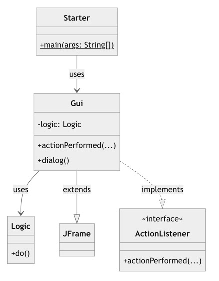

<!-- _class: big center -->

# Woche 3 / Modul 404

### Objektbasiert programmieren nach Vorgabe

---

<!-- _class: big center -->

# Agenda

## Siehe Screen

---

# :brain: Projekt Klassenstruktur

**Starter** - started das GUI (`main`)

```java
Gui g = new Gui();
g.dialog();
```

**Gui** - rendert die Grafik

- `extends JFrame` (erbt)
- `implements ActionListener`

```java
Logic logic = new Logic()
logic.do();
```

**Logik** - beinhaltet die Spielregeln



<!-- ```mermaid width=85% -->
<!-- classDiagram -->
<!--   class JFrame -->
<!--   class ActionListener { -->
<!--     <<interface>> -->
<!--     +actionPerformed(...) -->
<!--   } -->
<!--   class Starter { -->
<!--     +main(args: String[])$ -->
<!--   } -->
<!--   class Gui { -->
<!--     -logic: Logic -->
<!--     +actionPerformed(...) -->
<!--     +dialog() -->
<!--   } -->
<!--   class Logic { -->
<!--     +do() -->
<!--   } -->
<!---->
<!--   Starter ..> "1" Gui : uses -->
<!--   Gui ..> "1" Logic : uses -->
<!--   Gui --|> JFrame : extends -->
<!--   Gui ..|> ActionListener : implements -->
<!-- ``` -->

---

# :brain: Java Interface


- Definiert **Methoden-Signaturen**
- Schafft **gemeinsame Basis**
- **Interaktion zwischen Aktoren** wird ermöglicht

> Über die **Schnittstelle** vom **Audio Ausgang**, kann nur auf Audio
> zugegriffen werden. Dafür funkioniert ein Kopfhöhrer der 80er Jahre auch heute
> noch! :headphones:

---

# :brain: Das Interface `ActionListener` \*

[:link: Konzep ActionListener](https://codingluke.github.io/bbzbl-modul-404/docs/konzepte/actionlistener/)
**<-- Lesen!**

```java
package java.awt.event;

import java.util.EventListener;

public interface ActionListener extends EventListener {

    public void actionPerformed(ActionEvent e);

}
```

::: footnotes

[\* ActionListener JavaDoc](https://docs.oracle.com/en/java/javase/11/docs/api/java.desktop/java/awt/event/ActionListener.html)

:::

---

# Beispiel `ActionListener` mit `JButton`

```java
public class GUI extends JFrame implements ActionListener {
  private JButton button = new Button("Drücke mich!")

  public void dialog() {
    // Registriert das Objekt von sich selber (`this`) dem Button als Ziel,
    // welches Informiert werden soll, sobald der Button gedrückt wird.
    // Signatur: public void addActionListener(ActionListener l) {
    button.addActionListener(this);
  }

  // Diese Methode muss durch `interface ActionListener` implementiert werden
  public void actionPerformed(ActionEvent e) {
    System.out.println("ich wurde gedrückt");
  }
}
```

---

<!-- _class: small-text -->

# :bulb: Was geht da vor sich?

- Die Entwickler der Klasse `JButton` wissen, dass jede Klasse, welche das
  `interface ActionListener` implementiert, die Methode
  `public void actionPerformed(ActionEvent e)` implementiert haben muss.

- Sie können also im Code vom `JButton` fest implementieren, dass dem durch die
  Methode `addActionListener` registrierten Objekt die Methode `actionPerformed`
  aufgerufen werden kann.

- Mit `button.addActionListener(this)` wird somit `this` als Objekt registiert,
  welches beim drücken durch `actionPerformed(ActionEvent e)` informiert werden
  soll.

- `this` bezieht sich auf sich selbst, in diesem Beispiel das Objekt der Klasse
  `GUI`. Theoretisch könnte dies aber auch ein anderes Objekt sein.

---

# :keyboard: Nun seit Ihr dran!

::: columns

## Aufgaben

- [**Buttons aktivieren**](https://codingluke.github.io/bbzbl-modul-404/docs/aufgaben-swing/buttons-aktivieren)
  `implements ActionListener` anwenden
- [**Strings in Zahlen umwandeln**](https://codingluke.github.io/bbzbl-modul-404/docs/aufgaben-swing/strings-nach-int-umwandeln)
  Braucht man um Zahlen von Inputfelder einzulesen
- [**Account Applikation in Swing**](https://codingluke.github.io/bbzbl-modul-404/docs/aufgaben-swing/account-application)
  Die bereits bestehende App nun in Swing :smiley:

::: split

## :information_source:

Löst auf der Modulwebeite die Aufgaben selbständig weiter.

Ihr dürft den "Konstruktor" und "Easy Dice Game" überspringen, diese werden
nächste Woche genauer betrachtet.

:::

---

# :bulb: JFrames mit mehreren Buttons

```java
public class GUI extends JFrame implements ActionListener {
  JButton button1 = new JButton("Button 1");
  JButton button2 = new JButton("Button 2");

  public void dialog() {
    button1.addActionListener(this);
    button2.addActionListener(this);
  }

  public void actionPerformed(ActionEvent event) {
    if (event.getSource() == button1) {
      // button1 gedrückt
    } else if (event.getSource() == button2) {
      // button2 gedrückt
    }
  }
}
```

---

<!-- _class: big -->

# Abschluss / Lernjournal

---

<!-- _class: big -->

# <!--fit--> Ab hier ist alles Freiwillig!

## <!--fit--> :superhero: Blättert erst weiter, wenn Ihr alle Aufgaben gelöst habt

---

# :superhero: Weitere Swing Aufgaben

Programmieren lernt man nur durch Übung!

Ich kann euch nur wärmstens empfehlen diese Aufgaben zu machen. Die Erste Seite
könnt ihr ignorieren. Die Aufgaben werden nicht bewertet. Es zählt der LB1 und
die Projektarbeit.

## <!--fit--> :superhero: Natürlich wird die Projektarbeit davon profitieren!

- [:superhero: Weitere Swing-Aufgaben](https://codingluke.github.io/bbzbl-modul-404/docs/aufgaben-swing/zusatz)

---

# :bulb: Tieferes Wissen zu Interfaces

- Das Interface **definiert einen Typ**
- Implementiert eine Klasse ein Interface kann man von dieser Klasse auch ein
  Objekt vom Typ des Interface erstellen
- Dieses Objekt besitzt jedoch **nur die Methoden, welche vom Interface
  definiert werden!**
- Beispiel auf der nächsten Seite

---

# Beispiel Interface als Typ

::: columns

```java
public class GUI implements ActionListener {

  // Diese Methode muss durch das Interface
  // implementiert werden
  public void actionPerformed(ActionEvent e) {
    System.out.println("ich wurde gedrückt");
  }

  // Eine zusätzliche Methode, die nicht
  // vom Interface vorgegeben wird
  public void halloWelt() {
    System.out.println("hallo welt")!
  }

}
```

- JavaDoc
  [ActionListener](https://docs.oracle.com/javase/8/docs/api/java/awt/event/ActionListener.html#actionPerformed-java.awt.event.ActionEvent-)

::: split

```java
public class Starter {
  public static void main(String[] args) {
    GUI gui = new GUI();
    gui.actionPerformed(new ActionEvent()) // Existiert
    gui.halloWelt(); // Existiert!

    // Die gleiche Klasse `GUI` als `ActionListener`
    ActionListener actionListener = (ActionListener) gui;

    // actionPerformed kann immer noch aufgerufen werden
    // INFO: `new ActionEvent(...)` ist dummy-code und wird nicht kompilieren
    actionListener.actionPerformed(new ActionEvent(...))

    // halloWelt existiert nicht mehr!
    actionListener.halloWelt(); // ERROR!
  }
}
```

:::

---

## Was macht nun `button.addActionListener` ?

```java
public void addActionListener(ActionListener l) {
  listenerList.add(ActionListener.class, l);
}
```

- JavaDoc
  [JButton.addActionListener](<https://docs.oracle.com/javase/7/docs/api/javax/swing/AbstractButton.html#addActionListener(java.awt.event.ActionListener)>)

- Die Methode `addActionListener` erwartet einen Typ **`ActionListener` als
  Parameter**
- Mit `button.addActionListener(this)`, wird im vorherigen Beispiel das aktuelle
  Objekt der eigenen Klasse `GUI` übergeben.
- Die Klasse GUI **muss** also `implements ActionListener` implementieren
