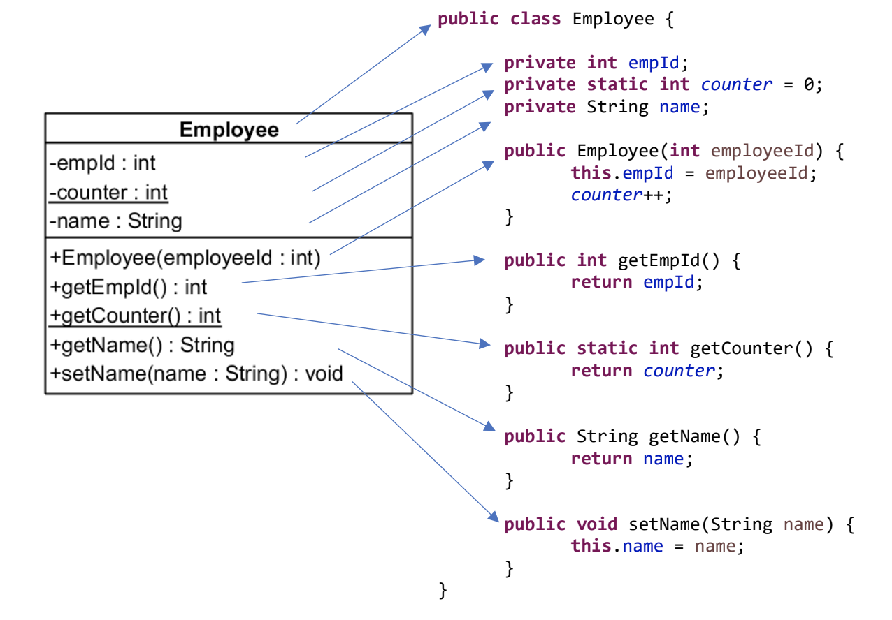
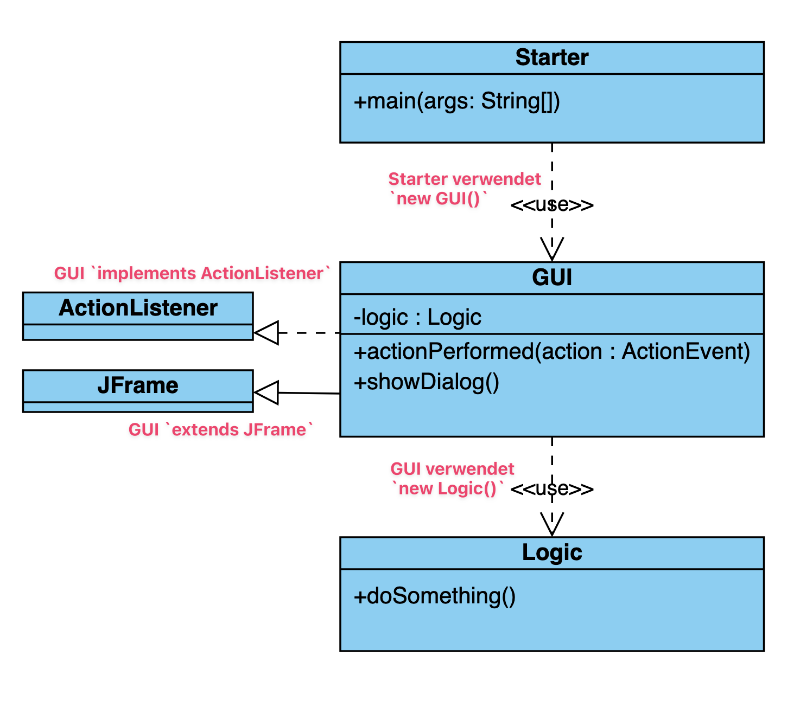

<!-- _class: big center -->

# Woche 4

## Modul 404

---

# Agenda

::: columns

## :brain: Input

- :man_teacher: Kontoverwaltung in Swing
- :triangular_ruler: [Formatierung](https://codingluke.github.io/bbzbl-modul-404/docs/konzepte/formatierung)
- :crayon: [UML Klassendiagram](https://codingluke.github.io/bbzbl-modul-404/docs/konzepte/uml)
- :hammer: [Konstruktor](https://codingluke.github.io/bbzbl-modul-404/docs/konzepte/konstruktor)

::: split

## :keyboard: Aufgaben

- [Account UML](https://codingluke.github.io/bbzbl-modul-404/docs/aufgaben-grundlagen/account-uml)
- [:performing_arts: DiceGame](https://codingluke.github.io/bbzbl-modul-404/docs/aufgaben-swing/dice-game)
- [Konstruktor](https://codingluke.github.io/bbzbl-modul-404/docs/aufgaben-swing/konstruktor)
- [:woman_superhero: Weitere Swing-Aufgaben](https://codingluke.github.io/bbzbl-modul-404/docs/aufgaben-swing/zusatz)

:::

---

<!-- _class: big center -->

# Kontoverwaltung in Swing

## :man_teacher: Musterlösung erläutern

---

<!-- _class: big -->

# :triangular_ruler: Formatierung

- :monocle_face: Wichtig um die **Lesbarkeit** zu erhöhen

- :woman_superhero: Ist ein **Zeichen von Professionalität**

- :juggling_person: Hilft **Flüchtigkeitsfehlern vorzubeugen**

- :grin: Macht Freude!

---

# :triangular_ruler:Formatierung / **Unsere Regeln!** :rotating_light:

- Wir verwenden **keine Umlaute** im Code (Ausnahmen sind Kommentare)
- Jede **Klasse**
  - beginnt mit einem **Grossbuchstaben**
  - hat einen `AusdrucksstarkenNamen` in :camel: [`UpperCamelCase` :link:](http://wiki.c2.com/?UpperCamelCase)
- Jede **Methode**
  - beginnt mit einem **Kleinbuchstaben**
  - hat einen `ausdrucksstarkenNamen` in :camel: [`lowerCamelCase` :link:](http://wiki.c2.com/?LowerCamelCase)
- Blöcke `{}` werden eingerückt (:keyboard: **Ctrl-Shift-F** :apple: **Command-Shift-F**)
- **Standard-Encoding `UTF-8`**: `Preferences > General > Workspace` -> `UTF-8`

---


# :symbols: `UTF-8` in Eclipse!

**Eclipse Preferences** öffnen:

1. **General** auswählen
2. **Workspace** auswählen
3. **Default (UTF-8)** setzen

4. Speichern

> :scream: **Sonst compiliert euer Code auf meinem Mac nicht!**

---

# :keyboard: Formatierung / **Auftrag** [:link:](https://codingluke.github.io/bbzbl-modul-404/docs/aufgaben-grundlagen/formatierung)

1. Lesen Sie das [Konzept Formatierung](https://codingluke.github.io/bbzbl-modul-404/docs/konzepte/formatierung) gut durch!

2. Lösen Sie folgende [Aufgabe Formatierung](https://codingluke.github.io/bbzbl-modul-404/docs/aufgaben-grundlagen/formatierung)

---

<!-- _class: big -->

# <!--fit--> UML - Unified Modeling Language

- :crayon: Visualisierung von Code und Abläufen

- :artist: Sollte grafisches programmieren ermöglichen `UML -> Code`

- :notebook_with_decorative_cover: Wird vor allem als Dokumentation verwendet `Code -> UML`

  - _Code ist konfortabler zu schreiben als UML zu malen :wink:_

- :earth_africa: Eignet sich für **Big-Picture** Analyse!

---

# <!--fit--> :crayon: `UML` Klassendiagram



- Eine Klasse ist ein Rechteck
- Klassenname ist zentrierter Titel
- Sichtbarkeit
  - `-` ist `private`
  - `+` ist `public`
- Obenhalb: Instanz**variablen**
- Unterhalb: Instanz**methoden**
- <u>`Unterstrichen`</u>: `static`

---

# :crayon: `UML` Klassendiagram / **Methoden**

:point_up: **`+|-methodennamen( variablenNamen: DatenTyp ) : returnDatenTyp`**

| UML                                  | Java Signatur                         |
| ------------------------------------ | ------------------------------------- |
| `+setName(name : String)`            | `public void setName(String name)`    |
| `+getName() : String`                | `public String getName()`             |
| <u>`+sum(a : int, b: int) : int`</u> | `public static int sum(int a, int b)` |
| `-secret(key : String) : String`</u> | `private String secret(String key)`   |

---

# :crayon: `UML` Klassendiagram / **Variablen**

**:point_up: `+|- variablenNamen : Datentyp`**

| UML                   | Java                       |
| --------------------- | -------------------------- |
| `-name : String`      | `private String name;`     |
| `+year : int`         | `public int year;`         |
| <u>`+PI : double`</u> | `public static double PI;` |

---

# <!--fit--> :crayon: `UML` Klassendiagram / **Abhängigkeiten**



**Klasse verwendet ein `new` Objekt**

- gestrichelter Pfeil

**Klasse `implements` ein Interface**

- gestrichelter Pfeil mit **Dreiecksspitze**

**Klasse `extends` eine Klasse**

- durchgezogener Pfeil mit **Dreiecksspitze**

---

# :toolbox: UML Tools

::: columns

- [diagrams.net](https://www.diagrams.net/) _früher draw.io_
- [Visual Paradigm Online](https://online.visual-paradigm.com)
  - Visual Paradigm finden Sie auf unseren **Windows VMs**
- [Mermaid](https://mermaid.js.org/) :mermaid:
  - wird auf dieser Seite verwendet
  - [Mermaid Dokumentation](https://mermaid.js.org/syntax/classDiagram.html)
  - [Mermaid Live im Browser](https://mermaid.live)

::: split

### :robot: Automatisches Generieren

- [IntelliJ Diagrams](https://www.jetbrains.com/help/idea/class-diagram.html) _jedoch nicht 100% UML Standard!!_
- [ObjektAid for Eclipse](https://github.com/AbbaouiAmine/objectAidArchive)
  - [Video mit Installationsanleitung](https://www.youtube.com/watch?v=UtSRX9swc1w)

:::

---

# :keyboard: UML-Klassendiagram / **Auftrag** :pen:

1. lesen Sie das [Konzept UML](https://codingluke.github.io/bbzbl-modul-404/docs/uml)
2. Erstellen Sie ein UML-Klassendiagram der Fachklasse [`Account`](https://codingluke.github.io/bbzbl-modul-404/docs/aufgaben-grundlagen/account-uml)
3. Implementieren Sie das [DiceGame](https://codingluke.github.io/bbzbl-modul-404/docs/aufgaben-swing/dice-game)
   - **Diese Aufgabe würde ich besonders gut anschauen! :wink:**

- [:woman_superhero: Weitere Swing-Aufgaben](https://codingluke.github.io/bbzbl-modul-404/docs/aufgaben-swing/zusatz)

---

# :hammer: Konstruktor

- Methodenname ist **immer gleich** wie die Klasse
- ist **nicht explizit aufrufbar**
- wird **ausgeführt wenn ein Objekt erstellt wird** (:bulb: in Verbindung mit **`new`**)
- hat **keinen Rückgabewert**
- es können mehrere Konstruktoren bestehen (:bulb: andere Anzahl Parameter)
- werden **keine Parameter** angegeben, nennt man ihn **Standardkonstruktor**
- dient dazu das **Objekt** mit gültigen Werten zu **initialisieren**

## :tv: [Video auf Youtube über Konstruktoren](https://www.youtube.com/watch?v=FKdxjjNdCYM)

---

# :hammer: Konstruktor / **Beispiel**

```java
public class MyClass {
  private String name; // Instanzvariable die Inizialisiert werden muss!
  private int year = 2000; // Instanzvariable mit Standardwert

  public MyClass() { // Standardkonstruktor (ohne Parameter)
    this.name = "Startwert"; // `name = "Startwert"` ohne `this` ist auch gültig
  }

  public MyClass(String name) { // konstruktor mit gleichnamigem parameter
    this.name = name; // `this` ist notwendig da gleichnamig
  }

  public MyClass(String aName, int year) { // Konstruktor mit zwei Variablen
    name = aName;     // `this` darf weggelassen werden (muss aber nicht!)
    this.year = year; // `this` ist notwendig da gleichnamig
  }
}
```

---

# :hammer: Konstruktor / **Verwendung**

```java
public class Starter {
  public static void main(String[] args) {
    // Standardkonstruktor wird ausgeführt!
    MyClass myClass = new MyClass();

    // Konstruktor mit einem Parameter wird ausgeführt
    MyClass myClass2 = new MyClass("Neuer Startwert");

    // Konstruktor mit zwei Parameter wird ausgeführt
    MyClass myClass3 = new MyClass("Neuer Startwert", 2022);
  }
}
```

## <!--fit--> :woman_superhero: Das nennt sich auch _[Methoden überladen](https://www.java-tutorial.org/ueberladen_von_methoden.html)_ und geht auch für normale Methoden

---

# :keyboard: Konstrutkor / **Auftrag**

1. Lesen Sie das [Konzept Konstruktor](https://codingluke.github.io/bbzbl-modul-404/docs/konzepte/konstruktor) gut durch!

2. Lösen Sie folgende Aufgabe [Konstruktor](https://codingluke.github.io/bbzbl-modul-404/docs/aufgaben-swing/konstruktor)

---

<!-- _class: big -->

# <!--fit--> :rotating_light: Nächste Woche gibts einen **Test!** :scream:

- :bulb: [Details auf der Modulwebseite](https://codingluke.github.io/bbzbl-modul-404/docs/beurteilungen/lb1)

- :woman_superhero: Geht **alle Aufgaben** nochmals durch und **versteht Sie**!
- :superhero_woman: Lernt ein UML-Klassendiagram in Java umzuwandeln :wink:
- :mage: **Arrays** sollte man anwenden können
- :supervillain: Schaut euch die **DiceGame** Würfel-Logik genau an
