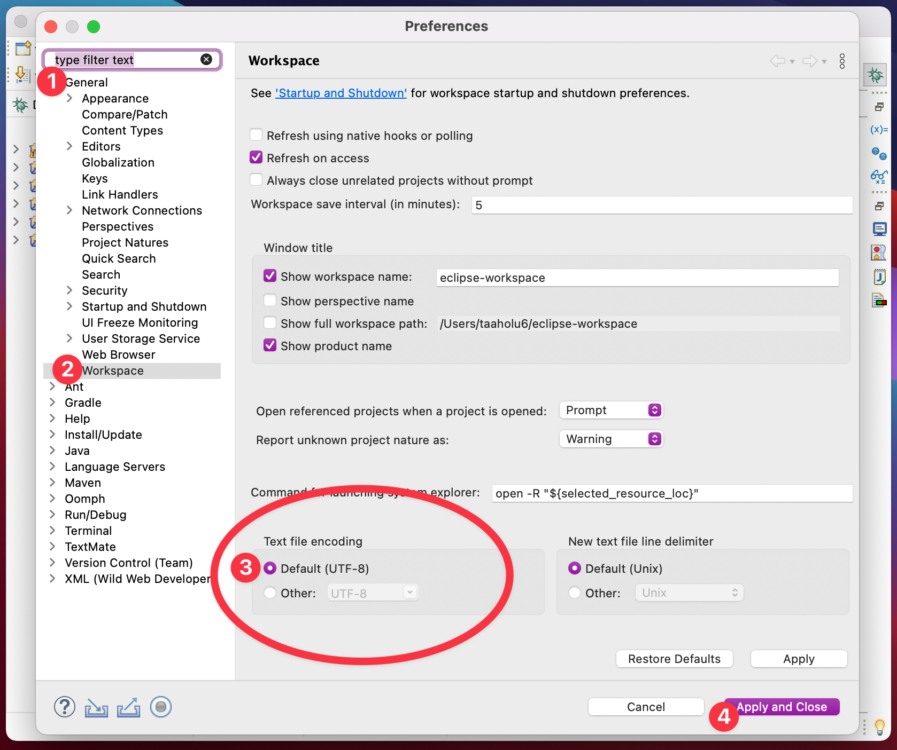
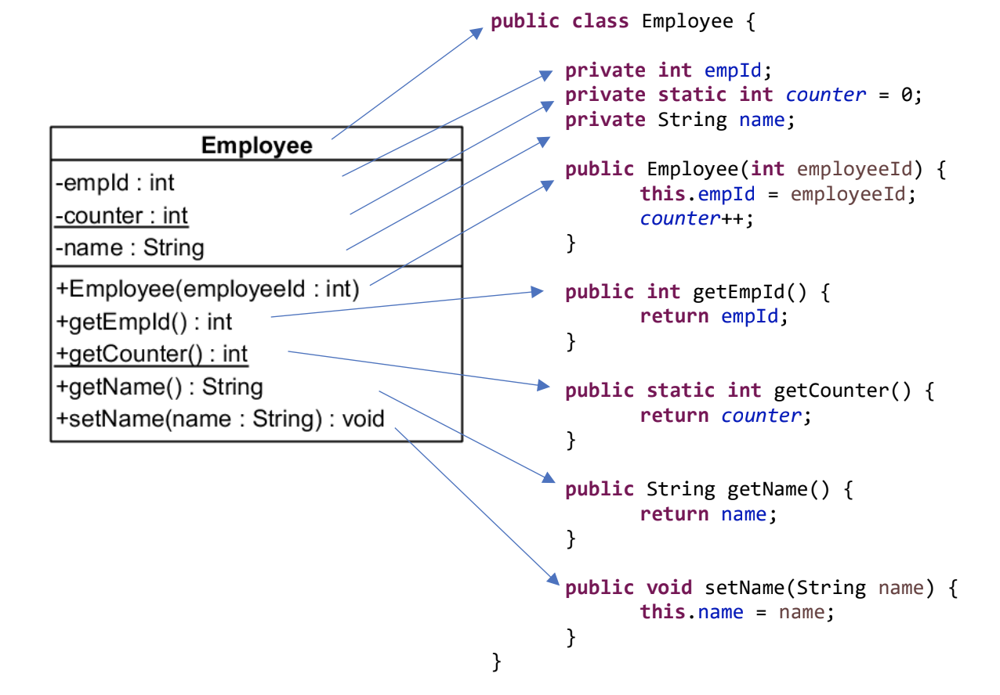

<!-- _class: big center -->

# Woche 5 / Modul 404

### Objektbasiert programmieren nach Vorgabe

---

<!-- _class: big emoji-list -->

# Agenda

- :checkered_flag: LB1 Vorbereitung
- :question: Fragen zum Test (:stopwatch: 10 Minuten)
- :student: LB 1 (:stopwatch: 90 Minuten)
- :alembic: Start vom Projekt (LB2)

---

<!-- _class: big emoji-list -->

# :checkered_flag: LB 1 / **Vorbereitung**

- 🔄 Workstation neustarten

- 👤 `e-vorname.nachname` ( ==**e-**== vorangestellt )
- 📁 **`L:\Klassenarbeiten\M404-LB1-INB23AB`**
  - **`eclipse-workspace.7z`** entzippen
  - in Eclipse **`File -> Open Projects from File System...`**

---

# :symbols: `UTF-8` in Eclipse!

**Eclipse Preferences** öffnen:

1. **General** auswählen
2. **Workspace** auswählen
3. **Default (UTF-8)** setzen

4. Speichern

> :scream: **Sonst compiliert euer Code auf meinem Mac nicht!**

---

# <!--fit--> :bulb: `UML` Klassendiagram

- Eine Klasse ist ein Rechteck
- Klassenname ist zentrierter Titel
- Sichtbarkeit
  - `-` ist `private`
  - `+` ist `public`
- Obenhalb: Instanz**variablen**
- Unterhalb: Instanz**methoden**
- <u>`Unterstrichen`</u>: `static`

---

<!-- _class: big -->

# :student: LB 1 / :stopwatch: 90 Minuten

- Immer **1 Person, auf die Toilette**
- **Faktenblätter** sind erlaubt!

---

<!-- _class: big -->

# :alembic: Start Projekt (LB 2 / LB 3)

## <!--fit--> :book: Bitte studiert nun alle den [Projektbeschrieb](https://codingluke.github.io/bbzbl-modul-404/docs/beurteilungen/lb2)

- Ab jetzt arbeiten wir nur noch am Projekt
