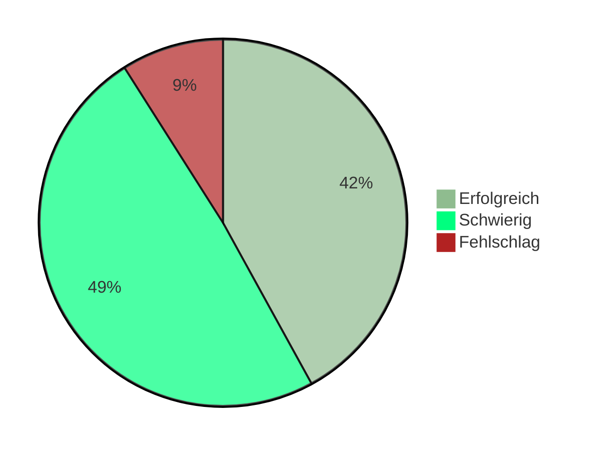

<!-- _class: big center compact -->

# :two_men_holding_hands: :two_women_holding_hands:  Woche 7 / Modul 404

## Tandem programmieren

### englisch Pair-Programming

---

<!-- _class: big center emoji-list -->

# :compass: Agenda

## :point_left: Siehe **grosser** Screen

---

<!-- _class: big emoji-list -->

# :dart: Ziele

- 🏅 Sie kennen Faktoren für Projekt Misserfolge
- 🕵️ Sie verstehen die Schwierigkeit **fremden Code zu lesen**
  - 💅 Sie verstehen, wieso **Formatierung und gute Namen** wichtig sind
- 👭 Sie können effizient im **Tandem programmieren**

- :zap: Sie erhalten ==**Feedback**== zum Stand vom Ihrem Projekt

---

# Kahoot

::: columns l65

## :jigsaw: Quiz über alle bisherigen Themen

- Wir spielen auf kahoot.com

::: split light-bg

- 👪 Plenum

- :clock2: **10 Minuten**
- :toolbox: Quiz
- :dart: Vorwissen abfragen

:::

---

# Projekterfolg in der Softwareentwicklung

::: footnotes

[https://projektmanagement-zentrum.ch/2019/12/04/agile-ansaetze/](https://projektmanagement-zentrum.ch/2019/12/04/agile-ansaetze/)

:::

---

# Gründe für Misserfolg _(Programmierer Sicht)_

- Fehlendes **Wissen** oder fehlende **Fertigkeiten** der Teammitglieder.
- **Kommunikation** ist ungenügend.
  - Aber ich dachte, das ist es, was gewünscht wird.
- Mitarbeiter**fluktuation** ist gross _(Braindrain)_.
  - Das hat immer der Hans gemacht, der ist leider nicht mehr im Team.
- Nur einer weiss Bescheid und ist in den Ferien.

---

<!-- _class: big -->

> Es ist wichtiger, das Richtige zu tun, als etwas richtig zu tun.  Es ist
> nichts unbrauchbarer als **mit grosser Effizienz das Falsche** zu tun.
>
> -- Peter F. Drucker (:star2: 1909 - ✝️ 2005)

---

<!-- _class: center big -->

# 🪄  Tandem Programmieren

---

# Tandem Programmieren / **Wie?**

- Zwei Personen arbeiten **gleichzeitig** an der **gleichen Codebasis**.
- **Einer** schreibt.
- Der andere denkt, kontrolliert und spricht Probleme an.
- Die Rollen sollen regelmässig getauscht werden.

---

# Tandem Programmieren / **Wieso?**

:::columns

- Fehler reduzieren
- Risikominimierung
- Softwarequalität steigern
  - bessere Kommunikation
  - Missverständnisse vermeiden!

::: split

- **Freude und Spass** 😄
- gegenseitiger Ansporn
- höhere Disziplin
- **Wissensvermittlung** 🧠
- Teambildung

:::

---

<!-- _class: emoji-list -->

# Auftrag 1 | 🕵️ **Fremder Code verstehen**

::: columns l65

1. Vorgegebene Zweiergruppen

2. Projektcode austauschen
3. Fremder Code versuchen zu verstehen

::: split light-bg

- ⛹️ _"Einzelarbeit"_

- :clock2: **10 Minuten**
- :toolbox: Code lesen
- :dart: Bewusstsein für verständlicher Code

:::

> - 🖊 **Notieren Sie**
> - ==Unklarheiten==, Erkenntnisse, Schwierigkeiten, ...

---

<!-- _class: emoji-list -->

# Auftrag 2 | :two_men_holding_hands: **Tandem programmieren**

::: columns l65

1. Vorgegebene Zweiergruppen
2. Gegenseitig das eigene Programm erklären  _(**10'** pro Programm)_

3. Machen Sie evtl. Verbesserungen zusammen

::: split light-bg

- 👭 Partnerarbeit

- :clock4: **20 Minuten**
- :toolbox: Tandem Programmieren
- :dart: Inspiration, Synergien, Kreativität

:::

> - 🖊 **Notieren Sie**
> - ==Verbesserungen==, Erkenntnisse, Schwierigkeiten, ...

---

<!-- _class: center big compact -->

# Austausch :mega:

## <!-- fit --> Jede Gruppe teilt :bulb: **zwei Erkenntnisse**

---

<!-- _class: center big compact -->

# In **drei Worten**

## Was geht euch gerade durch den Kopf?
