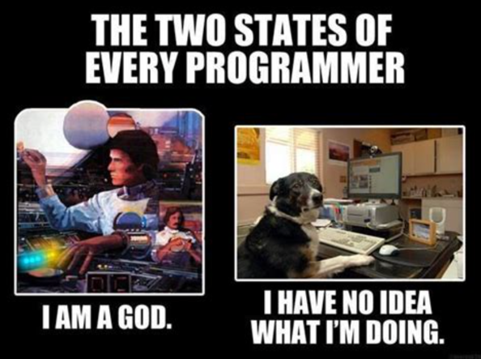
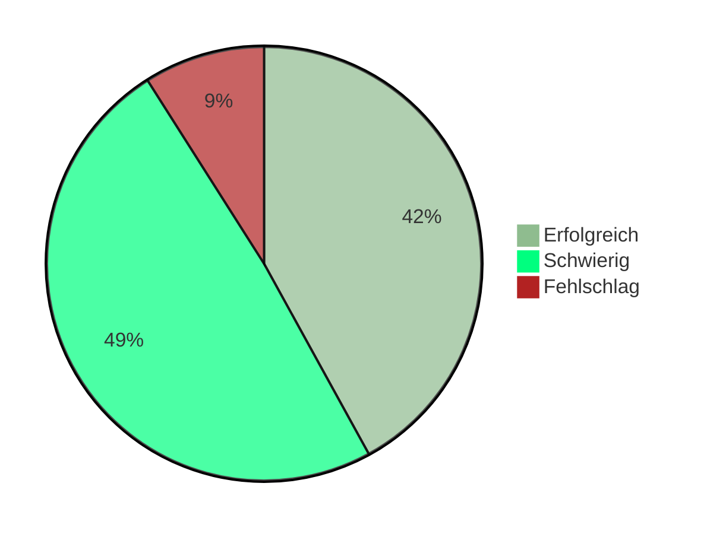

<!-- _class: big center compact -->

# :compass:  Woche 7 / Modul 404

## Projekterfolg / Standortbestimmung

---

---

---

<!-- _class: big center emoji-list -->

# Agenda

## :point_left: Siehe **grosser** Screen

---

<!-- _class: big emoji-list -->

# :dart: Ziele

- :zap: Sie haben sich gegenseitig Feedback zu Ihrem Stand vom Projekt gegeben.

- :bulb: Sie können zwei Erkenntnisse nennen, die Sie näher zum eigenen
  Projekterfolg bringen
- 🏅 Sie kennen allgemeine Faktoren für Projekterfolge.
- 💅 Sie verstehen, wieso Formatierung, Kommentare und gute Namen wichtig sind.

---

# Kahoot

::: columns l65

## :jigsaw: Quiz über alle bisherigen Themen

- Wir spielen auf kahoot.it.

- Der QR-Code für das Live-Spiel wird direkt aus Kahoot aufgeblendet.
- Hier der
  [Link zu den Fragen](https://create.kahoot.it/share/m404-theoriefragen/f645c0f8-7147-4d08-a060-f51b8e9d503a)
  fürs Selbststudium.

  <!--  -->

::: split light-bg

- 👪 Plenum

- :clock2: **10 Minuten**
- :toolbox: Quiz
- :dart: Vorwissen abfragen

:::

---

# Projekterfolg in der Softwareentwicklung

::: footnotes

[https://projektmanagement-zentrum.ch/2019/12/04/agile-ansaetze/](https://projektmanagement-zentrum.ch/2019/12/04/agile-ansaetze/)

:::

---

<!-- _class: big center -->

# Faktoren für Projekterfolg

## _Aus Sicht von :woman_technologist: Programmierenden_

---

# Projekterfolg **Kommunikation**

> **Was** ist das :dart: Ziel?

 

Der 🧠 **Wissenstransfer** zwischen den Teammitglieder ist gut

- Alle sprechen vom Gleichen

:::footnotes

Bild: pexels.com

:::

---

# Projekterfolg **Wissen**

> **Wie** ist das :dart: Ziel zu erreichen?

 

Das :bulb: **Wissen** und die 🦾 **Fertigkeiten** für das Ziel sind vorhanden.

:::footnotes

Bild: pexels.com

:::

---

# Projekterfolg **Methoden**

> **Womit** wird das :dart: Ziel eher erreicht?

 

Die :toolbox: **Werkzeuge** für das Erlangen des Ziels

- werden beherrscht
- sind angebracht

:::footnotes

Bild: pexels.com

:::

---

<!-- _class: emoji-list -->

# :pencil: Aufgabe 1: **Fremden Code verstehen**

::: columns l65

1. Vorgegebene Zweiergruppen

2. Projektcode austauschen _(5')_
3. Fremden Code versuchen zu verstehen _(10')_

::: split light-bg

- 🕵️ _"Einzelarbeit"_

- :clock2: **15 Minuten**
- :toolbox: Code lesen
- :dart: Bewusstsein für Lesbarkeit

:::

> - 🖊 **Notieren Sie**
> - Erkenntnisse, Schwierigkeiten, Unklarheiten, ...

---

<!-- _class: big -->

> Programmiere immer so, als wäre der Typ, der am Ende mit deinem Code arbeiten
> muss, ein Psychopath, der weiss, wo du wohnst.
>
> -- John Woods oder Martin Golding

---

<!-- _class: center big -->

# 🧰  Tandem-Programmieren

---

# Tandem-Programmieren / **Wie?**

 

- **Zwei Personen** arbeiten gleichzeitig an der **gleichen Codebasis**.

- Nur **eine** ⌨️ tippt.
- Die andere 🤔 **denkt**, :cop: **kontrolliert** und 🗣️ **spricht Probleme
  an**.
- Die :tophat: **Rollen** sollen **regelmässig 🔂 getauscht** werden.

---

# Tandem-Programmieren **Toll für den Mensch**

- Freude und Spass

- Wissensvermittlung
- Teambildung
  - gegenseitiger Ansporn
  - höhere Selbstdisziplin

:::footnotes

Bild: pexels.com

:::

---

# Tandem-Programmieren **Gut für die Sache**

- Fehlerreduzierung

- Risikominimierung
- Qualitätssteigerung
  - bessere Kommunikation
  - mehr Sorgfalt
  - vermiedene Missverständnisse

:::footnotes

Bild: pexels.com

:::

---

<!-- _class: emoji-list -->

# :pencil: Aufgabe 2: **Tandem-Programmieren**

::: columns l65

1. Vorgegebene Zweiergruppen
2. Gegenseitig das eigene Programm erklären  _(**10'** pro Programm)_

3. Machen Sie evtl. Verbesserungen zusammen

::: split light-bg

- 👭 Partnerarbeit

- :clock4: **20 Minuten**
- :toolbox: Tandem-Programmieren
- :dart: Feedback
- :dart: Erkenntnisse
- :dart: Projekterfolg

:::

> - 🖊 **Notieren Sie**
> - Erkenntnisse, Verbesserungen, Schwierigkeiten, ...

---

<!-- _class: center big compact -->

# Austausch :mega:

## <!-- fit --> Jede Gruppe teilt :bulb: **zwei Erkenntnisse**

---

<!-- _class: big -->

> Es ist wichtiger, das Richtige zu tun, als etwas richtig zu tun.  Es ist
> nichts unbrauchbarer als **mit grosser Effizienz das Falsche** zu tun.
>
> -- Peter F. Drucker (:star2: 1909 - ✝️ 2005)

---

# :scroll: Lernjournal | **:clock2: 10'**

:::columns

## :question: Fragen beantworten

- Das habe ich gemacht
- Das habe ich gelernt
- Das ist mir gut gelungen
- Damit hatte ich Schwierigkeiten
- So habe ich auf die Schwierigkeiten reagiert
- So fühle ich mich jetzt

::: split

## :sparkles: Erkenntnisse festhalten!

:::

---

<!-- _class: center big compact -->

# :zap: Blitzlicht :zap:

## Was geht euch gerade durch den Kopf?
