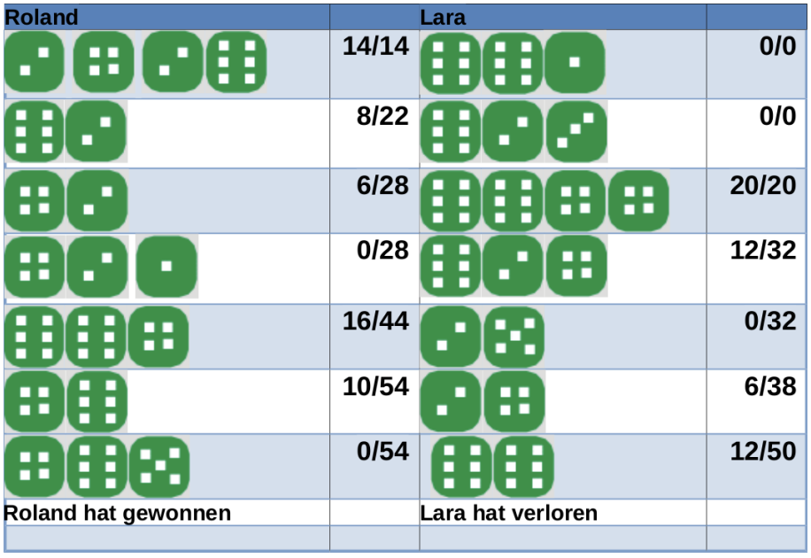
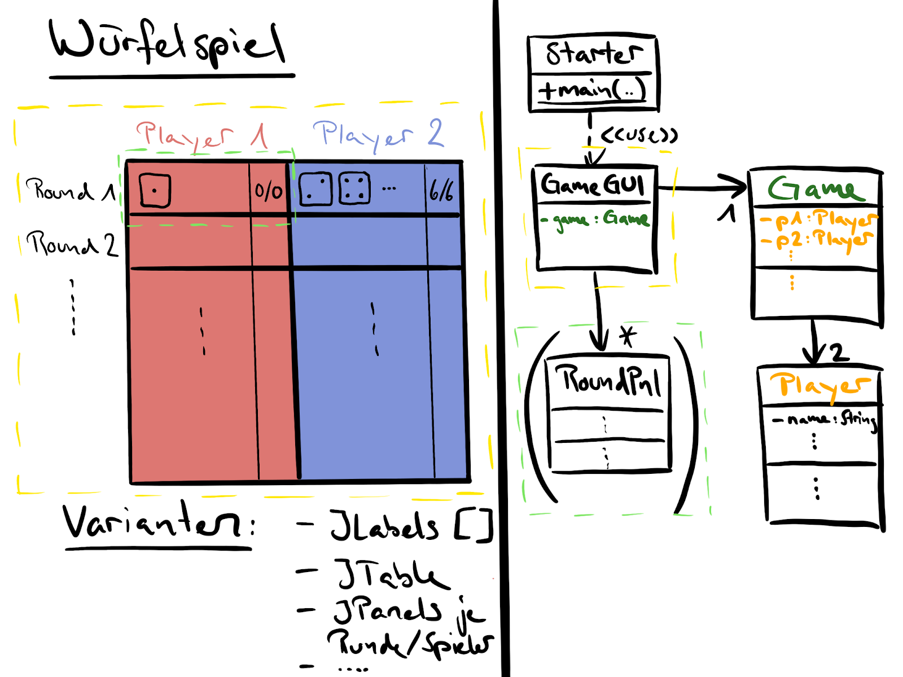

<!-- _class: big center -->

# :alembic:  Woche 8 / Modul 404

## Arbeiten am Projekt

---

# :policeman: Spielregeln

- 2 Spieler / X Runden

- 5 Würfe _max_ pro Spieler/Runde
- **Gerader Wurf** aufsummieren
- **Ungerader Wurf** beendet die Runde des Spielers **mit 0**
- Runde darf abgebrochen werden

> :point_up: Die Regeln dürfen abgewandelt werden!

---

# :keyboard: Implementation

**Fachklassen**

- Spieler _(Player)_, Spielregeln _(Game)_, Würfel _(Dice)_

**GameGui**

- Eingabe der Spielernamen
- Darstellung des Spiels
  - ([JPanel](https://codingluke.github.io/bbzbl-modul-404/docs/aufgaben-swing/jpanel),
    [JTable](https://sites.google.com/bbzbl-it.ch/modul404-lh/themen/ui/jtable))
- Würfeln / Abbrechen

---

# :pen: Dokumentation [:book: **Google Docs Dokument**](https://docs.google.com/document/d/1OhUYxLkwIWsxuk3SwcycjGUcRzkJQPRYRnbpkjiLEho)

Heute wichtig:

### :triangular_ruler: Implementation

- Klassendiagram (UML)
- Klassenstruktur

### :scroll: Lernjournal

- Reflexion der Lektion
- Dokumentieren der Erfolge und Probleme
